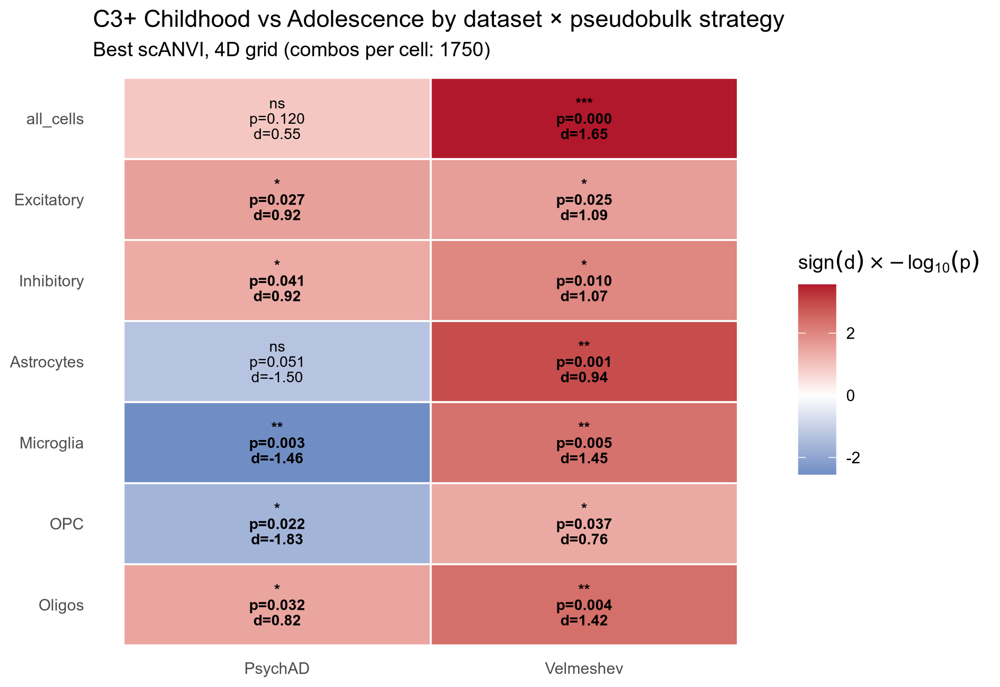
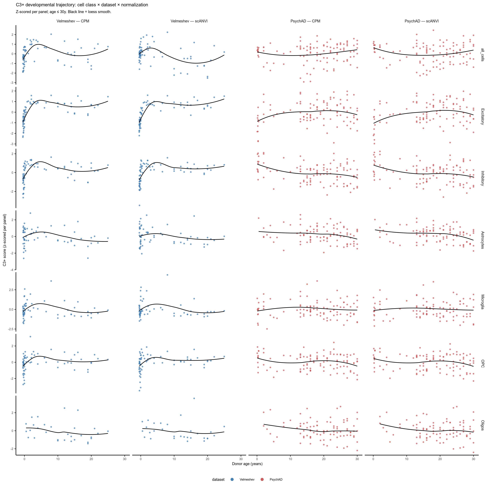

# AHBA C3 Developmental Trends — Cross-Dataset Comparison

## 1. Setup

### 1.1 Environment

    Environment : hpc
      rds_dir  : /home/rajd2/rds/rds-cam-psych-transc-Pb9UGUlrwWc
      code_dir : /home/rajd2/rds/hpc-work/snRNAseq_2026/code
      ref_dir  : /home/rajd2/rds/hpc-work/snRNAseq_2026/reference

### 1.2 Parameters

Loads multiple datasets from a YAML config and produces a direct
cross-dataset comparison of cell-class composition and per-cell-class
C3+ developmental trends. The 4D sensitivity grid is shared across
datasets.

    Loading params from: /home/rajd2/rds/hpc-work/snRNAseq_2026/notebooks/results/compare_Vel_PsychAD/grn_dev_compare_datasets_params.yaml

    EXPERIMENT_NAME : compare_Vel_PsychAD
    N datasets       : 2
      [Velmeshev]
        by_cell_class : /home/rajd2/rds/rds-cam-psych-transc-Pb9UGUlrwWc/Cam_snRNAseq/integrated/Vel_prepost_noage_tuning5/pseudobulk_output/by_cell_class.h5ad
        all_cells     : /home/rajd2/rds/rds-cam-psych-transc-Pb9UGUlrwWc/Cam_snRNAseq/integrated/Vel_prepost_noage_tuning5/pseudobulk_output/all_cells_by_donor.h5ad
        cell_class_col: cell_class_original
      [PsychAD]
        by_cell_class : /home/rajd2/rds/rds-cam-psych-transc-Pb9UGUlrwWc/Cam_snRNAseq/integrated/PsychAD_noage_tuning5/pseudobulk_output/by_cell_class.h5ad
        all_cells     : /home/rajd2/rds/rds-cam-psych-transc-Pb9UGUlrwWc/Cam_snRNAseq/integrated/PsychAD_noage_tuning5/pseudobulk_output/all_cells_by_donor.h5ad
        cell_class_col: cell_class
    CELL_CLASSES     : ['Excitatory', 'Inhibitory', 'Astrocytes', 'Microglia', 'OPC', 'Oligos']
    CHILD_STARTS     : [1, 2, 3, 4, 5]
    GAP_STARTS       : [8, 9, 10, 11, 12, 13, 14]
    GAP_LENGTHS      : [0, 1, 2, 3, 4]
    ADOL_ENDS        : [18, 20, 22, 24, 26]

### 1.3 Libraries

## 2. Load datasets & project GRN

For each dataset, set up the GRN against that dataset’s gene-set, then
project across each major cell class (by_cell_class filtered) plus
all-cells.

    ============================================================
    Dataset: Velmeshev

    Input sequence provided is already in string format. No operation performed
    Input sequence provided is already in string format. No operation performed

    Mapped 6641/7973 symbols via adata.var
    Querying mygene for 1332 unmapped symbols...

    134 input query terms found dup hits:   [('ACTG1P4', 2), ('ADAM20P1', 2), ('AKR7A2P1', 3), ('AMZ2P1', 2), ('ANKRD18CP', 2), ('ANKRD19P', 2),
    338 input query terms found no hit: ['AAED1', 'AARS', 'ADPRHL2', 'ADSSL1', 'ALS2CR12', 'APOPT1', 'ARMT1', 'ARNTL', 'ARNTL2', 'AZIN1-AS1'

    After mygene: 6650/7973 mapped, 1323 dropped
    GRN genes in adata: 6650 / 6650
      by_cell_class shape: (428, 17663)
      Cell classes: {'Excitatory': 76, 'Inhibitory': 75, 'OPC': 73, 'Microglia': 67, 'Astrocytes': 67, 'Glia': 36, 'Oligos': 34}
    Found 6650 matching genes in var_names.
    Aligning GRN weights to 6650 matched genes for projection...
    Computing sparse-dense dot product...
    Found 6650 matching genes in var_names.
    Aligning GRN weights to 6650 matched genes for projection...
    Computing sparse-dense dot product...
        Excitatory: n_donors=76
    Found 6650 matching genes in var_names.
    Aligning GRN weights to 6650 matched genes for projection...
    Computing sparse-dense dot product...
    Found 6650 matching genes in var_names.
    Aligning GRN weights to 6650 matched genes for projection...
    Computing sparse-dense dot product...
        Inhibitory: n_donors=75
    Found 6650 matching genes in var_names.
    Aligning GRN weights to 6650 matched genes for projection...
    Computing sparse-dense dot product...
    Found 6650 matching genes in var_names.
    Aligning GRN weights to 6650 matched genes for projection...
    Computing sparse-dense dot product...
        Astrocytes: n_donors=67
    Found 6650 matching genes in var_names.
    Aligning GRN weights to 6650 matched genes for projection...
    Computing sparse-dense dot product...
    Found 6650 matching genes in var_names.
    Aligning GRN weights to 6650 matched genes for projection...
    Computing sparse-dense dot product...
        Microglia: n_donors=67
    Found 6650 matching genes in var_names.
    Aligning GRN weights to 6650 matched genes for projection...
    Computing sparse-dense dot product...
    Found 6650 matching genes in var_names.
    Aligning GRN weights to 6650 matched genes for projection...
    Computing sparse-dense dot product...
        OPC: n_donors=73
    Found 6650 matching genes in var_names.
    Aligning GRN weights to 6650 matched genes for projection...
    Computing sparse-dense dot product...
    Found 6650 matching genes in var_names.
    Aligning GRN weights to 6650 matched genes for projection...
    Computing sparse-dense dot product...
        Oligos: n_donors=34
      Loading all_cells: /home/rajd2/rds/rds-cam-psych-transc-Pb9UGUlrwWc/Cam_snRNAseq/integrated/Vel_prepost_noage_tuning5/pseudobulk_output/all_cells_by_donor.h5ad
        shape: (76, 17663)
    Found 6650 matching genes in var_names.
    Aligning GRN weights to 6650 matched genes for projection...
    Computing sparse-dense dot product...
    Found 6650 matching genes in var_names.
    Aligning GRN weights to 6650 matched genes for projection...
    Computing sparse-dense dot product...
        all_cells: n_donors=76

    ============================================================
    Dataset: PsychAD

    Input sequence provided is already in string format. No operation performed
    Input sequence provided is already in string format. No operation performed

    No gene_symbol/feature_name column found — resolving all symbols via mygene
    Querying mygene for 7973 unmapped symbols...

    152 input query terms found dup hits:   [('ACTG1P4', 2), ('ADAM20P1', 2), ('AKR7A2P1', 3), ('AMZ2P1', 2), ('ANKRD18CP', 2), ('ANKRD19P', 2),
    389 input query terms found no hit: ['AAED1', 'AARS', 'ADAL', 'ADPRHL2', 'ADSSL1', 'ALS2CR12', 'APOPT1', 'ARMT1', 'ARNTL', 'ARNTL2', 'AZ

    After mygene: 6955/7973 mapped, 1018 dropped
    GRN genes in adata: 6955 / 6955
      by_cell_class shape: (1265, 34176)
      Cell classes: {'OPC': 191, 'Inhibitory': 190, 'Excitatory': 187, 'Astrocytes': 181, 'Microglia': 176, 'Oligos': 176, 'Endothelial': 164}
    Found 6955 matching genes in var_names.
    Aligning GRN weights to 6955 matched genes for projection...
    Computing sparse-dense dot product...
    Found 6955 matching genes in var_names.
    Aligning GRN weights to 6955 matched genes for projection...
    Computing sparse-dense dot product...
        Excitatory: n_donors=187
    Found 6955 matching genes in var_names.
    Aligning GRN weights to 6955 matched genes for projection...
    Computing sparse-dense dot product...
    Found 6955 matching genes in var_names.
    Aligning GRN weights to 6955 matched genes for projection...
    Computing sparse-dense dot product...
        Inhibitory: n_donors=190
    Found 6955 matching genes in var_names.
    Aligning GRN weights to 6955 matched genes for projection...
    Computing sparse-dense dot product...
    Found 6955 matching genes in var_names.
    Aligning GRN weights to 6955 matched genes for projection...
    Computing sparse-dense dot product...
        Astrocytes: n_donors=181
    Found 6955 matching genes in var_names.
    Aligning GRN weights to 6955 matched genes for projection...
    Computing sparse-dense dot product...
    Found 6955 matching genes in var_names.
    Aligning GRN weights to 6955 matched genes for projection...
    Computing sparse-dense dot product...
        Microglia: n_donors=176
    Found 6955 matching genes in var_names.
    Aligning GRN weights to 6955 matched genes for projection...
    Computing sparse-dense dot product...
    Found 6955 matching genes in var_names.
    Aligning GRN weights to 6955 matched genes for projection...
    Computing sparse-dense dot product...
        OPC: n_donors=191
    Found 6955 matching genes in var_names.
    Aligning GRN weights to 6955 matched genes for projection...
    Computing sparse-dense dot product...
    Found 6955 matching genes in var_names.
    Aligning GRN weights to 6955 matched genes for projection...
    Computing sparse-dense dot product...
        Oligos: n_donors=176
      Loading all_cells: /home/rajd2/rds/rds-cam-psych-transc-Pb9UGUlrwWc/Cam_snRNAseq/integrated/PsychAD_noage_tuning5/pseudobulk_output/all_cells_by_donor.h5ad
        shape: (201, 34176)
    Found 6955 matching genes in var_names.
    Aligning GRN weights to 6955 matched genes for projection...
    Computing sparse-dense dot product...
    Found 6955 matching genes in var_names.
    Aligning GRN weights to 6955 matched genes for projection...
    Computing sparse-dense dot product...
        all_cells: n_donors=201

    Combined projection df: (7080, 12)
      pb_kind values: ['Astrocytes', 'Excitatory', 'Inhibitory', 'Microglia', 'OPC', 'Oligos', 'all_cells']
      datasets: ['PsychAD', 'Velmeshev']
    Combined composition df: (1693, 6)

## 3. Cell-class composition side-by-side

    frac_df: (1493, 8)

    Mean cell-class fraction by dataset:
    cell_class  Astrocytes  Excitatory  Inhibitory  Microglia    OPC  Oligos
    dataset                                                                 
    PsychAD          0.147       0.220       0.200      0.068  0.103   0.306
    Velmeshev        0.121       0.475       0.194      0.037  0.066   0.220

    Spearman correlation of cell-class fraction vs age:
      [PsychAD   ]  Astrocytes    n=181  rho=+0.072  p=0.334
      [PsychAD   ]  Excitatory    n=187  rho=+0.147  p=0.0453
      [PsychAD   ]  Inhibitory    n=190  rho=-0.260  p=0.00029
      [PsychAD   ]  Microglia     n=176  rho=-0.450  p=3.54e-10
      [PsychAD   ]  OPC           n=191  rho=-0.487  p=8.58e-13
      [PsychAD   ]  Oligos        n=176  rho=+0.222  p=0.00302
      [Velmeshev ]  Astrocytes    n=67  rho=+0.394  p=0.000984
      [Velmeshev ]  Excitatory    n=76  rho=-0.630  p=1.11e-09
      [Velmeshev ]  Inhibitory    n=75  rho=-0.167  p=0.152
      [Velmeshev ]  Microglia     n=67  rho=+0.636  p=7.18e-09
      [Velmeshev ]  OPC           n=73  rho=+0.687  p=1.86e-11
      [Velmeshev ]  Oligos        n=34  rho=+0.381  p=0.0262

**Interpretation — composition × age differs sharply between datasets.**
Velmeshev shows much stronger composition-vs-age correlations than
PsychAD, and several cell classes have **opposite-signed** slopes
between the two datasets:

-   Velmeshev: Excitatory fraction **drops** with age (rho ≈ -0.63),
    while OPC (+0.69), Microglia (+0.64), Astrocytes (+0.39), and Oligos
    (+0.38) all **rise**. This is consistent with V2 chemistry (used
    predominantly for younger donors) under-capturing non-neuronal
    cells, plus genuine postnatal glial expansion.
-   PsychAD: Microglia (-0.45) and OPC (-0.49) **decline** with age —
    opposite to Velmeshev. PsychAD’s much broader age range (0–89y)
    means the trend is dominated by later-life glial decline, not the
    early-life expansion phase.

Because Velmeshev’s composition shifts so strongly with age, its
`all_cells` pseudobulk is essentially a moving-target weighted mixture
of cell types. The apparent age trend on `all_cells` is partly
within-cell expression change and partly composition change.

## 4. Per-(dataset × pb_kind) 4D sensitivity grid

    Per-(dataset × pb_kind) best scANVI sensitivity:
       dataset    pb_kind n_donors       best_p   cohens_d n_sig n_total
     Velmeshev Excitatory       76 0.0245059289  1.0896488   243    1750
     Velmeshev Inhibitory       75 0.0102143910  1.0691739   273    1750
     Velmeshev Astrocytes       67 0.0011756732  0.9443741   672    1750
     Velmeshev  Microglia       67 0.0045751634  1.4516488   363    1750
     Velmeshev        OPC       73 0.0366902444  0.7596610    67    1750
     Velmeshev     Oligos       34 0.0039960040  1.4244253   369    1750
     Velmeshev  all_cells       76 0.0002756877  1.6503381   531    1750
       PsychAD Excitatory      187 0.0266927650  0.9238366    37    1750
       PsychAD Inhibitory      190 0.0406893981  0.9194390     8    1750
       PsychAD Astrocytes      181 0.0507936508 -1.5002028     0    1750
       PsychAD  Microglia      176 0.0028449502 -1.4616123   149    1750
       PsychAD        OPC      191 0.0222016651 -1.8282489    67    1750
       PsychAD     Oligos      176 0.0317207956  0.8220859    12    1750
       PsychAD  all_cells      201 0.1197436431  0.5496166     0    1750
     child_start gap_start adol_start adol_end p_label signed_log10p
               1        14         17       20       *     1.6107288
               1         8          8       22       *     1.9907875
               1         8          8       22      **     2.9297134
               3         9         12       26      **     2.3395934
               1         8          8       20       *     1.4354494
               3        13         17       20      **     2.3983741
               1         8          8       20     ***     3.5595825
               5        14         14       18       *     1.5736064
               1        13         15       18       *     1.3905187
               5         8          9       20      ns    -1.2941906
               5         8          8       20      **    -2.5459253
               5         8          8       22       *    -1.6536145
               1        13         16       22       *     1.4986559
               1        14         14       18      ns     0.9217475

**Interpretation — uniform-sign vs opposing-sign per-class signals are
the dominant mechanism for the puzzle.**

-   **Velmeshev**: every one of the 6 cell classes carries a
    **positive** Cohen’s d at its best window (Exc +1.09, Inh +1.07, Ast
    +0.94, Mic +1.45, OPC +0.76, Oligos +1.42). Averaging coherent
    same-sign signals **amplifies** the effect → `all_cells` p = 3 ×
    10⁻⁴, d = +1.65, *more* significant than any single class.
-   **PsychAD**: three glial classes carry **negative** Cohen’s d
    (Astrocytes −1.50, Microglia −1.46, OPC −1.83), opposing the
    neuronal classes’ positive d (Exc +0.92, Inh +0.92, Oligos +0.82).
    Averaging opposite-sign signals **cancels** the effect → `all_cells`
    p = 0.12, d = +0.55, not significant.

This direction-mismatch across cell classes — not just composition — is
the main reason `all_cells` *boosts* the signal in Velmeshev but
*erases* it in PsychAD. The composition × chemistry confound in Section
3 contributes additionally by inflating Velmeshev’s apparent magnitude.

### 4.1 Head-to-head heatmap

### 4.2 Trajectory grid (cell class × dataset × normalization)

Rows = pseudobulk strategy (cell class or `all_cells`); columns =
dataset × normalization (CPM vs scANVI). Each panel is z-scored
independently. Velmeshev points are steelblue, PsychAD points are
indianred; loess fit is black.

### 4.3 Childhood vs Adolescence boxplots (cell class × dataset × normalization)

Rows = pseudobulk strategy; columns = dataset × normalization. Age
windows are the per-(dataset, pb_kind) **best-scANVI** boundaries from
the 4D sensitivity grid (same window applied to both CPM and scANVI
projections in each row, so the only thing varying along each row’s
columns is the normalization method). Box outlines black; jitter points
coloured by dataset.

## 5. V3-only Velmeshev sensitivity test

For Velmeshev only (which mixes V2 + V3 chemistries): re-run the 4D
sensitivity grid restricted to V3-only donors, to test whether the
apparent all-cells signal is inflated by the V2/V3 chemistry × age
confound.

      [Velmeshev] chemistries: ['V2', 'V3']
        full   n donors: 76
        V3only n donors: 39
      [PsychAD] single chemistry (['V3']) — skipping V3-only test

    v3_compare_df: (2856, 13)

    V3-only vs all-chemistries best scANVI:
        dataset_subset    pb_kind n_donors       best_p   cohens_d n_sig n_total
        Velmeshev__all Excitatory       76 0.0245059289  1.0896488   243    1750
        Velmeshev__all Inhibitory       75 0.0102143910  1.0691739   273    1750
        Velmeshev__all Astrocytes       67 0.0011756732  0.9443741   672    1750
        Velmeshev__all  Microglia       67 0.0045751634  1.4516488   363    1750
        Velmeshev__all        OPC       73 0.0366902444  0.7596610    67    1750
        Velmeshev__all     Oligos       34 0.0039960040  1.4244253   369    1750
        Velmeshev__all  all_cells       76 0.0002756877  1.6503381   531    1750
     Velmeshev__V3only Excitatory       39 0.0714285714 -2.7655955     0    1750
     Velmeshev__V3only Inhibitory       39 0.0121212121 -2.1552784   174    1750
     Velmeshev__V3only Astrocytes       36 0.1078921079  0.2527063     0    1750
     Velmeshev__V3only  Microglia       38 0.1454545455  0.5908961     0    1750
     Velmeshev__V3only        OPC       39 0.0303030303 -1.5779463    16    1750
     Velmeshev__V3only     Oligos       16 0.0952380952  1.0188409     0    1750
     Velmeshev__V3only  all_cells       39 0.0293040293  1.4262794    27    1750
     child_start gap_start adol_start adol_end p_label signed_log10p
               1        14         17       20       *     1.6107288
               1         8          8       22       *     1.9907875
               1         8          8       22      **     2.9297134
               3         9         12       26      **     2.3395934
               1         8          8       20       *     1.4354494
               3        13         17       20      **     2.3983741
               1         8          8       20     ***     3.5595825
               3        14         14       18      ns    -1.1461280
               3        10         10       26       *    -1.9164539
               1         8          8       20      ns     0.9670103
               3         8          8       26      ns     0.8372727
               3        12         12       26       *    -1.5185139
               3        13         17       20      ns     1.0211893
               1         8          8       20       *     1.5330727

**Interpretation — chemistry contributes but is not the sole driver.**
Restricting Velmeshev to V3-only donors (n = 39, vs 76 with V2+V3) drops
the `all_cells` effect from p = 3 × 10⁻⁴, d = +1.65 down to p = 0.029, d
= +1.43 — still significant but visibly weaker, and the number of
significant 4D-grid combos collapses from 531 to 27. So
chemistry-correlated composition shifts clearly inflate Velmeshev’s
all-cells signal. However, the *direction* of the effect persists in
V3-only, so the underlying per-class positive-d signal is the more
important driver. The Excitatory apparent flip to negative d under
V3-only is largely a small-n artifact (removing V2 strips out most of
the infancy/young-childhood donors).

### 5.1 Sensitivity heatmap (Velmeshev all vs V3-only vs PsychAD)

Same encoding as the Section 4.1 head-to-head: fill = sign(d) ×
−log10(p), labels show p-value, Cohen’s d and significance star. Adding
PsychAD as a third column makes it visually obvious whether V3-only
Velmeshev converges to PsychAD’s pattern (which would implicate the
chemistry confound).

## 6. Conclusions

The dataset-dependent puzzle — `all_cells` *amplifies* the C3+ drop in
Velmeshev but *erases* it in PsychAD — has two layered explanations,
both visible in the analyses above:

1.  **Per-class effect direction differs across datasets** (Section 4,
    the dominant mechanism). In Velmeshev every cell class shows a
    positive childhood→adolescence Cohen’s d, so averaging compounds the
    signal. In PsychAD, three glial classes (Astrocytes, Microglia, OPC)
    carry strong *negative* d that opposes the neuronal classes;
    averaging cancels.
2.  **Velmeshev’s V2-vs-V3 chemistry × age confound additionally
    inflates the apparent all-cells signal** (Section 5). When
    restricted to V3-only donors, Velmeshev’s all-cells effect drops
    from d = +1.65, p = 3 × 10⁻⁴ to d = +1.43, p = 0.029 (and
    significant-combo count collapses from 531 → 27). The effect
    direction persists, so chemistry is a multiplier, not the cause.

**Practical recommendation**: the Excitatory-only pseudobulk gives a
comparable, more conservative read-out across both datasets (Velmeshev d
= +1.09, PsychAD d = +0.92). The all-cells strategy is dataset-specific
and should be interpreted with caution — its sensitivity to per-class
direction mismatch and to chemistry composition shifts means it does not
necessarily “add information” relative to Excitatory-only.
