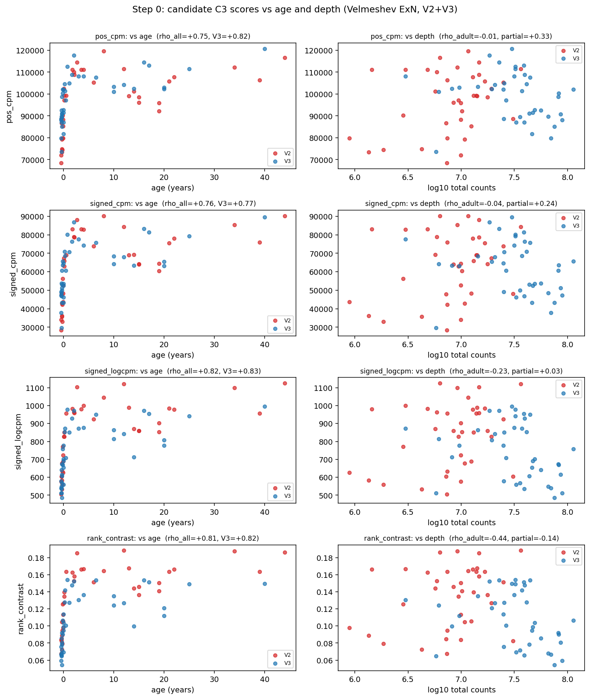
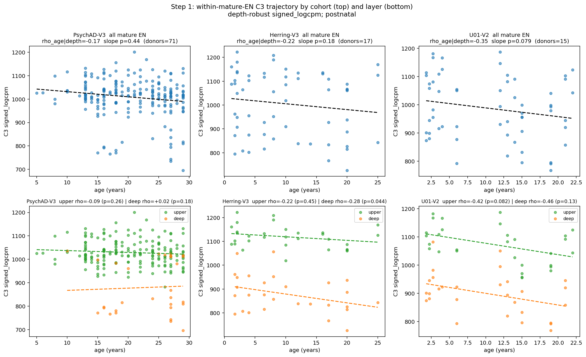
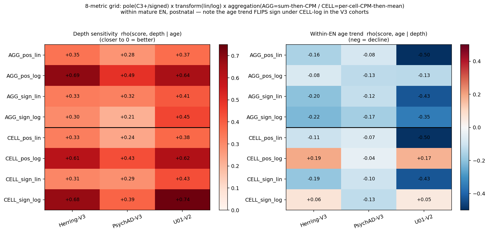
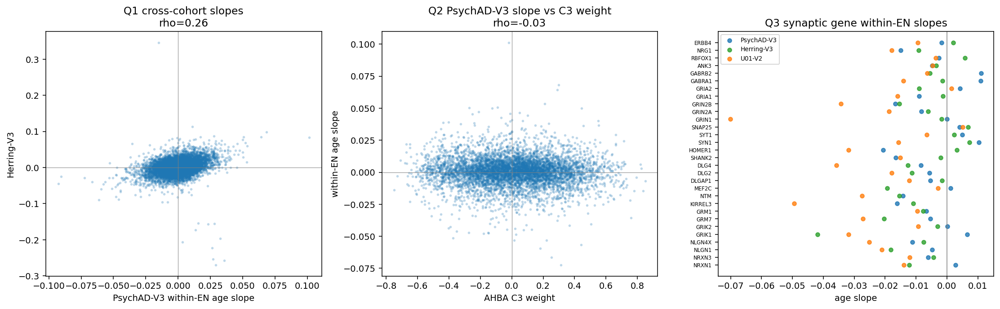
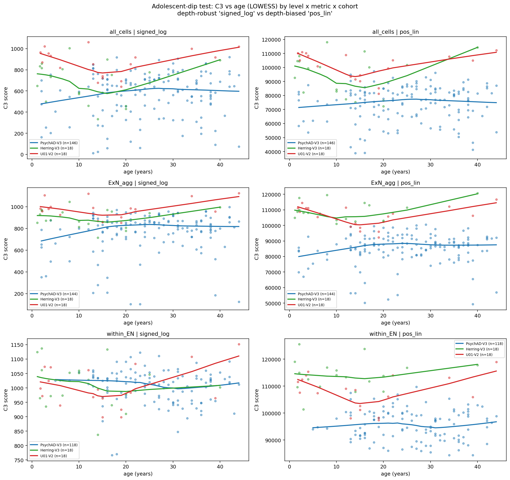
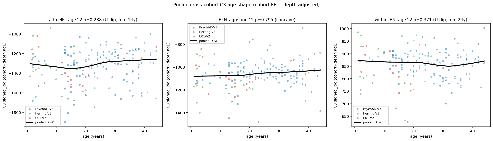
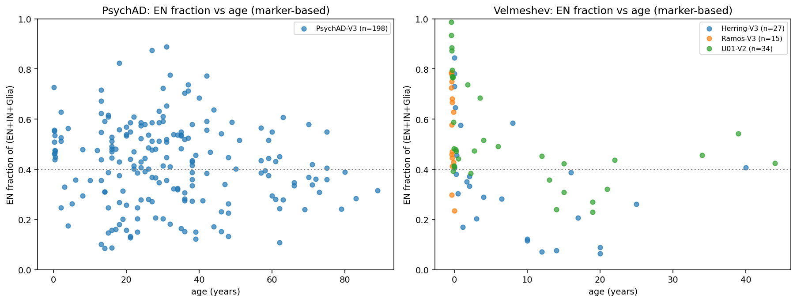
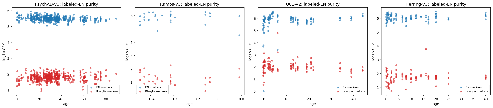
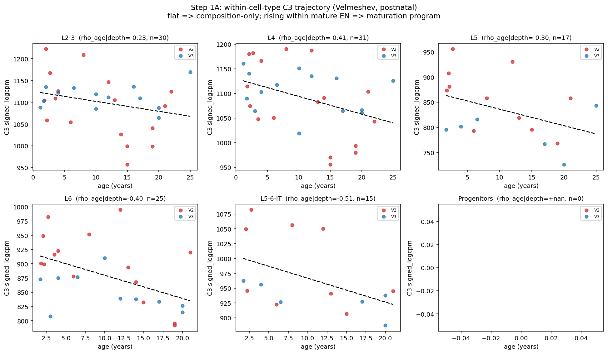

# Does AHBA C3 encode a within-neuron maturation program, or just neuron-vs-glia composition?

**Investigation:** `c3_maturation` · scripts in `scripts/c3_maturation/`, outputs here in `output/c3_maturation/`
· _living document, updated as results come in._

---

## TL;DR (current state)

**Headline:** C3-the-axis is **composition** (neuron-vs-glia / differentiation). Every claimed
*within-neuron* C3 trend (the postnatal decline; the adolescent dip) turns out to be **fragile to
method choices** — pseudobulk aggregation, the ExN definition, and cohort/batch handling — and none
is yet established. The one hypothesis still genuinely open, and *not* cleanly testable with our
current labels, is a **late-maturing-ExN dip** (see caveats).

1. **C3's big age signal is prenatal→postnatal differentiation (composition).** Robust; this is the
   deflationary core and it is not in dispute.
2. **The "within-mature-EN postnatal decline" is NOT robust to pseudobulk aggregation.** Under
   *sum-counts-then-CPM* (deep-cell-weighted) it is negative; under *per-cell-CPM-then-mean* (equal
   cell weight, log) it **flattens or reverses** in the clean V3 cohorts (s05, 8-metric grid). So
   the Step-1 decline is largely a deep-cell-weighting artefact, not a robust biological trend.
   *No* metric is cleanly depth-free at the within-subtype level (all ρ(score,depth|age)=0.2–0.7).
3. **The nonlinear "adolescent dip" is suggestive but unestablished.** Its descending arm
   (childhood→~18y) is significant in *both* Velmeshev cohorts incl. clean Herring-V3 under the
   depth-robust metric (so not merely V2 depth); but the adult *recovery* arm rests on 1–3 Velmeshev
   donors, adult-rich PsychAD shows no rebound, and the pooled cross-cohort U-shape is **n.s.
   (p≈0.29)**. It is also composition- and ExN-definition-dependent (see #5).
4. **The reproducible within-neuron developmental program is AHBA *C1*, not C3** (ion-channel /
   intrinsic-excitability genes — SCN1A/1B, KCNC1/3 — that *rise* with maturation). C3 weight does
   not predict within-neuron dynamics (robust to expression confound). _[Caveat: computed on AGG
   pseudobulks; the synaptic-set decline within this analysis should be re-checked under CELL
   aggregation given #2.]_
5. **The ExN definition is uncertain and consequential — and *no* current label is reliable for
   young donors.** Native PsychAD labels (and `cell_type_aligned`, scANVI **trained on them**) call
   only ~10–25% of cells EN *and give a biologically backwards young EN:IN ratio (16:36)*. The
   "marker" classifier calls ~40–50% EN but **over-calls**, because its RBFOX3 (NeuN) gate is
   **pan-neuronal** and sweeps in GAD-dropout interneurons (44% of its PsychAD "EN" are native
   IN_SST/VIP/PVALB). So young EN% must be defined by **excitatory-specific** markers
   (SLC17A7/SATB2 vs GAD1), not RBFOX3 and not the reference labels. Young-donor UMAPs (both scVI and
   raw-PCA, PsychAD & Velmeshev): **`REPORT_young_umaps.md`**. Our within-EN analyses used
   `cell_type_aligned`, so their **young end is unreliable** and the late-maturing-dip test must be
   redone with SLC17A7-based, immature-inclusive EN membership (planned).

**Bottom line.** Strongly **deflationary** for "C3 = a within-neuron maturation axis": once you
control aggregation and acknowledge the ExN-selection bias, the within-neuron C3 trends largely
dissolve, and the genuine within-neuron developmental axis is C1, not C3. C3's psychiatric-GWAS
relevance is most parsimoniously explained by it up-weighting synaptic genes (which are neuronal),
i.e. C3 marks *where* risk genes are expressed, not *when* they change. **The remaining live
question** — whether a real adolescent dip exists in late-maturing neurons that our reference-based
labels discard — requires the marker-based, immature-inclusive, batch-aware analysis set out under
*Caveats & planned work*.

---

## Key results

> **Independent corroboration.** A separate, embedding-free analysis line in this repo
> (`scripts/grn_dev_diagnostics/`, FINAL_REPORT) reached the same deflationary conclusion by a
> different route: within **native** postnatal ExN (cell_class == Excitatory, raw counts), the C3+
> score has ~zero coupling to a 9-gene maturity module (PsychAD r≈0.08, Herring r≈−0.10) and ~zero
> age trend at the donor level (PsychAD r≈+0.09 n.s., Herring r≈−0.11 n.s.) — whereas across *all*
> cell classes the C3+↔maturity coupling is r≈+0.85 (the neuron-vs-glia contrast). Two independent
> methods (per-cell maturity-module coupling vs per-gene slope/AHBA alignment) agree: the C3↔age
> relationship is a cell-type-composition effect, not a within-neuron program. _(Caveat on EN
> definition: both that line's `cell_class==Excitatory` and our `cell_type_aligned` are
> reference-based and **mature-biased** in PsychAD — see #5 and `REPORT_annotation.md`. The "C3↔age
> is composition" conclusion is robust to this because it concerns the contrast collapsing once you
> are within neurons at all; the **dip**, by contrast, is sensitive to the EN definition.)_

### 1. Depth-robustness gate (Step 0)

Four candidate C3 scores were compared on the Velmeshev ExN-per-donor pseudobulk, which contains
both V2 (n=37) and V3 (n=39) donors.

| score | age-partialled depth ρ (want ≈0) | age trend V2+V3 vs V3-only (want equal) | verdict |
|---|---|---|---|
| `pos_cpm` (old C3+ aggregate) | **+0.33** | 0.75 vs 0.82 — **0.07 gap = the artefact** | depth-biased |
| `signed_cpm` | +0.24 | 0.76 vs 0.77 | ok |
| **`signed_logcpm`** ✅ | **+0.03** | **0.82 vs 0.83 — identical** | **adopted** |
| `rank_contrast` | −0.14 | 0.81 vs 0.82 | ok |

`signed_logcpm` = Σᵢ wᵢ · log1p(CPMᵢ) over signed C3 weights. Adopted for all downstream analyses.

*Left column: each score vs age (red=V2, blue=V3) — for `signed_logcpm`/`rank_contrast` the
chemistries interleave (no batch separation); for `pos_cpm` the V2 donors sit low, dragging the
aggregate. Right column: score vs depth.*

### 2. Composition vs within-cell-type program (Step 1)

Restricting to **postnatal mature EN subtypes** and conditioning on subtype identity + sequencing
depth (donor-clustered robust SE), the C3 score trend is reported **separately for three cohorts**
(per the design that V3-Herring and V3-PsychAD are different sources from V2-U01):

| cohort | layer | ρ(age \| depth) | slope p | donors |
|---|---|---|---|---|
| **PsychAD-V3** (cleanest, largest) | all mature EN | −0.17 | 0.44 | 71 |
| | upper | −0.09 | 0.26 | 68 |
| | deep | +0.02 | 0.18 | 18 |
| **Herring-V3** | all mature EN | −0.22 | 0.18 | 17 |
| | upper | −0.22 | 0.45 | 16 |
| | deep | −0.28 | **0.044** | 13 |
| **U01-V2** | all mature EN | −0.35 | 0.079 | 15 |
| | upper | −0.43 | 0.082 | 15 |
| | deep | −0.46 | 0.13 | 13 |

**Inverse-variance meta-analysis (all mature EN, 3 cohorts): slope = −0.94, p = 0.087.**

Reading:
- All three cohorts decline in the same direction; none is individually significant; the meta is
  marginal (p≈0.09).
- The decline is **not upper-layer-specific** (upper ≈ deep, if anything deeper-biased) — so the
  simplest "upper-layer pruning" prediction is **not** supported by these data.
- Effect magnitude tracks cohort: largest in U01-V2 (steepest, also the V2/depth-prone cohort) and
  in the child-rich Velmeshev cohorts; weakest in the adult-heavy PsychAD-V3.

> ⚠️ **This decline does not survive the aggregation robustness check (§2b) — read that next before
> interpreting it.** It also rests on the mature-biased `cell_type_aligned` EN definition (#5).

### 2b. Robustness of the within-EN trend to scoring metric & aggregation (s05, 8-metric grid)

The C3 score has three independent binary choices — pole {C3+, signed} × transform {linear CPM,
log1p CPM} × **aggregation** {`AGG` = sum-counts-then-CPM (deep-cell-weighted, the pipeline
default); `CELL` = per-cell-CPM-then-mean (equal cell weight)} = **8 metrics**. Computed per
(donor × mature-EN subtype) from per-cell counts in each cohort:

Two things stand out:

- **No metric is cleanly depth-free at the within-subtype level.** Every metric retains
  ρ(score, depth | age) ≈ 0.2–0.7 (left panel). The Step-0 depth-robustness of `signed_logcpm` was
  established at the *donor-level ExN aggregate*; it does **not** carry down to the noisier
  per-(donor×subtype) level. (`AGG_*_log` are in fact the *most* depth-coupled here, because at low
  depth log1p(CPM) is dominated by dropout.)
- **The within-EN "decline" flips sign with aggregation.** Under `AGG` metrics the age trend is
  negative (−0.08 to −0.50); under **`CELL` per-cell-CPM-then-mean with log**, it **reverses to
  ≈0/positive in both V3 cohorts** (Herring `CELL_pos_log` +0.19, `CELL_sign_log` +0.06; U01 +0.17,
  +0.05), while only the depth-prone U01-V2 keeps a strong negative under linear metrics. (right
  panel).

**Conclusion:** the Step-1 within-EN decline is **largely an artefact of deep-cell weighting**
(sum-then-CPM), not a robust biological trend. This is the single most important methodological
result here, and it cuts *toward* the deflationary reading. _Best practice note: for "average cell
state" comparisons across samples with differing per-cell depth, per-cell-normalise-then-mean is the
more defensible aggregation; sum-then-CPM is standard for count-model DE (edgeR/DESeq2) but lets a
few deep cells dominate. The conclusion should track the metrics that are *invariant* to this
choice — here, "no robust within-EN trend."_

### 3. De novo within-EN developmental program, and its (non-)alignment to C3 (Step 2)

Rather than projecting C3 weights, we compute **per-gene** within-EN age slopes (log1p CPM
residualised on subtype + depth) in each cohort, and ask three questions.

**Q1 — does a within-neuron developmental program exist & replicate?** Yes. The per-gene slope
vectors correlate across cohorts (Spearman ρ): PsychAD-V3↔Herring-V3 **0.26**, PsychAD-V3↔U01-V2
**0.24**, Herring-V3↔U01-V2 **0.40**. A reproducible within-EN program is present even though the
aggregate C3 score barely moved.

**Q2 — is that program C3?** **No — it is C1.** Spearman(per-gene slope, AHBA weight):

| cohort | C1 | C2 | C3 |
|---|---|---|---|
| PsychAD-V3 | **+0.33** | −0.01 | −0.03 |
| Herring-V3 | **+0.22** | +0.07 | −0.08 |
| U01-V2 | **+0.18** | +0.05 | −0.14 |

The C1 alignment is **not** an expression-level artefact: partialling on mean expression leaves it
essentially unchanged (PsychAD C1: 0.326 → 0.322; C3 stays ≈ −0.04). So the within-neuron
developmental axis is captured by **C1**, and C3 weight does not predict within-neuron dynamics.

**Q3 — are the dynamic genes synaptic (pruning)?** Yes, at the set level. Canonical synaptic genes
(incl. the prior NRXN1/NLGN1/GRIK… set) decline within EN more than background in **all three
cohorts**: MWU p = 0.018 (PsychAD-V3), **3.5e-5 (Herring-V3, clean V3)**, 4e-12 (U01-V2). Individual
slopes are small (≈ −0.01 to −0.05 log1p-CPM/yr); the signal is robust at the set level.
Canonical maturation *switches* (GRIN2B→GRIN2A, KCC2/NKCC1) are **not** cleanly recovered — likely
because the switch is largely perinatal and our window is postnatal.

*Left: cross-cohort slope replication. Middle: within-EN slope vs C3 weight (flat). Right: synaptic
gene slopes — predominantly negative across cohorts.*

### What C1 and C3 actually weight (gene identity)

| | top genes / enrichment | within-EN age dynamics |
|---|---|---|
| **C1+** | ion channels: SCN1A, SCN1B, KCNC1/KCNC3 (Kv3), VAMP1 — intrinsic excitability / firing maturation | **rise** (slope ↔ C1 weight ρ≈+0.33) |
| **C3+** | synaptic / adhesion genes (NRXN, NLGN, GRIK, DLG, SHANK…): mean C3 loading **+0.29** vs ~0 baseline | **decline** (the Q3 synaptic-set drop) |

C3 weight also weakly tracks mean expression in neurons (ρ=0.21) — i.e. C3+ partly = "highly
expressed neuronal genes" — but the synaptic enrichment is specific and is what carries the GWAS
signal. The net within-neuron developmental program is **ion-channels-up / synapses-down**.

### 5. The nonlinear "adolescent dip" (s08)

Does C3 trace a U-shape — high in childhood, low in adolescence, recovering in adulthood? Tested via
quadratic convexity (age², centred, depth-controlled) at three aggregation levels and two metrics
(depth-robust `signed_log` vs depth-biased `pos_lin`), per cohort. **Important:** the three levels
use *different* ExN definitions — `all_cells` (no ExN selection), `ExN_agg` (**marker-based** ExN,
incl. immature), `within_EN` (**`cell_type_aligned`** mature subtypes, subtype-averaged) — so they
are not strictly comparable; see #5 caveat.

- **Both Velmeshev cohorts — incl. clean Herring-V3 — show a significant U-shape** (trough ~18–20y)
  at the `all_cells` and `ExN_agg` levels, under the **depth-robust** metric (Herring p=0.043/0.045,
  U01 p=0.003/0.002). So the *descending* arm is **not** a pure V2-depth artefact.
- **PsychAD-V3 shows no dip** — but it barely samples childhood (<10y), covering mainly the
  *ascending* arm; it does not contradict the dip so much as miss its left half.
- The dip **weakens to non-significance within EN subtypes** (`within_EN`), i.e. it is substantially
  **composition-mediated**.

**Pooled, cohort+depth-adjusted** across all cohorts (the only frame spanning 1–44y), the U-shape is
**not significant** (all_cells age² p=0.29, trough ~14y; ExN_agg concave; within_EN p=0.37):

**Verdict.** The childhood→adolescence **decline** is real in Velmeshev (depth-robust, both cohorts)
— but the **recovery** arm is fragile (1–3 adult donors; no PsychAD rebound; pooled U n.s.), and the
whole pattern is composition- and ExN-definition-dependent. ⚠️ *This combined-cohort framing is not
batch-corrected and should be treated as provisional (see planned work).* A clean test needs (a) a
marker-based, immature-inclusive ExN definition, (b) batch-corrected combining, (c) the `CELL`
aggregation from §2b.

### Open items / status

- [x] Step 0 depth gate · Step 1 within-EN · Step 2 de novo (C1 not C3) · C1 = ion-channel axis.
- [x] **Normalisation robustness (s05)** — done: within-EN decline is aggregation-dependent (§2b).
- [x] **Annotation provenance / UMAP (s07)** — done: `cell_type_aligned` is mature-biased
      (`REPORT_annotation.md`).
- [ ] **ExN-definition sensitivity of the dip** — recompute the dip/within-EN trajectory under a
      marker-based, **immature-inclusive** ExN definition (per-cell), esp. for PsychAD. _(planned)_
- [ ] **Batch-corrected combining** — redo any cross-cohort/pooled analysis on the
      `scanvi_normalized` (batch-corrected) layer; treat current non-corrected pooled results as
      suspect. _(planned)_
- [ ] **Re-check Step 2 synaptic-set decline under `CELL` aggregation.**

### Caveats & planned work (method choices that change the answer)

Three method choices have been shown to flip or dissolve the within-neuron signals, so any future
claim must be robust to all three:

1. **Pseudobulk aggregation** (§2b). Use `CELL` (per-cell-normalise-then-mean) as the primary; report
   `AGG` only alongside. The within-neuron decline is not robust to this.
2. **ExN definition** (#5, `REPORT_annotation.md`). `cell_type_aligned`/native = mature-biased
   (10–25% EN in PsychAD); the marker classifier (40–50%) includes immature/late-maturing neurons
   but over-calls via ambient RBFOX3. The *late-maturing-ExN dip* hypothesis specifically requires
   the immature-inclusive definition — plan: per-cell, define ExN by marker (RBFOX3/DCX), split
   mature vs immature, and compute the C3 age curve within each, especially in PsychAD where the
   discrepancy is largest.
3. **Batch / cohort combining.** Pooling cohorts on raw/CPM scores (as in the current pooled dip) is
   **suspect** — cohort offsets are absorbed by fixed effects but residual batch structure is not.
   Plan: for any combined-data analysis, use the **`scanvi_normalized`** layer (the batch-corrected
   embedding-run output) and/or model cohort explicitly; treat non-batch-corrected combined results
   as provisional. *(Not yet implemented — flagged per design discussion.)*

---

## Methods

### Datasets and cohorts

Three cohorts are treated independently (V3-Herring and V3-PsychAD are distinct sources from
V2-U01):

| cohort | source | chemistry | age coverage (this analysis) | role |
|---|---|---|---|---|
| PsychAD-V3 | PsychAD | V3 | 5–30 y (adult-heavy) | large, clean, but few children |
| Herring-V3 | Velmeshev "Herring" | V3 | 1–25 y | cleanest child coverage, small |
| U01-V2 | Velmeshev "U01" | V2 | 1–22 y | child coverage, but V2 depth-prone |

Velmeshev "Ramos" (V3) is ~all prenatal and is excluded from the postnatal test.
Pseudobulks are pre-computed per (donor × cell type) by the project pipeline
(`code/pipeline/pseudobulk.py`); we read the small pseudobulk h5ads (login-node safe).

### Defining "mature EN"

`cell_type_aligned` subtype labels, restricted to excitatory subtypes and excluding
immature/newborn/subplate/progenitor classes. Explicitly:
- **Velmeshev**: L2-3, L4, L5, L5-6-IT, L6 (upper = L2-3, L4).
- **PsychAD**: EN_L2_3_IT, EN_L3_5_IT_1/2/3, EN_L6_IT_1/2, EN_L6_CT, EN_L6B, EN_L5_6_NP
  (upper = L2_3_IT + L3_5_IT_*).

These labels are validated as genuinely EN at all ages in Appendix A (marker purity). **Subtype-
level** accuracy in young donors is not separately validated and is a caveat for the layer split.

### The C3 score

Signed AHBA C3 loadings (6641 genes mapped to Ensembl: 3456 positive "C3+", 3185 negative "C3−")
are applied as `signed_logcpm` = Σᵢ wᵢ · log1p(CPMᵢ). Inside a pure-EN population the C3− (glial)
genes are near-floor, so the score is effectively driven by the C3+ (synaptic/neuronal) pole.

### What "conditioning on depth" means here, and what it does/doesn't fix

- **CPM** puts pseudobulks of different total depth on a common per-million scale, removing the
  *linear library-size* effect. It does **not** remove *dropout / compositional* depth effects:
  shallower samples have more zeros and systematically under-detect mid/low-expression genes,
  distorting the relative profile. So CPM alone does **not** fully control depth.
- **"Conditioning on depth"** = adding log10(total pseudobulk counts) as a covariate in the
  regression (or partialling it in a Spearman correlation). This removes residual *linear*
  association between the score and remaining depth variation, but not nonlinear dropout effects.
- Therefore depth-covariate adjustment is **necessary but not sufficient**. The stronger controls
  are: (a) choosing a score that is empirically depth-insensitive (`signed_logcpm`, partialled
  ρ=0.03) and gives identical V2/V3 trends (Step 0); (b) a negative-control null band from
  expression-matched random gene sets; (c) **reporting V2 and V3 cohorts separately**, so a
  V2-specific age×depth confound cannot masquerade as biology in the V3 cohorts; (d) within-cohort
  replication, where depth is more uniform.
- **The specific V2 age×depth worry** (younger U01-V2 donors being shallower, so age and depth
  correlate within that cohort) is handled by separating cohorts and leaning on the two **V3**
  cohorts, where the same-direction decline appears without any V2 data.

### De novo within-EN slopes (Step 2)

Per cohort, on mature-EN postnatal pseudobulks, each gene's log1p(CPM) and age are residualised on
[subtype dummies + log10 depth] and the per-gene slope is cov(resid_expr, resid_age)/var(resid_age).
This is a within-subtype, depth-controlled developmental slope. Alignment to AHBA components uses
Spearman correlation over shared genes; the synaptic set is a curated list of canonical
synaptic/maturation genes (NRXN/NLGN/GRIK/GRM/DLG/SHANK/GRIN/GRIA/GABR/… incl. the prior drop set),
compared to all genes by Mann–Whitney U.

### Metric grid & pseudobulk aggregation (s05)

The C3 score is defined by pole {C3+, signed} × transform {linear CPM, log1p CPM} × aggregation
{`AGG`, `CELL`} = 8 metrics. **`AGG`** = sum raw counts across the cells of a (donor×subtype) group,
then CPM (the pipeline pseudobulk default; deeper cells contribute proportionally more — standard
for count-model DE à la edgeR/DESeq2). **`CELL`** = CPM-normalise each cell, (log1p), then mean
across cells (equal cell weight; the more defensible choice when per-cell depth varies across
samples/chemistries). `s05_metric_grid.py` computes all 8 per (donor×subtype) from per-cell counts
in the integrated objects (sbatch), then reports ρ(score,depth|age) and ρ(score,age|depth) per
cohort. Result (§2b): the within-EN trend is **not invariant** to aggregation — it is negative under
`AGG` and ≈0/positive under `CELL`-log in V3 — so the conclusion follows the aggregation-invariant
reading (no robust within-EN trend).

### Adolescent-dip test (s08)

U-shape tested by fitting `score ~ age_c + age_c² + log10_depth` (age centred; HC3-robust SE) and
inspecting the age² coefficient (convex & significant = dip; minimum at mean_age − b₁/2b₂), plus
LOWESS curves. Run at three aggregation levels (`all_cells`, marker-ExN `ExN_agg`, aligned-mature
`within_EN`) × two metrics × per cohort, and pooled with cohort fixed effects + depth. **Caveat:**
the pooled fit is *not* batch-corrected (cohort FE only) and the three levels use different ExN
definitions — both flagged for proper treatment in *Caveats & planned work*.

---

## Appendices

### Appendix A — Data sanity: PsychAD cell-type misclassification check

**Concern:** PsychAD native labels derive from an aging/dementia reference, so young-donor EN
subtypes might be mislabeled. **Full provenance + UMAP evidence: see `REPORT_annotation.md`.**

**Three labelings, different provenance** (this matters — an earlier draft conflated them):
- **native** `cell_type_raw` = PsychAD `subclass` (the aging/dementia reference itself);
- **`cell_type_aligned`** = scANVI **trained on the native labels** (so reference-derived) — *this is
  what Steps 1–2 used for EN subtypes*;
- **`marker_annotation`** = `code/annotation_by_markers.py`, a hard-threshold classifier on **raw
  counts** (InN if max(GAD1,GAD2,SLC32A1)≥10; ExN if RBFOX3 or DCX≥1; glia by AQP4/PLP1/…),
  **independent** of the reference and of scANVI — *used here for composition only*. Caveat: being a
  per-cell hard threshold, it is dropout-/depth-sensitive (a neuron with 0 RBFOX3 counts is missed),
  so its EN fractions are a depth-attenuated **lower bound**.

**A1. Composition vs age (marker labels) — with an important correction.** By `marker_annotation`,
young-donor EN fractions look higher (PsychAD ~0.5 at <2y) than the native ~0.1 — so the native "~5%
EN in young" is partly a labeling artefact. **But** the young-donor UMAP analysis
(`REPORT_young_umaps.md`) shows the marker classifier itself **over-calls** EN (its RBFOX3 gate is
pan-neuronal → absorbs GAD-dropout interneurons), while native **over-calls IN**. So neither EN% is
trustworthy in young donors; the true value needs excitatory-specific (SLC17A7 vs GAD1) gating. The
qualitative point survives — young neurons are mis-partitioned by the reference labels — but the
specific ~40–50% figure is **withdrawn**.

**A2. Marker purity inside labeled-EN pseudobulks.** Across all cohorts and age bins, the labeled-EN
subtype pseudobulks express EN markers (SLC17A7/SATB2/RBFOX3) at log1p-CPM ≈5.5–6.1 and IN+glia
markers (GAD1/2, AQP4/GFAP, PLP1/MOBP, PDGFRA, CSF1R) at ≈1.7–2.0 — a clean ~4-log gap that is
**identical in young (<5y) and old (20+) donors**. So the within-EN analysis operates on genuine EN
cells at all ages.

### Appendix B — Velmeshev per-subtype trajectories (postnatal)

---

## Reproducibility

| script | purpose |
|---|---|
| `_lib_c3.py` | signed C3 weights (Ensembl), scorers, depth metrics, downsampling, null |
| `s00b_depth_harness.py` | Step 0 depth-robustness gate → `signed_logcpm` |
| `s01a/s01b/s01c…` | Step 1 development (per-subtype, confound check, PsychAD) |
| `s03_sanity_composition_markers.py` | Appendix A composition + marker purity |
| `s04_within_en_cohorts.py` | 3-cohort within-EN aggregate trajectory + layer split + meta |
| `s05_metric_grid.py` + `s05_plot.py` | (sbatch) **8-metric grid** depth/age robustness (§2b) |
| `s06_denovo_within_en.py` | **Step 2** per-gene within-EN program, C3/C1 alignment, synaptic set |
| `s07_annotation_provenance.py` | (sbatch) PsychAD UMAP + EN-fraction by labeling (`REPORT_annotation.md`) |
| `s08_adolescent_dip.py` | **§5** nonlinear dip: quadratic + LOWESS, 3 levels × metrics × cohorts + pooled |

Run pattern (login-safe, small pseudobulks):
`singularity exec --pwd $PWD <sif> micromamba run -n shortcake_default python3 -u scripts/c3_maturation/<script>.py`
