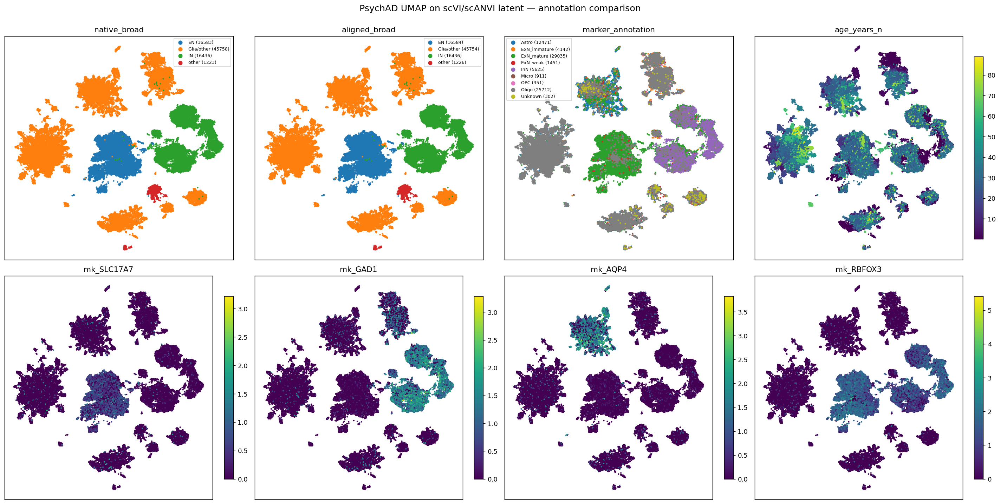
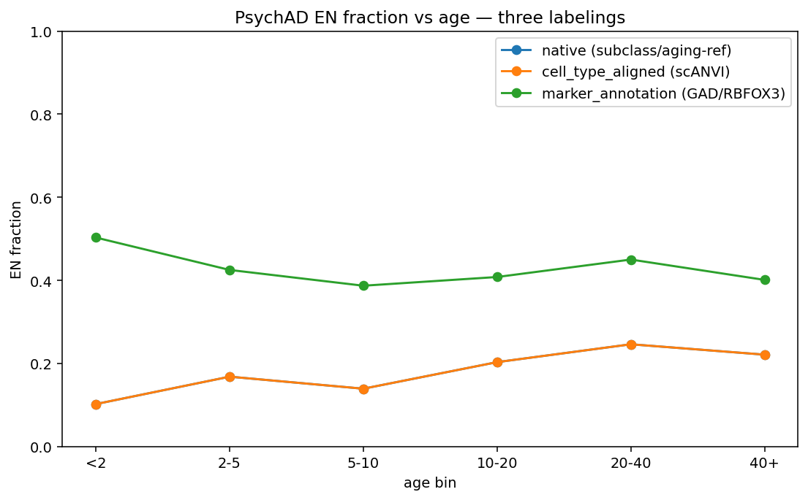

# PsychAD cell-type annotation: provenance, comparison, and recommendation

_Companion to `REPORT.md`. Addresses: what exactly is the "marker-based" annotation, where did it
come from, and which labels should the within-EN analysis use?_ · pushed to github `main`.

## Why this matters

PsychAD was built for dementia/aging studies, and its **native** cell-type labels come from an
**aging reference**. If young-donor neurons are mislabeled, any "within-EN" developmental analysis
could be measuring a labeling artefact rather than biology. There are **three** labelings in play,
with very different provenance — and an earlier draft of `REPORT.md` conflated two of them. This
document sets the record straight with code-level provenance and UMAP evidence.

## The three labelings (provenance)

| label | where it comes from | depends on aging reference? | depends on scVI/scANVI embedding? |
|---|---|---|---|
| **native** `cell_type_raw` (= PsychAD `subclass`) | PsychAD's own published annotation (aging/dementia reference) | **Yes** (it *is* the reference) | No |
| **`cell_type_aligned`** | scANVI label transfer, **trained on `cell_type_raw`** (config `PsychAD_noage_tuning5.yaml`: `scanvi_label_transfer.label_column: cell_type_raw`), run on the scVI latent | **Yes** — inherits the native reference as training labels | Yes (scVI latent + scANVI) |
| **`marker_annotation`** | `code/annotation_by_markers.py` — a hard-threshold marker classifier on **raw counts**, read directly from the raw per-dataset h5ads via h5py | **No** | **No** |

### Exact logic of `marker_annotation` (`code/annotation_by_markers.py`)

Per cell, on **raw integer counts** (PsychAD: HBCC/Aging h5ads; the `manual_annotations.parquet`
sidecar is its cached output), applied in this order:

1. **InN** if `max(GAD1, GAD2, SLC32A1) ≥ 10` — the deliberately high "GAD>10" cutoff (reduces
   ambient-RNA false positives).
2. **ExN** if `RBFOX3 ≥ 1` or `DCX ≥ 1` (neuron-exclusive; overrides glial signal as ambient):
   `DCX`-only → **ExN_immature**; `RBFOX3` → **ExN_mature**.
3. **Glia** (only if no neuronal marker): Astro (`AQP4`/`GFAP`) > Oligo (`MBP`/`PLP1`) >
   Micro (`CX3CR1`/`P2RY12`) > OPC (`PDGFRA`), each at `≥ 1` count.
4. **ExN_weak** if `RBFOX1 ≥ 1` and no glia.
5. else **Unknown**.

So `marker_annotation` is genuinely **independent** of both the aging reference and the scANVI
embedding — but it is a crude per-cell classifier with one important caveat: it is **dropout-/
depth-sensitive**. A real neuron whose single-cell `RBFOX3`/`DCX` counts happen to be 0 (common at
low depth, e.g. V2 or shallow cells) is *not* called ExN — it falls to glia or **Unknown**. So
`marker_annotation` EN fractions are a **lower bound** that degrades with sequencing depth.

## What the analysis actually used

- **Steps 1–2 (within-EN trajectory & per-gene program)** used **`cell_type_aligned`** (EN subtype
  labels: EN_L2_3_IT, …). These are **reference-derived** (scANVI trained on the native subclass) —
  *not* reference-independent. The earlier `REPORT.md` Appendix wording ("independent of the aging
  reference") was correct for `marker_annotation` but was wrongly implied for the subtype labels;
  this is now corrected.
- **The composition sanity check (A1)** used **`marker_annotation`** (reference-independent) — this
  is the appropriate, conservative check that young EN fractions are not absurd.
- **The purity check (A2)** showed the `cell_type_aligned` EN pseudobulks express EN markers high /
  IN+glia markers low at all ages — i.e. whatever its subtype-level accuracy, `cell_type_aligned`
  EN is genuinely *neuronal*.

**Which conclusions are / aren't robust to this.** The **deflationary** result ("C3↔age is
composition; no within-neuron C3 program") is robust — it is also reproduced by the independent
`grn_dev_diagnostics` line using native `cell_class == Excitatory` + raw counts, and it concerns the
C3↔maturity contrast collapsing *once you are within neurons at all*, which holds for any reasonable
EN subset. The **adolescent-dip** claim is **not** robust to the EN definition: a dip hypothesised to
live in *late-maturing* neurons is exactly the population `cell_type_aligned` discards (see below),
so the dip must be re-tested with a marker-based, immature-inclusive definition before it can be
believed or dismissed.

## UMAP comparison (s07, job 30337068)

UMAP computed on the **scANVI latent space** (`obsm['X_scANVI']`; the integrated object also carries
`X_scVI`, `X_pca_*`, and precomputed `X_umap_*`) — the same embedding used for label transfer — on
an 80k-cell subsample (young-oversampled so <10y cells are visible). Coloured by native / aligned /
marker labelings, by age, and by **ground-truth marker genes** (SLC17A7, GAD1, AQP4, RBFOX3,
log1p-CPM from raw counts).

Two visual facts:
- **`native_broad` and `aligned_broad` are essentially identical** — scANVI simply reproduces the
  native subclass. Both label a large fraction of the map as glia/other.
- The **SLC17A7+ / RBFOX3+ neuron territory is larger than the EN-labeled region**: cells that are
  clearly excitatory by marker expression are labeled glia/IN by native/aligned.

### EN fraction vs age — the three labelings diverge sharply

| age bin | native = aligned EN frac | marker EN frac |
|---|---|---|
| <2 | **0.10** | 0.50 |
| 2–5 | 0.17 | 0.42 |
| 5–10 | 0.14 | 0.39 |
| 10–20 | 0.20 | 0.41 |
| 20–40 | 0.25 | 0.45 |
| 40+ | 0.22 | 0.40 |

Native/aligned under-call EN at **all** ages (worst in young: 10% vs 50% at <2y). This is the origin
of the "~5–10% EN in young donors" anomaly — a **labeling** artefact, not biology.

### Where the disagreement is: young (<10y) native × marker confusion (row-normalised)

| native broad | →ExN_mature | →ExN_immature | →InN | →Oligo | →Astro |
|---|---|---|---|---|---|
| **EN** | 0.95 | 0.01 | 0.00 | 0.02 | 0.01 |
| **IN** | **0.54** | 0.05 | 0.37 | 0.02 | 0.01 |
| **Glia/other** | 0.08 | **0.16** | 0.00 | 0.42 | 0.23 |

- Cells the native reference calls **EN are 95% marker-ExN** → consistent (both agree these are
  neurons).
- **54% of natively-"IN" young cells are RBFOX3+** and **~24% of natively-"glia" young cells** too.
  _Read with the correction below:_ because RBFOX3 is **pan-neuronal**, a native-IN cell being
  RBFOX3+ is *expected* and does **not** by itself prove native mislabels it — so this crosstab is
  ambiguous, and the excitatory-**specific** SLC17A7-vs-GAD1 view (`REPORT_young_umaps.md`) is needed
  to tell whether the contested cells are truly excitatory or GAD-dropout interneurons.

> ⚠️ **Update — the marker classifier is NOT trustworthy for EN% either.** The young-donor UMAP
> analysis (`REPORT_young_umaps.md`) shows its "ExN = RBFOX3≥1 & GAD<10" rule uses **RBFOX3 (NeuN),
> a pan-neuronal marker**, so it absorbs GAD-dropout interneurons and ambient-RBFOX3 OPCs: 44% of
> its PsychAD "EN" calls are natively IN_SST/VIP/PVALB, 28% glia/OPC. So the "~40–50% EN, the
> trustworthy number" claim above is **withdrawn** — marker *over*-calls EN, native (aging ref)
> over-calls IN, and **neither is reliable for young EN%**. Use excitatory-**specific** markers
> (SLC17A7/SATB2 vs GAD1) instead.

## The consequence for the dip — and the recommendation

The within-EN analyses in `REPORT.md` (Steps 1–2 and the `within_EN` dip level) used
`cell_type_aligned` (≈ native). In young donors that is unreliable two ways: it is **mature-biased**
(discards immature/late-maturing neurons) *and* it **mislabels young excitatory neurons as
interneurons** (native young EN:IN ≈ 16:36, biologically backwards). **If an adolescent "dip" lives
in late-maturing neurons, that is exactly the population these labels mishandle** — so the current
within-EN/dip results cannot settle the late-maturing hypothesis, especially in PsychAD.

**Recommendation** (revised after the young-UMAP finding)
- **EN membership:** define ExN by **excitatory-specific** markers — `SLC17A7` (and/or `SATB2`)
  dominant over `GAD1/GAD2` (e.g. `SLC17A7 ≥ 1` & `SLC17A7 > GAD1`) — *not* RBFOX3 and *not*
  `cell_type_aligned`. Use `DCX`/`STMN2` to *include* immature neurons. Report sensitivity to the gate.
- **Subtype/layer:** `cell_type_aligned` only as a covariate within SLC17A7-confirmed EN; young
  subtype labels are unvalidated.
- **Decisive next analysis (planned):** per-cell, define ExN by SLC17A7-vs-GAD1 gating, split
  **mature vs immature** (RBFOX3 vs DCX/STMN2), and compute the C3 age curve within each — especially
  in PsychAD — to test directly whether a dip is carried by late-maturing neurons. Combine cohorts
  only on the batch-corrected `scanvi_normalized` layer.
