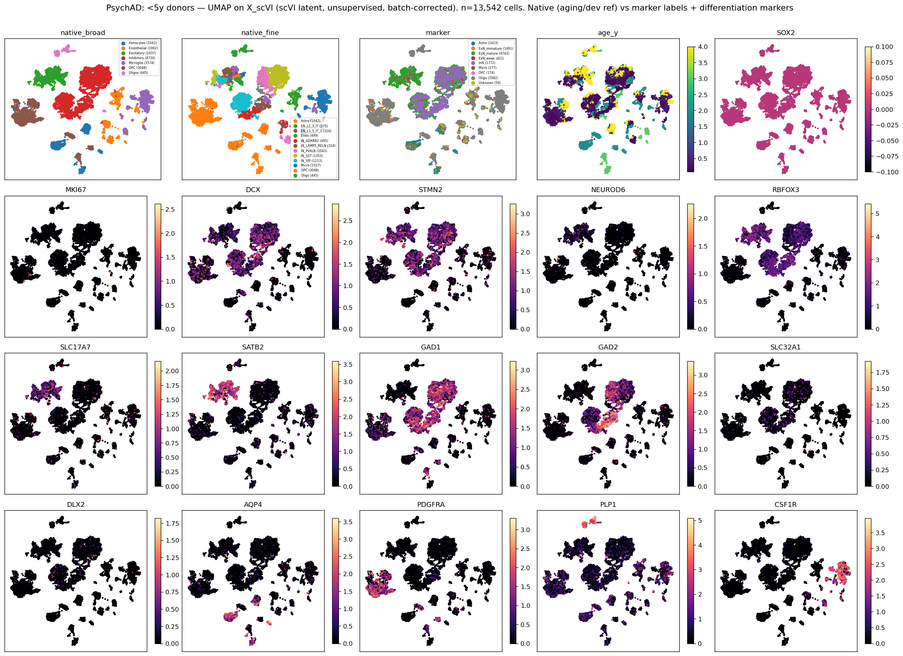
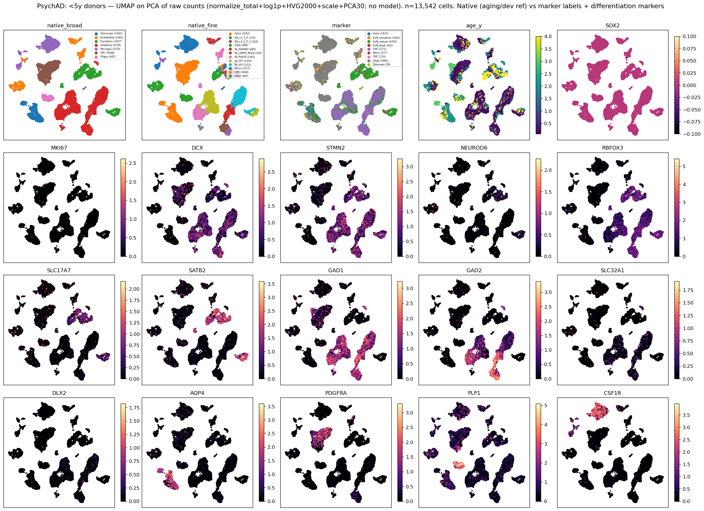
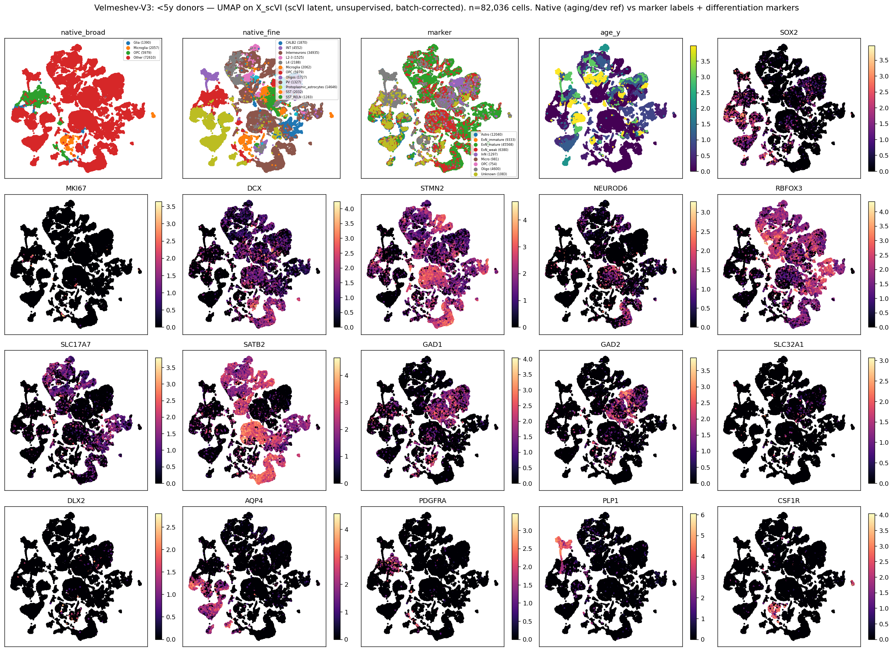
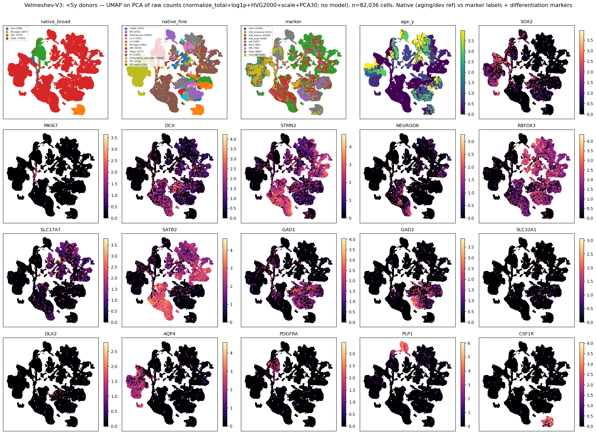
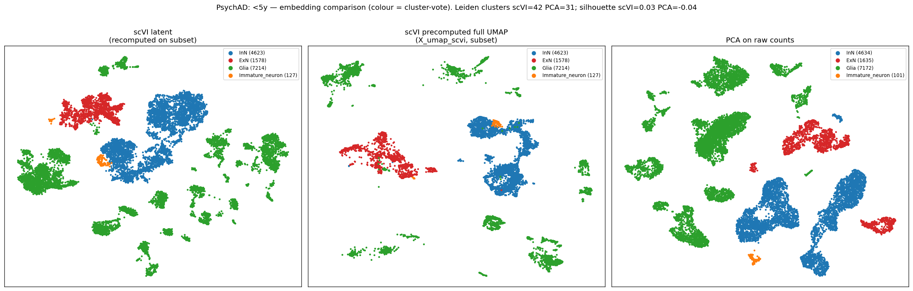
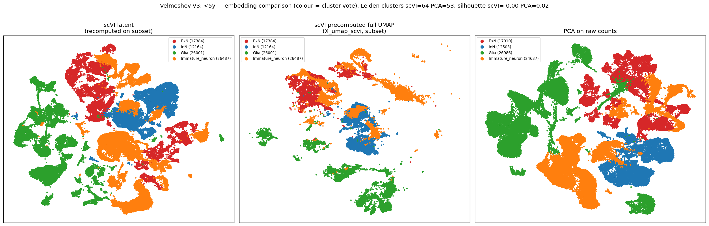
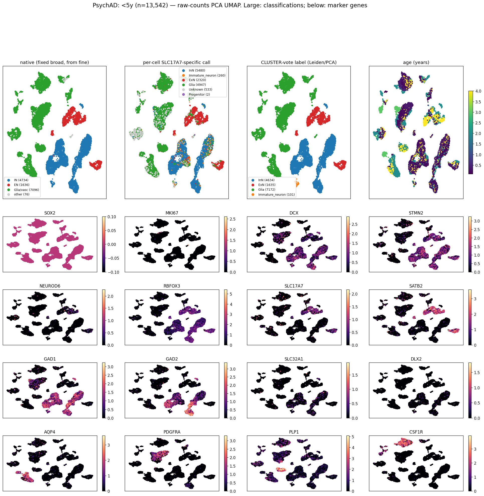
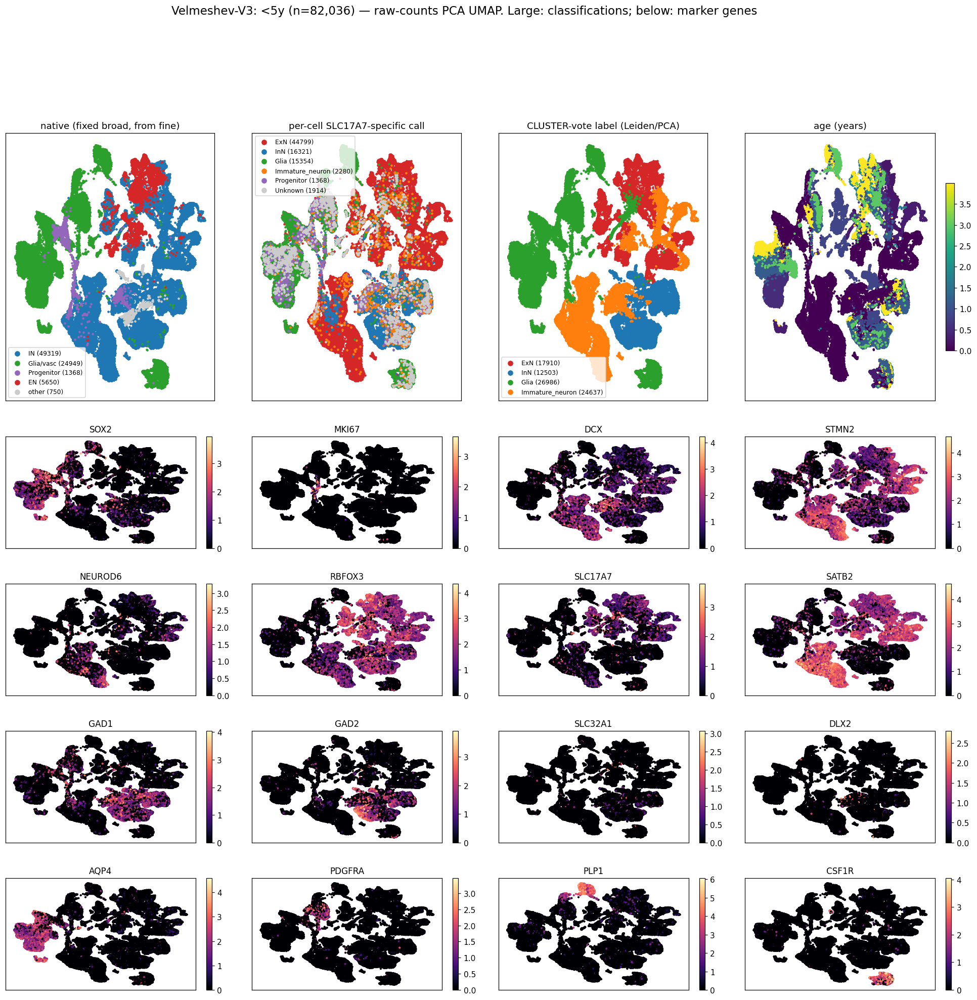

# Young-donor (<5y) UMAPs: does the ExN definition hold up?

_Companion to `REPORT.md` / `REPORT_annotation.md`. Dedicated visual check of cell-type labeling in
the youngest donors, where the aging-reference labels are most suspect._ · github `main`.

## Question

In PsychAD, native labels (and `cell_type_aligned`, scANVI-trained on them) call only ~10% of <2y
cells excitatory, vs ~50% by a marker classifier (`REPORT_annotation.md`). Is the native labeling
*wrong* in young donors, and does the discrepancy make visual sense? We look at the **youngest
donors (<5y)** directly, per dataset, and ask whether the unsupervised clusters agree with the
native labels or with the marker labels — using the differentiation markers as ground truth.

## Method (be explicit)

- **Cells:** ALL cells from donors aged **<5y**, per dataset, taken from the integrated objects.
  PsychAD = `PsychAD_noage_tuning5`; Velmeshev-V3 = `Vel_prepost_noage_tuning5` filtered to
  `chemistry == V3` (Herring + Ramos sub-sources; excludes V2-U01).
- **UMAP representation — two versions shown:**
  1. **scVI latent** (`X_scVI`): the *unsupervised*, batch-corrected scVI embedding from each
     dataset's integration run. We use scVI, **not** scANVI, because scANVI is trained on the native
     labels we are scrutinising; scVI clusters independently of them.
  2. **PCA on raw counts** (no model): the young subset's own counts →
     `normalize_total(1e4)` → `log1p` → `highly_variable_genes(2000)` → `scale` → `PCA(30)` →
     `neighbors`+`umap`. This is the most unbiased view — *if young-donor labels are wrong, a plain
     PCA should show it without any scVI/scANVI involvement.*
  Both are recomputed on the <5y subset only (scanpy defaults, n_neighbors=15).
- **Labels shown:** native broad (`cell_class`), native fine (`cell_type_raw`/`subclass` for PsychAD,
  `Cell_Type` for Velmeshev), and our **marker** label computed here from raw counts with the
  `code/annotation_by_markers.py` logic (InN if max(GAD1,GAD2,SLC32A1)≥10; ExN_mature if RBFOX3≥1;
  ExN_immature if DCX≥1 & RBFOX3<1; glia by AQP4/GFAP/MBP/PLP1/CX3CR1/P2RY12/PDGFRA≥1).
- **Marker genes (log1p CPM):** differentiation axis — SOX2 (progenitor), MKI67 (cycling), DCX /
  STMN2 (immature/migrating neuron), NEUROD6 (neuronal diff.), RBFOX3 (mature neuron); ExN identity —
  SLC17A7, SATB2; InN identity — GAD1, GAD2, SLC32A1, DLX2; glia — AQP4, PDGFRA, PLP1, CSF1R.

## Headline finding (the labels are worse than "native under-calls EN")

Comparing native labels to the marker classifier *and* to the excitatory-**specific** marker SLC17A7
(vs the pan-neuronal RBFOX3) overturns the earlier framing:

- **`marker_annotation` over-calls EN**, because its "ExN = RBFOX3≥1 & GAD<10" rule uses **RBFOX3
  (NeuN), a *pan-neuronal* marker**. It therefore sweeps in **interneurons with GAD dropout** and
  ambient-RBFOX3 OPCs. Of the cells it calls "EN": in **PsychAD** 44% are natively IN_SST/VIP/PVALB
  and 28% native glia/OPC; in **Velmeshev** 65% are natively "Interneurons".
- **Native PsychAD (aging ref) gives a biologically impossible EN:IN ratio in young donors** — 16%
  EN vs **36% IN** (more interneurons than excitatory, the reverse of real cortex ~80:20).
- So **neither label is reliable for young-donor EN%.** The earlier claim ("marker gives the
  trustworthy ~40–50% EN") is **withdrawn**. Excitatory-**specific** markers (SLC17A7/SATB2 vs
  GAD1/GAD2) help — but, as the cluster analysis below (s10) shows, **SLC17A7 alone *under*-counts**
  (it is a *mature* marker that immature excitatory neurons don't yet express), so the honest
  conclusion is that young EN identity is **intrinsically ambiguous** and needs cluster/trajectory
  methods, not any single cutoff.

The same cluster structure and marker-gene territories appear in **both** the scVI-latent and the
**raw-counts PCA** UMAPs (below), so this is real biology, not a model artefact — you do *not* need
scVI to see it.

## PsychAD (<5y, n=13,542)

UMAP on scVI latent:

UMAP on raw-counts PCA (no model):

Label composition (<5y):

| labeling | EN | IN | Glia/vasc | other/unknown |
|---|---|---|---|---|
| native (aging ref, fine→broad) | **0.16** | **0.36** | 0.46 | 0.02 |
| marker (RBFOX3/GAD) | 0.49 | 0.13 | 0.37 | 0.00 |

Of **marker-"EN"** cells: 27% native-EN, **44% native-IN** (top: OPC, IN_SST, IN_VIP, IN_PVALB),
28% native-glia. Read the figures: the **SLC17A7/SATB2** territory is the true excitatory island; the
**GAD1/GAD2/SLC32A1/DLX2** territory is interneurons; **SOX2/MKI67** mark a progenitor pole and
**DCX/STMN2/NEUROD6** an immature-neuron region (the hypothesised late-maturing population). The
adjudication to make visually: do the contested native-IN / marker-EN cells sit in the **SLC17A7+**
island (→ native mislabels young EN as IN) or the **GAD1+** territory (→ marker over-calls)?

## Velmeshev-V3 (<5y, n=82,036)

UMAP on scVI latent:

UMAP on raw-counts PCA (no model):

Velmeshev's native labels come from a **developmental** atlas. At the **broad** level it collapses
young cells into Glia/Other (developmentally appropriate — many are progenitors/immature), so use the
**fine** labels (`native_fine` panel). Even so, the fine labels call **50% of <5y cells
"Interneurons"** — also implausibly IN-heavy — and 65% of marker-"EN" cells are natively
"Interneurons". So the *same* RBFOX3-pan-neuronal over-call + unreliable young IN labels appear here
too; this is **not** a PsychAD-only problem, though PsychAD's aging reference is the worse of the two.

## Cluster-based labeling & embedding quality (s10)

Following the request to use an SLC17A7-**specific** definition, label by **clusters** not per-cell
cutoffs, fix Velmeshev's broad labels, enlarge the classification panels, and judge whether the
scVI-UMAP fragmentation reflects a bad embedding.

**Fixed native broad labels.** Velmeshev's stored broad column is `{Glia, Microglia, OPC, Other}` —
**no EN/IN class** (all neurons → "Other"); PsychAD's is fine. Both broad labels here are now derived
from the **fine** labels.

**Fragmentation = a UMAP-recompute artefact, not a bad embedding.**

Three embeddings of the same <5y cells (colour = cluster-vote): (left) scVI latent **recomputed on
the subset** — fragmented; (middle) the **precomputed full-data scVI UMAP** subset to these cells —
coherent; (right) **raw-counts PCA** — coherent. So the s09 fragmentation was a
**recompute-on-subset artefact**; the scVI embedding is fine. Quantitatively, Leiden over-segments in
**both** representations (PsychAD 42 scVI / 31 PCA; Velmeshev 64 / 53) and the **silhouette of
marker-based labels ≈ 0 in both** (PsychAD 0.03 / −0.04; Velmeshev −0.00 / 0.02) — low separation in
*both* spaces reflects the **immature, still-differentiating cells**, not scVI.

**Cluster-based labels work and are the right approach.** Leiden clusters labeled by dominant marker
*signature* track the marker-gene territories cleanly (main figures): SLC17A7/SATB2/NEUROD6 → ExN,
GAD1/GAD2/SLC32A1/DLX2 → IN, AQP4/PLP1/PDGFRA/CSF1R → glia, SOX2/MKI67 → progenitors, DCX/STMN2 →
immature. Cluster-vote on model-free **PCA** is preferable to per-cell cutoffs (averages out dropout)
and to **scANVI** (trained on the unreliable reference labels — avoid for young cells).

**The deeper finding: young EN identity is *intrinsically* ambiguous.** SLC17A7 (VGLUT1) is a
**mature** excitatory marker — immature excitatory neurons barely express it. So SLC17A7 gating
(and the cluster-vote) puts most young excitatory-lineage cells in the **Immature/DCX+** pool, not
"ExN": PsychAD cluster-vote = ExN 12% / InN 34% / Glia 53%; Velmeshev = ExN 22% / **Immature 30%** /
IN 15% / Glia 33%. So:
- **RBFOX3** (pan-neuronal) → **over**-counts EN; **SLC17A7** (mature) → **under**-counts EN; and at
  <5y the truth is a large **immature/transitional pool that markers cannot confidently split into
  EN vs IN** (silhouette ≈ 0).

## Verdict & recommendation

1. **No single marker cutoff defines young EN.** RBFOX3 over-counts (pan-neuronal), SLC17A7
   under-counts (mature-only). Use **cluster-based** labeling with a maturation-aware scheme:
   ExN-lineage = SLC17A7/SATB2/NEUROD6 territory *including* the contiguous DCX+ immature pool that
   flows into it; IN-lineage = DLX2/GAD territory; progenitors = SOX2/MKI67 — but accept that some
   <5y cells are irreducibly ambiguous.
2. **Embedding is adequate; the scVI fragmentation was a viz artefact.** Cluster on raw-counts PCA
   (model-free) or the precomputed scVI UMAP; do **not** use scANVI for young-cell identity.
3. **Implication for the dip — important.** The "late-maturing ExN" the dip hypothesis needs are
   *exactly* this immature, marker-ambiguous pool. So a clean dip test **at the youngest ages is
   fundamentally limited**, not just a labeling fix. The dip's descending arm is on firmer ground at
   **~5–20y**, where excitatory neurons express mature identity; the <5y end is intrinsically
   uncertain. Practical path: (a) restrict the within-EN dip to ages with confident EN identity
   (≳5y), or (b) use a **pseudotime/trajectory** EN-lineage assignment (progenitor→immature→mature)
   rather than discrete labels, then test C3 along maturation × age.
4. This **strengthens** the `REPORT.md` caveat: the within-EN/dip results used `cell_type_aligned`
   (≈ native), unreliable in young donors; redo with cluster/trajectory-based EN-lineage and restrict
   firm claims to ages ≳5y.
