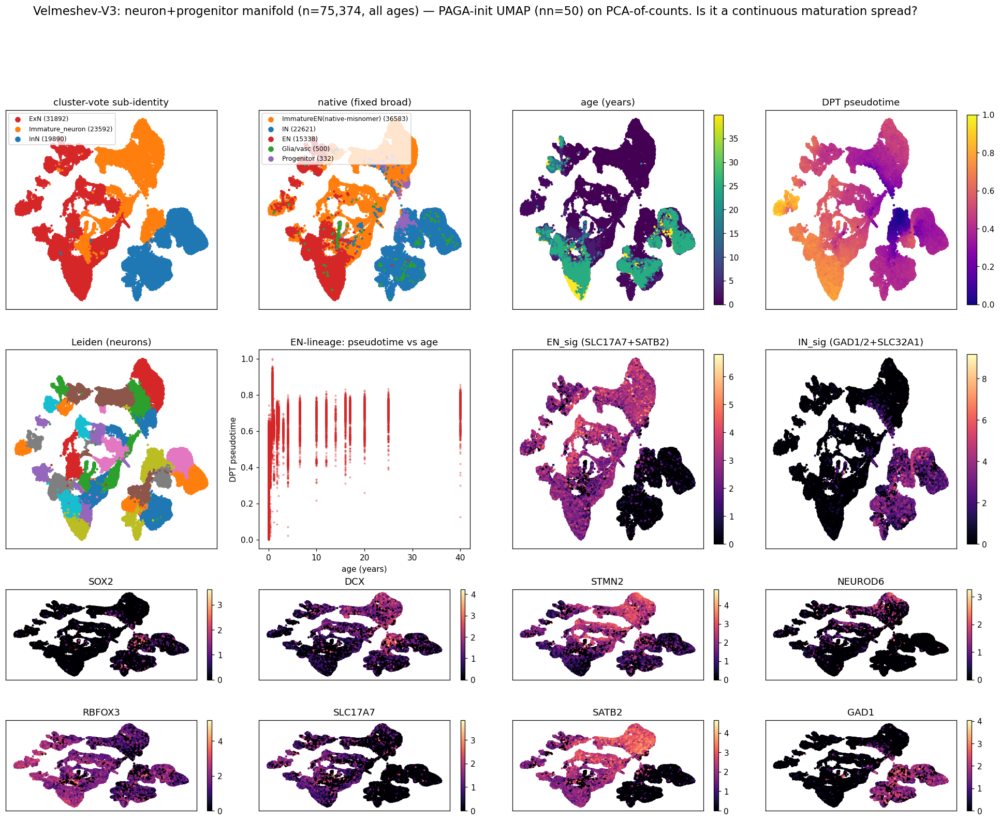
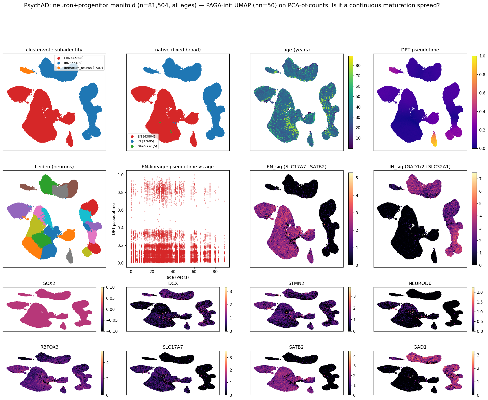
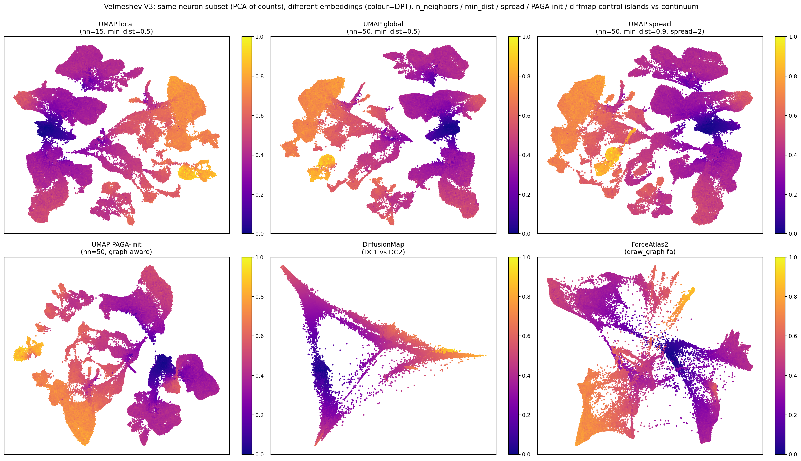
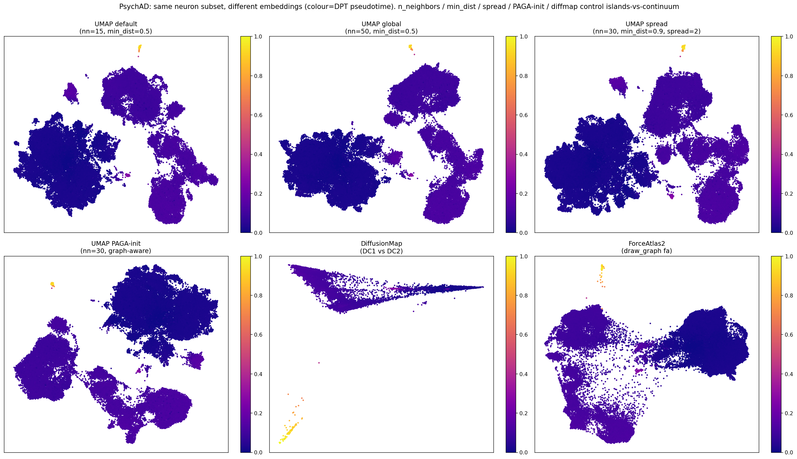
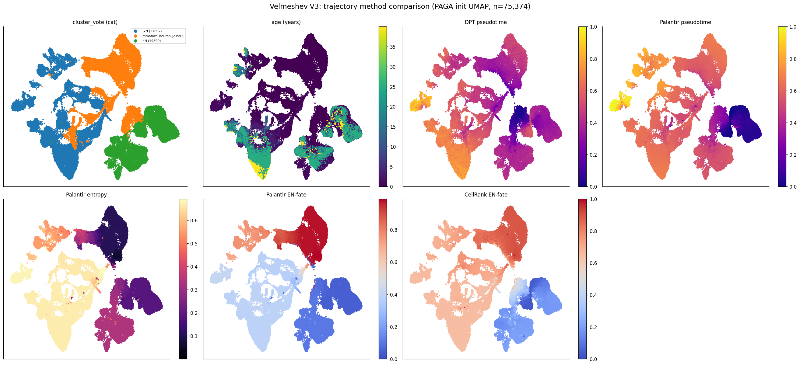
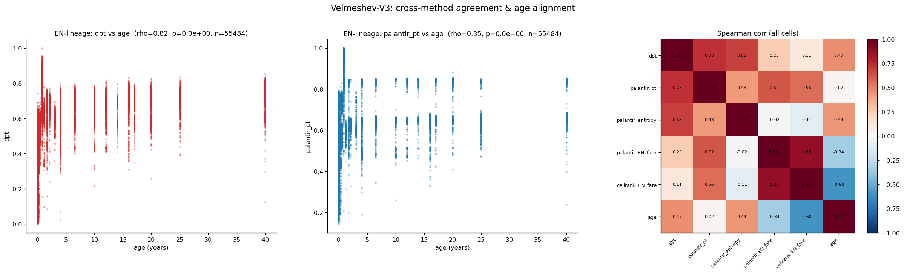
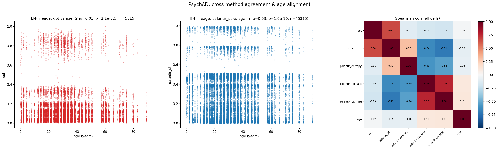

# Young-donor (<5y) UMAPs: does the ExN definition hold up?

_Companion to `REPORT.md` / `REPORT_annotation.md`. Dedicated visual check of cell-type labeling in
the youngest donors, where the aging-reference labels are most suspect._ · github `main`.

## Question

In PsychAD, native labels (and `cell_type_aligned`, scANVI-trained on them) call only ~10% of <2y
cells excitatory, vs ~50% by a marker classifier (`REPORT_annotation.md`). Is the native labeling
*wrong* in young donors, and does the discrepancy make visual sense? We look at the **youngest
donors (<5y)** directly, per dataset, and ask whether the unsupervised clusters agree with the
native labels or with the marker labels — using the differentiation markers as ground truth.

## Method (be explicit)

- **Cells:** ALL cells from donors aged **<5y**, per dataset, taken from the integrated objects.
  PsychAD = `PsychAD_noage_tuning5`; Velmeshev-V3 = `Vel_prepost_noage_tuning5` filtered to
  `chemistry == V3` (Herring + Ramos sub-sources; excludes V2-U01).
- **UMAP representation — two versions shown:**
  1. **scVI latent** (`X_scVI`): the *unsupervised*, batch-corrected scVI embedding from each
     dataset's integration run. We use scVI, **not** scANVI, because scANVI is trained on the native
     labels we are scrutinising; scVI clusters independently of them.
  2. **PCA on raw counts** (no model): the young subset's own counts →
     `normalize_total(1e4)` → `log1p` → `highly_variable_genes(2000)` → `scale` → `PCA(30)` →
     `neighbors`+`umap`. This is the most unbiased view — *if young-donor labels are wrong, a plain
     PCA should show it without any scVI/scANVI involvement.*
  Both are recomputed on the <5y subset only (scanpy defaults, n_neighbors=15).
- **Labels shown:** native broad (`cell_class`), native fine (`cell_type_raw`/`subclass` for PsychAD,
  `Cell_Type` for Velmeshev), and our **marker** label computed here from raw counts with the
  `code/annotation_by_markers.py` logic (InN if max(GAD1,GAD2,SLC32A1)≥10; ExN_mature if RBFOX3≥1;
  ExN_immature if DCX≥1 & RBFOX3<1; glia by AQP4/GFAP/MBP/PLP1/CX3CR1/P2RY12/PDGFRA≥1).
- **Marker genes (log1p CPM):** differentiation axis — SOX2 (progenitor), MKI67 (cycling), DCX /
  STMN2 (immature/migrating neuron), NEUROD6 (neuronal diff.), RBFOX3 (mature neuron); ExN identity —
  SLC17A7, SATB2; InN identity — GAD1, GAD2, SLC32A1, DLX2; glia — AQP4, PDGFRA, PLP1, CSF1R.

## Headline finding (the labels are worse than "native under-calls EN")

Comparing native labels to the marker classifier *and* to the excitatory-**specific** marker SLC17A7
(vs the pan-neuronal RBFOX3) overturns the earlier framing:

> **⚠️ CORRECTION (s11): Velmeshev `Interneurons` is a misnomer for *immature excitatory* cells.**
> The Velmeshev native label `Interneurons` (the single largest <5y group, 34,935 cells) is **95%
> SLC17A7-specific-excitatory by per-cell call and 36% ExN / 61% Immature by cluster-vote, with ~0%
> InN** — these cells express SLC17A7/SATB2 and lack GAD. Genuine inhibitory neurons are Velmeshev's
> *granular* SST/PV/VIP/CALB2/CCK/INT labels (which correctly vote 72–99% InN). So the "Velmeshev is
> 50–65% interneurons in young donors" appearance below is **a native-label naming artefact, not a
> marker over-call**: once `Interneurons`→immature-EN, young Velmeshev is appropriately
> excitatory-heavy. The bullet below is left as originally written but is **superseded for Velmeshev**.

- **`marker_annotation` over-calls EN**, because its "ExN = RBFOX3≥1 & GAD<10" rule uses **RBFOX3
  (NeuN), a *pan-neuronal* marker**. It therefore sweeps in **interneurons with GAD dropout** and
  ambient-RBFOX3 OPCs. Of the cells it calls "EN": in **PsychAD** 44% are natively IN_SST/VIP/PVALB
  and 28% native glia/OPC; in **Velmeshev** 65% are natively "Interneurons" (← *but per the correction
  above, those are genuinely excitatory; the PsychAD over-call from GAD-dropout interneurons still
  stands, the Velmeshev one does not*).
- **Native PsychAD (aging ref) gives a biologically impossible EN:IN ratio in young donors** — 16%
  EN vs **36% IN** (more interneurons than excitatory, the reverse of real cortex ~80:20).
- So **neither label is reliable for young-donor EN%.** The earlier claim ("marker gives the
  trustworthy ~40–50% EN") is **withdrawn**. Excitatory-**specific** markers (SLC17A7/SATB2 vs
  GAD1/GAD2) help — but, as the cluster analysis below (s10) shows, **SLC17A7 alone *under*-counts**
  (it is a *mature* marker that immature excitatory neurons don't yet express), so the honest
  conclusion is that young EN identity is **intrinsically ambiguous** and needs cluster/trajectory
  methods, not any single cutoff.

The same cluster structure and marker-gene territories appear in **both** the scVI-latent and the
**raw-counts PCA** UMAPs (below), so this is real biology, not a model artefact — you do *not* need
scVI to see it.

## PsychAD (<5y, n=13,542)

UMAP on scVI latent:

UMAP on raw-counts PCA (no model):

Label composition (<5y):

| labeling | EN | IN | Glia/vasc | other/unknown |
|---|---|---|---|---|
| native (aging ref, fine→broad) | **0.16** | **0.36** | 0.46 | 0.02 |
| marker (RBFOX3/GAD) | 0.49 | 0.13 | 0.37 | 0.00 |

Of **marker-"EN"** cells: 27% native-EN, **44% native-IN** (top: OPC, IN_SST, IN_VIP, IN_PVALB),
28% native-glia. Read the figures: the **SLC17A7/SATB2** territory is the true excitatory island; the
**GAD1/GAD2/SLC32A1/DLX2** territory is interneurons; **SOX2/MKI67** mark a progenitor pole and
**DCX/STMN2/NEUROD6** an immature-neuron region (the hypothesised late-maturing population). The
adjudication to make visually: do the contested native-IN / marker-EN cells sit in the **SLC17A7+**
island (→ native mislabels young EN as IN) or the **GAD1+** territory (→ marker over-calls)?

## Velmeshev-V3 (<5y, n=82,036)

UMAP on scVI latent:

UMAP on raw-counts PCA (no model):

Velmeshev's native labels come from a **developmental** atlas. At the **broad** level it collapses
young cells into Glia/Other (developmentally appropriate — many are progenitors/immature), so use the
**fine** labels (`native_fine` panel). Even so, the fine labels call **50% of <5y cells
"Interneurons"** — also implausibly IN-heavy — and 65% of marker-"EN" cells are natively
"Interneurons". So the *same* RBFOX3-pan-neuronal over-call + unreliable young IN labels appear here
too; this is **not** a PsychAD-only problem, though PsychAD's aging reference is the worse of the two.

## Cluster-based labeling & embedding quality (s10)

Following the request to use an SLC17A7-**specific** definition, label by **clusters** not per-cell
cutoffs, fix Velmeshev's broad labels, enlarge the classification panels, and judge whether the
scVI-UMAP fragmentation reflects a bad embedding.

**Fixed native broad labels.** Velmeshev's stored broad column is `{Glia, Microglia, OPC, Other}` —
**no EN/IN class** (all neurons → "Other"); PsychAD's is fine. Both broad labels here are now derived
from the **fine** labels.

**Fragmentation = a UMAP-recompute artefact, not a bad embedding.**

Three embeddings of the same <5y cells (colour = cluster-vote): (left) scVI latent **recomputed on
the subset** — fragmented; (middle) the **precomputed full-data scVI UMAP** subset to these cells —
coherent; (right) **raw-counts PCA** — coherent. So the s09 fragmentation was a
**recompute-on-subset artefact**; the scVI embedding is fine. Quantitatively, Leiden over-segments in
**both** representations (PsychAD 42 scVI / 31 PCA; Velmeshev 64 / 53) and the **silhouette of
marker-based labels ≈ 0 in both** (PsychAD 0.03 / −0.04; Velmeshev −0.00 / 0.02) — low separation in
*both* spaces reflects the **immature, still-differentiating cells**, not scVI.

**Cluster-based labels work and are the right approach.** Leiden clusters labeled by dominant marker
*signature* track the marker-gene territories cleanly (main figures): SLC17A7/SATB2/NEUROD6 → ExN,
GAD1/GAD2/SLC32A1/DLX2 → IN, AQP4/PLP1/PDGFRA/CSF1R → glia, SOX2/MKI67 → progenitors, DCX/STMN2 →
immature. Cluster-vote on model-free **PCA** is preferable to per-cell cutoffs (averages out dropout)
and to **scANVI** (trained on the unreliable reference labels — avoid for young cells).

**The deeper finding: young EN identity is *intrinsically* ambiguous.** SLC17A7 (VGLUT1) is a
**mature** excitatory marker — immature excitatory neurons barely express it. So SLC17A7 gating
(and the cluster-vote) puts most young excitatory-lineage cells in the **Immature/DCX+** pool, not
"ExN": PsychAD cluster-vote = ExN 12% / InN 34% / Glia 53%; Velmeshev = ExN 22% / **Immature 30%** /
IN 15% / Glia 33%. So:
- **RBFOX3** (pan-neuronal) → **over**-counts EN; **SLC17A7** (mature) → **under**-counts EN; and at
  <5y the truth is a large **immature/transitional pool that markers cannot confidently split into
  EN vs IN** (silhouette ≈ 0).

## Neuron-only manifold & trajectory feasibility (s11)

To get a trajectory-amenable embedding we first **remove the major non-neuronal classes** (rather
than trying to resolve EN vs IN up front): cluster the cells, vote each cluster neuronal/progenitor vs
glia using a **pan-neuronal** signature (RBFOX3 + DCX + STMN2 + NEUROD6, alongside EN/IN/Prog
signatures), keep neurons+progenitors, and recompute the embedding. The representation is **PCA(30) on
raw counts** (each dataset is treated as a single batch, so no scVI is used; `n_neighbors`=50),
stratified-subsampled to ~300k cells across all ages. Velmeshev's `Interneurons` is treated as
immature-EN (correction above). A compact neuron-manifold (`neuron_manifold.h5ad`: X_pca, neighbor
graph, diffmap, labels, age, signatures, markers) is written next to each `integrated.h5ad` for the
downstream trajectory-comparison pipeline (`code/trajectory/`).

Each manifold figure puts the **cell-label options side by side with age and pseudotime** on the same
PAGA-init UMAP: top row = `cluster-vote sub-identity` · `native (fixed broad)` · `age (years)` ·
`DPT pseudotime`; second row = Leiden, the `EN-lineage pseudotime-vs-age` scatter, and the EN/IN
signatures; bottom rows = the differentiation markers (SOX2→DCX/STMN2→NEUROD6→RBFOX3→SLC17A7/SATB2,
GAD1). This lets you read directly whether the labels, the age gradient, and the inferred maturation
ordering agree. In **Velmeshev** they do: the cluster-vote ExN/Immature territory coincides with the
SLC17A7/SATB2 + DCX gradient, age sweeps across it, and DPT runs along the same axis. In **PsychAD**
the labels are clean (ExN vs InN) but age and DPT are flat over a mature blob (no SOX2/DCX), so there
is no maturation axis to order.

### Method — how cluster-vote labeling works (full)

Labels are assigned **per Leiden cluster from averaged marker signatures**, never by a per-cell
cutoff. This is deliberate: single-cell counts are dropout-ridden (a real excitatory neuron often has
zero SLC17A7 UMIs), so per-cell thresholds (RBFOX3≥1, SLC17A7≥1, …) misclassify heavily in young/
immature cells; the cluster mean averages dropout out.

**(a) Per-cell signature scores** — for every cell, sum the log1p-CPM of a small marker panel into
five additive scores: `EN_sig` = SLC17A7+SATB2 (excitatory-specific); `IN_sig` = GAD1+GAD2+SLC32A1
(inhibitory); `Prog_sig` = SOX2+MKI67 (progenitor/cycling); `Imm_sig` = DCX+STMN2 (immature/migrating);
`Pan_sig` = RBFOX3+DCX+STMN2+NEUROD6 (pan-neuronal/neurogenic); `Glia_sig` = AQP4+PLP1+PDGFRA+CSF1R+
GFAP+MBP.

**(b) Average each signature within each Leiden cluster, then label the whole cluster by its dominant
signature** (`cluster_vote` in `s11`): the cluster is `Progenitor` if `Prog_sig` is its top score
(and ≥0.5); else `Immature_neuron` if `Imm_sig` exceeds both EN and IN; else `ExN` if `EN_sig ≥
IN_sig`, otherwise `InN`. Every cell inherits its cluster's label.

**(c) How the neuronal population was selected** (`vote_neuron_glia`): for each cluster compute a
neuronal score `max(EN_sig, IN_sig, Pan_sig)` and **keep the cluster if `neuronal ≥ Glia_sig`** (or if
it is progenitor-dominated); drop it as glia otherwise. The unit kept/dropped is the **cluster**, not
the cell. The `native_broad_fixed × kept` crosstab confirms this is clean: native `Glia/vasc` clusters
are 99.2% dropped, native `IN` 100% kept, native `ImmatureEN(native-misnomer)` 99.5% kept.

**(d) Why a few native-"glia" cells are retained.** Because selection is per-cluster, a handful of
cells carrying a native `glia` label sit inside clusters whose *average* expression is decisively
neuronal, so they are kept (≈0.1–0.3% of the kept pool; 210 cells in Velmeshev, 82 in PsychAD in the
<40y run). These are a mix of (i) doublets / ambient-contaminated cells that co-embed with neurons,
(ii) genuine native **mis-labels** (the aging-reference problem we are scrutinising), and (iii) a few
cluster-boundary cells. The fraction is tiny and the cluster mean is unambiguously neuronal, so
retaining them is harmless — but it is surfaced in the printed crosstab for transparency.

### Results

**1. Subsetting works.** Pan-neuronal cluster-vote cleanly keeps the neuronal lineage and drops glia.
In the PCA-on-counts run (all ages, 200k-cell stratified subsample per dataset): PsychAD kept 81,504
(41%), Velmeshev 75,374 (54%). Sub-identity of the kept pool differs sharply between datasets and
**this is the key result**:

| dataset (neurons kept) | ExN | Immature | InN | progenitors / SOX2 |
|---|---|---|---|---|
| **Velmeshev-V3** | 31,892 | **23,592** | 19,890 | present (SOX2/DCX/STMN2 gradient) |
| **PsychAD** | 43,808 | **1,507** | 36,189 | ~absent (SOX2 ≈ 0 everywhere) |

**Velmeshev has a real developmental continuum; PsychAD does not.** PsychAD neurons (all ages) are
essentially *all mature* — no SOX2, negligible DCX — so it can only supply the **mature end** of a
trajectory, not the maturation axis itself. Any pseudotime/dip analysis of the *maturing* EN lineage
must be anchored in **Velmeshev** (a true developmental atlas), with PsychAD as mature-end replication.

**2. Diffusion-map pseudotime tracks age strongly in Velmeshev — and PCA-of-counts beats scVI for
this.** DPT (rooted at the progenitor/immature pole) along the EN lineage (ExN + immature) gives
**Spearman ρ(pseudotime, age) = +0.825, p≈0 (n=55,484)** in Velmeshev on the PCA-of-counts manifold —
a far cleaner maturation ordering than the earlier scVI-latent run (ρ=+0.35). The reason is
principled: the **scVI latent is trained to remove batch and encode discrete identity, which
*suppresses* the continuous maturation variance** we want; **PCA on raw counts preserves it**. In
PsychAD the same correlation is **+0.01** (noise: only 1,507 immature cells, no axis to anchor a
trajectory). So trajectory analysis **is feasible — but only in Velmeshev, and on PCA-of-counts**.

**3. Why the UMAPs are islands, not a continuous spread (answered empirically).**

The same neuron subset (PCA-of-counts) under six embeddings (coloured by DPT). The finding: **UMAP
fragments into islands *regardless of parameters*** — local (`n_neighbors`=15), global
(`n_neighbors`=50), spread (`min_dist`=0.9, `spread`=2), and even **PAGA-initialised** all stay
islanded. So the islands are **not** merely a parameter choice; they reflect genuinely **discrete
cluster structure in the data** (present in PCA-of-counts too, so not a scVI artefact), which UMAP is
designed to *emphasise* (it optimises local neighbourhoods and exaggerates gaps). The parameters that
*do* exist and what they control:
- `n_neighbors` — local (low, more/tighter islands) vs global (high, more connected) structure;
- `min_dist` / `spread` — purely cosmetic compactness/scale of clumps;
- `init_pos='paga'` — seeds layout from cluster connectivity (helps, insufficient here).

The embedding that **does** give a continuous spread is the **diffusion map** (DC1×DC2): in Velmeshev
it resolves a clean **Y-shaped bifurcation** — a shared immature root splitting into two branches,
with DPT increasing along them — exactly the EN-vs-IN topology a trajectory method needs. **ForceAtlas2**
(force-directed) is intermediate (connected but noisier). **Conclusion: do trajectory work in
diffusion-map / DPT space (or ForceAtlas2), not UMAP.** UMAP is for visualization of discrete identity;
it structurally cannot show the maturation continuum even when one exists (as the Velmeshev diffmap
proves it does).

**4. The `Interneurons` correction, visualized.** In the Velmeshev neuron manifold the native panel's
`ImmatureEN(native-misnomer)` group (36,122 cells — the largest) sits squarely in the **EN_sig /
immature (SLC17A7+, DCX+) territory**, *not* the GAD1+ IN territory — confirming it is immature
excitatory, and that the earlier "IN-heavy young Velmeshev" was a naming artefact.

## Trajectory method comparison: PAGA→DPT vs Palantir vs CellRank2 (`code/trajectory/`)

A config-driven pipeline (`code/trajectory/run_trajectory.py`) runs all three on each
`neuron_manifold.h5ad` and cross-validates them: PAGA for topology, then **DPT**, **Palantir**, and
**CellRank2** for pseudotime / branch-fate, with a UMAP grid, PAGA graph, pseudotime-vs-age scatters,
and a Spearman heatmap. (CellRank's flagship GPCCA needs `petsc4py`, which is ABI-broken in the
container, so the pipeline falls back to the **CFLARE** estimator — eigendecomposition via ARPACK, no
PETSc — with terminal states set from the EN/IN signature poles.)

### Velmeshev-V3

- **DPT is the cleanest age-aligned maturation pseudotime:** EN-lineage **ρ(DPT, age) = 0.82**
  (n=55,484) — reproducing the s11 value. **Palantir pseudotime is positive but much noisier**
  (EN-lineage ρ=0.35); the two pseudotimes agree only moderately (ρ=0.73). Palantir's waypoint
  sampling evidently struggles on this islanded manifold where DPT (diffusion-based) does not.
- **The two independent branch-fate estimates agree strongly:** `palantir_EN_fate` ↔
  `cellrank_EN_fate` **ρ=0.88**, and visually the two EN-fate panels are nearly identical — so the
  EN-vs-IN fate assignment is robust to the method, *independent* of the pseudotime choice.
- **EN-fate declines with age** (cellrank −0.60, palantir −0.34 over all neurons): the young pool is
  immature-EN-dominated, consistent with the developmental composition.

### PsychAD

- **No method recovers an age-aligned pseudotime** (EN-lineage ρ(DPT,age)=0.01, Palantir 0.03). This
  is not a method failure — it is the **absence of a maturation axis**: PsychAD's neurons are
  essentially all mature (≈1.5k immature cells, no SOX2/DCX), so there is nothing to order. Confirms
  PsychAD is **mature-end replication only**.

**Recommendation for the C3 dip test:** use **DPT pseudotime on the Velmeshev EN lineage** (ExN +
immature) as the maturation axis (cleanest age alignment), and the (method-agreeing) **EN-fate
probability** to define soft EN-lineage membership. Then project the depth-robust C3 score
(`signed_logcpm`) along DPT and against age within pseudotime bins.

## Verdict & recommendation

1. **No single marker cutoff defines young EN.** RBFOX3 over-counts (pan-neuronal), SLC17A7
   under-counts (mature-only). Use **cluster-based** labeling with a maturation-aware scheme:
   ExN-lineage = SLC17A7/SATB2/NEUROD6 territory *including* the contiguous DCX+ immature pool that
   flows into it; IN-lineage = DLX2/GAD territory; progenitors = SOX2/MKI67 — but accept that some
   <5y cells are irreducibly ambiguous.
2. **Embedding is adequate; the scVI fragmentation was a viz artefact.** Cluster on raw-counts PCA
   (model-free) or the precomputed scVI UMAP; do **not** use scANVI for young-cell identity.
3. **Implication for the dip — important.** The "late-maturing ExN" the dip hypothesis needs are
   *exactly* this immature, marker-ambiguous pool. So a clean dip test **at the youngest ages is
   fundamentally limited**, not just a labeling fix. The dip's descending arm is on firmer ground at
   **~5–20y**, where excitatory neurons express mature identity; the <5y end is intrinsically
   uncertain. Practical path: (a) restrict the within-EN dip to ages with confident EN identity
   (≳5y), or (b) use a **pseudotime/trajectory** EN-lineage assignment (progenitor→immature→mature)
   rather than discrete labels, then test C3 along maturation × age.
4. This **strengthens** the `REPORT.md` caveat: the within-EN/dip results used `cell_type_aligned`
   (≈ native), unreliable in young donors; redo with cluster/trajectory-based EN-lineage and restrict
   firm claims to ages ≳5y.
5. **Trajectory is feasible — in Velmeshev only, on PCA-of-counts, in diffusion-map/DPT space (s11).**
   The neuron-only manifold gives a Velmeshev EN-lineage pseudotime that tracks age **ρ=+0.825** (vs
   +0.35 on the scVI latent — PCA-of-counts preserves the maturation variance scVI removes); PsychAD
   lacks the immature pool (ρ≈0; use it for the mature end only). UMAP cannot show the continuum at any
   parameter setting — use the diffusion map. **Next step (in progress):** the `code/trajectory/`
   pipeline runs PAGA→{DPT, Palantir, CellRank2} on these manifolds to cross-validate the pseudotime/
   branching, then project the depth-robust C3 score (`signed_logcpm`) along the Velmeshev EN-lineage
   pseudotime (and against age within pseudotime bins) — the principled dip test, replacing discrete
   age-binned pseudobulk.
