# Pairwise per-cell relationships: age, depth, maturity, C3+

**Date:** 2026-06-07 · script `u_pairwise_scatter.py` · data
`r_per_cell_cache_v4.parquet` (Donor_1400 excluded).

A step back from the modelling to look at the raw per-cell structure among
the four variables that drive the C3+ developmental analysis: **donor age**,
**UMI depth**, **maturity module** (mean log1p-CP10k of 9 post-mitotic
markers), and **per-cell C3+** (CPM). Each relationship is shown as a
3-panel hexbin (cohort order **PsychAD-V3 / Velmeshev-V3 / Velmeshev-V2**)
with the **Spearman ρ** annotated, first for all ExN cells, then for
upper-layer ExN only.

## Spearman ρ summary

**All ExN cells**

| relationship | PsychAD-V3 | Velmeshev-V3 | Velmeshev-V2 |
|---|---:|---:|---:|
| 1. depth vs age | +0.07 | −0.04 | +0.50 |
| 2. maturity vs age | +0.06 | −0.07 | +0.12 |
| 3. maturity vs depth | **+0.65** | **+0.64** | **+0.55** |
| 4. C3+ vs age | +0.07 | +0.01 | **−0.30** |
| 5. C3+ vs depth | **+0.66** | **+0.57** | +0.10 |
| 6. C3+ vs maturity | **+0.78** | **+0.74** | +0.40 |

**Upper-layer ExN only**

| relationship | PsychAD-V3 | Velmeshev-V3 | Velmeshev-V2 |
|---|---:|---:|---:|
| 1. depth vs age | +0.06 | −0.04 | +0.49 |
| 2. maturity vs age | +0.06 | −0.07 | +0.09 |
| 3. maturity vs depth | +0.60 | +0.64 | +0.52 |
| 4. C3+ vs age | +0.07 | +0.05 | −0.31 |
| 5. C3+ vs depth | +0.62 | +0.54 | +0.03 |
| 6. C3+ vs maturity | +0.73 | +0.69 | +0.34 |

Restricting to upper layer barely changes anything — every relationship is
layer-independent, confirming none of this is a layer-composition effect.

## Five things this makes plain

1. **The age axis is weak at the cell level.** depth–age, maturity–age and
   C3+–age are all ≈ 0 in the two V3 cohorts (|ρ| ≤ 0.07). The
   childhood→adolescence C3+ drop (donor-level fuzzy d ≈ +0.5) is **not**
   visible as a per-cell gradient in PsychAD-V3 or Vel-V3 — it is a small
   donor-level *mean* shift that only emerges after aggregation + the
   child/adol contrast. This is consistent with the modest raw magnitude
   (report §3.5) and is the honest reason the effect needs careful
   statistics.

2. **The dominant cell-level structure is cross-sectional, not
   developmental.** The strong correlations are all among depth ↔ maturity
   ↔ C3+ (ρ = 0.55–0.78), i.e. a single "bigger/deeper/more-mature cell has
   more synaptic transcript" axis. This axis **swamps** the age signal at
   the cell level.

3. **Only the shallow cohort shows the age effect per-cell.** Velmeshev-V2
   is the exception: C3+–age = −0.30 (clear decline), C3+–depth = +0.10
   (near zero). Because V2's depth range is compressed, the depth/maturity
   axis does *not* dominate, so the developmental decline shows through at
   the cell level. In the deep cohorts the same biology is buried under the
   depth/maturity axis (C3+–depth = +0.6).

4. **C3+ vs depth is mostly a deep-cohort phenomenon** (+0.66 / +0.57 vs
   V2's +0.10; upper-layer V2 falls to +0.03). That the C3+–depth coupling
   nearly vanishes where depth range is small is consistent with a large
   **technical** component (ambient dilution + under-detection of the few
   low-abundance high-weight C3+ genes), on top of the biological
   "mature cells have more synapses" component — see report §3.5.

5. **Maturity tracks depth (≈ +0.6) but not age (≈ 0).** The maturity
   module is ~40 % depth by rank, and essentially flat with age — which
   sets up the discussion below.

## Figures — all ExN cells

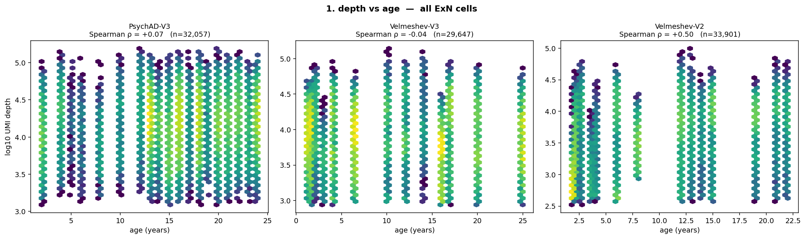
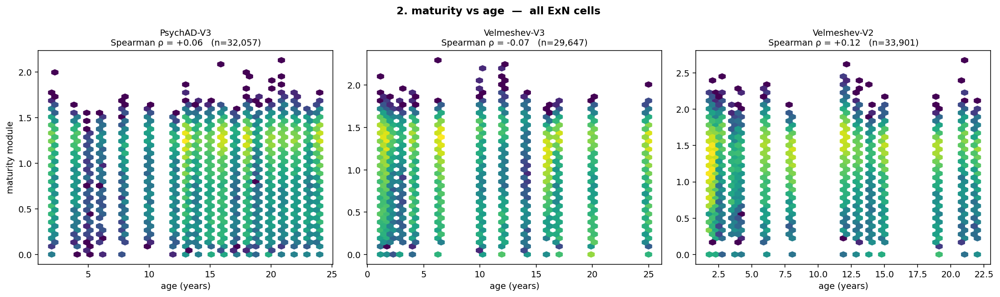
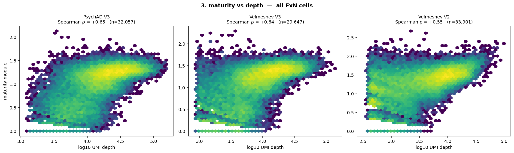
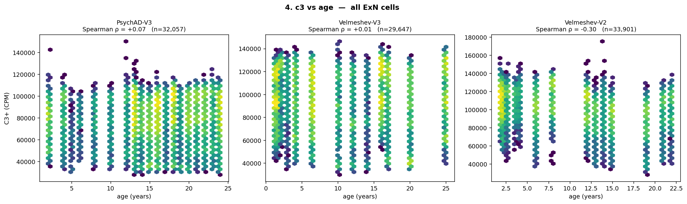
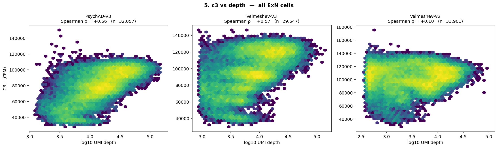
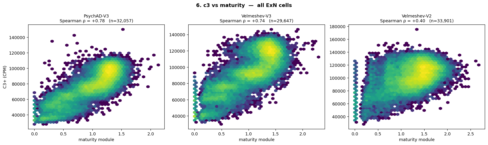

## Figures — upper-layer ExN only

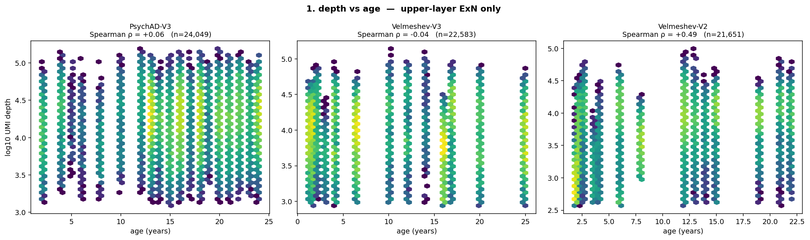
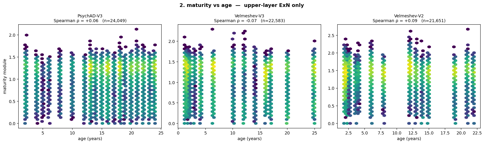
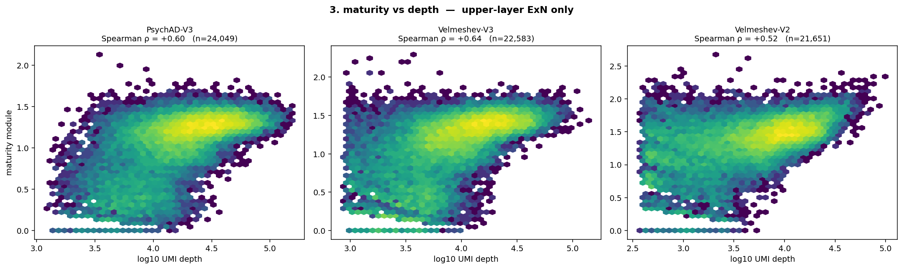
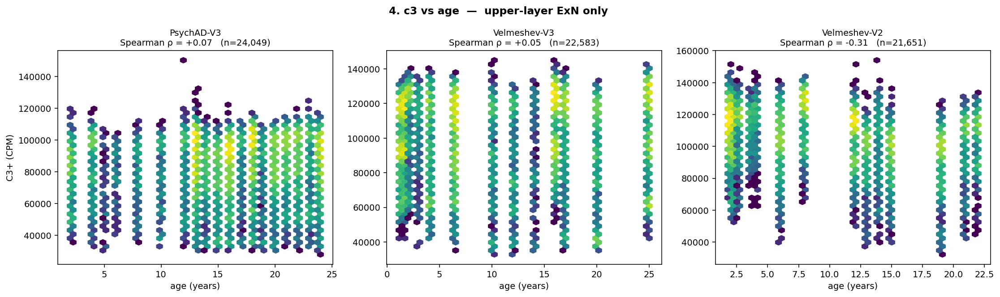
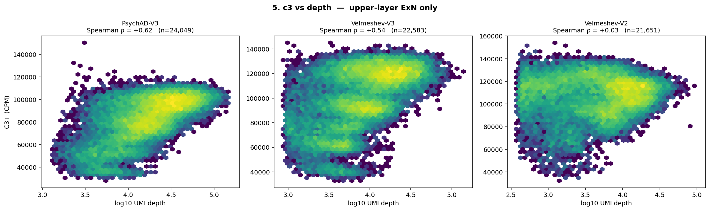
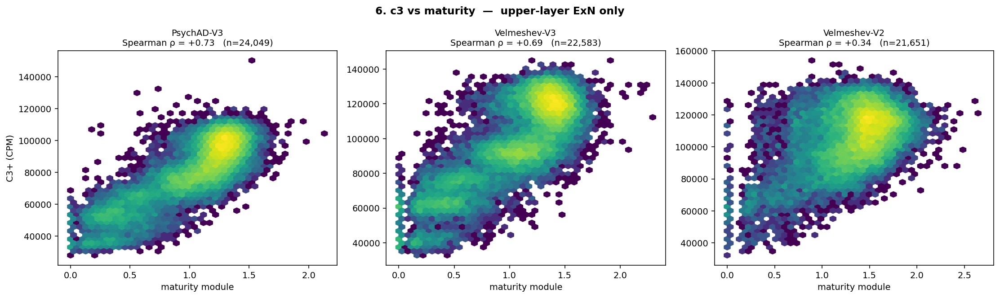

---

## Discussion — is "maturity" the right variable, and is our definition too narrow?

**Why do cells differ in module-maturity if it is flat with age?** The
cross-sectional spread in the 9-marker module is real but is *mostly not
developmental-age variance*. It is a mixture of: (i) **technical / depth**
(maturity–depth ρ ≈ 0.6 — shallow cells score low because the markers are
undetected, not because they are biologically immature); (ii) **cell
identity / layer** (the module includes fate TFs SATB2 = upper, BCL11B =
L5, so part of the axis is *which* subtype, not *how mature*); and (iii) a
small genuine **immature tail** (DCX⁺ / low-marker cells, present at low
frequency at every age). Technical + identity dominate; the genuine-
maturation sliver is thin — which is exactly why the module is flat with
age.

**The definition captures *fate* maturation, not *circuit* maturation.**
NEUROD2 / SATB2 / BCL11B fix neuronal identity right after cell-cycle exit;
NEFM / NEFH / SYT1 / SNAP25 / MAP2 come up during the first wave of neurite
outgrowth and synapse assembly. These mark the **neuroblast → postmitotic
neuron** transition, which is essentially complete prenatally / in infancy.
By the 1 y lower bound — let alone in DLPFC tissue — every excitatory neuron
has crossed it, so the module is at ceiling and flat. The biologically
interesting childhood→adolescence change is a *different, slower* process:
synaptic overproduction → pruning, dendritic/spine refinement, peri-neuronal
myelination, activity-dependent and metabolic maturation — **circuit
maturation**, which these markers do not track. Tellingly, UMI depth (cell
size / transcriptional output) crudely echoes this later growth, while the
fate module does not.

**C3+ is itself part of that later axis.** C3+ is enriched for synapse-
formation genes (NRXN1, NLGN1, GRIN2A, DLGAP1…), so "C3+ declines with age"
*is* a circuit-maturation readout. C3+ is closer to a circuit-maturation-
stage marker than the fate module is.

**Would a pseudotime maturity axis help?** Appealing, but with three
serious caveats:

1. **Circularity (the major risk).** If the dominant axis of age-related
   transcriptional change in postnatal DLPFC ExN *is* the synaptic program,
   any data-driven trajectory (DPT / diffusion / much of the scVI latent)
   will order cells along that synaptic axis — and stratifying C3+ by it is
   then tautological. A pseudotime maturity axis would have to be built on
   genes **set-disjoint from C3+**, or the result is circular.
2. **Pseudotime is ill-defined for terminally postmitotic cells.** DPT
   assumes a continuum from a progenitor; these cells are all already
   differentiated, so within 1–25 y there is no developmental trajectory to
   trace — it would latch onto the biggest axis of variance (quite possibly
   depth) and call it "time".
3. **We already have the clock.** For postmitotic cells, *donor age* is the
   maturation clock, measured directly. A per-cell maturity axis is only
   worth building if maturation is non-uniform across cells; the Vel-V2
   Kitagawa decomposition (§3.5) suggests the within-state decline is fairly
   uniform (largest in the immature tail), so there may be no strong hidden
   per-cell axis to recover.

**Recommendation.** Two cleaner paths than pseudotime:
(A) **Accept the reframe** — "maturity" as a per-cell axis is not the right
frame for postnatal DLPFC; age is the clock, C3+ *is* the circuit-maturation
readout, and the result is a roughly-uniform within-state synaptic decline.
(B) **If a moving maturity axis is wanted, curate it from independent
biology** — a circuit-maturation signature (dendritic/spine, myelination-
adjacent, activity-dependent, metabolic-switch genes) drawn from the
literature and explicitly disjoint from the C3+ gene set; confirm *its*
distribution shifts child→adol (unlike the fate module), then test whether
C3+ tracks it. This is the only way to obtain a "maturity whose distribution
changes with age" without the circularity trap. Pseudotime on the scVI
latent (report §6) remains an option but must be guarded against all three
caveats above.

### Artifacts
`u_all_*.png`, `u_upper_*.png` (12 figures), `u_correlation_summary.csv`.
