# Does AHBA C3+ track childhood→adolescent synaptic maturation in human DLPFC? — PsychAD vs Velmeshev/Herring

*Revised answer (2026-06-08): C3+ robustly indexes neuronal **maturation state**
(mature cells carry more C3+); evidence that it encodes a developmental **time**
signal across childhood/adolescence is **weak** once the Velmeshev-V2 technical
artefact and immature-interneuron contamination of the ExN pool are removed. See
§0 (framing) and §0.5 (revision).*

## 0. The question

**C3+ is externally derived.** It is the positive tail of the **third
spatial component (C3)** of the Allen Human Brain Atlas bulk-microarray
expression gradient (Dear et al. 2024 *Nature Neuroscience*) — a pattern
learned from *adult* post-mortem cortex, with **no developmental or
single-cell information used in its construction**. That externality is the
whole point of this analysis: aligning an adult-derived spatial gene
programme with a data-driven cell-maturation axis is **cross-validation
across independent data modalities**, not a circular re-discovery of the
same signal.

The biological question is:

> **How does C3+ relate to brain development — and is there evidence that it
> represents childhood + adolescent maturation of synaptic circuits, beyond
> the cell differentiation that is already complete at birth?**

This sits at the frontier of what is known. The field has well-characterised
transcriptional programmes for **early** cortical excitatory-neuron
differentiation (the fate/identity TFs — NEUROD2, SATB2, BCL11B — and the
first wave of synaptic genes), and these are largely complete by early
childhood. The genes that drive **later** circuit maturation across
childhood and adolescence — synaptic pruning, refinement, the protracted
rise-and-fall of synapse density that peaks in childhood and declines toward
adult levels — are **much less well defined**. The hypothesis under test is
that C3+, an adult spatial programme enriched for synaptic genes, may
capture part of that under-described late-maturation circuitry.

**Framing (first principles).** An earlier version of this work set out to
*confirm* a childhood→adolescent C3+ **decline**. That hypothesis was
motivated mainly by a large apparent drop in Velmeshev-V2 — which we have
since shown is a **technical artefact** (a depth×age confound moving most of
the transcriptome; Appendix C.1). With that motivation removed, this report
takes the question **open**: given the newer snRNA-seq data, *how does the
AHBA-derived C3+ programme relate to childhood and adolescent development?* —
with no prior commitment to a drop. **"No developmental change" is an
admissible and, as it turns out, largely correct answer.** Two foundational
corrections from the 2026-06-08 revision (see §0.5) shape the reading:

1. **What C3+ robustly *is*: a single-cell maturation-state programme.** Within
   any age, C3+ rises with a neuron's maturity (ρ +0.3–0.6 under the principled
   ExN set; §2). An adult-derived spatial programme cleanly tracks the
   single-cell maturation *state* of developing neurons. This is the strongest,
   most reproducible finding.
2. **What C3+ is *not* (or only weakly): a childhood→adolescent developmental
   *time* signal.** Once the Velmeshev-V2 artefact is excluded *and* the ExN
   definition is corrected (the old marker rule swept immature inhibitory
   neurons into the least-mature stratum), the per-donor maturity-q0 child→adol
   effect is small (combined V3-pair fuzzy d **+0.22**, vs +0.46 before) and
   **weak in the one genuinely independent cohort** (Herring +0.12). At the
   single-cell level, C3+ does not track the data-driven age axis monotonically
   (U-shaped, weak; §4). So the evidence that C3+ encodes development *beyond*
   the cross-sectional maturation state is **weak**.
3. **The gene-level alignment (§4)** — childhood-elevated genes enriched for
   C3+ membership — was computed under the old ExN definition and awaits
   re-test; treat as provisional.

**Bottom line.** C3+ is best read as a marker of neuronal **maturation state**,
not of developmental **time** across childhood/adolescence. The previously
reported developmental "drop" was largely (a) the Velmeshev-V2 technical
artefact and (b) immature-interneuron contamination of the ExN pool. A small
PsychAD-only residual remains, but it is not corroborated by the independent
cohort. The methodological scaffolding (cell-class relabelling, aggregation
fix, depth confound, maturity index) is **in the Appendix**; **the ExN
definition (Appendix A.1) is the central methods point of this revision.**

---

## 0.5. Major revision (2026-06-08): a principled ExN definition halves the effect

**What changed and why.** Every C3+ number in the original report was computed
on excitatory neurons selected by a **marker rule** (`annotation_by_markers.py`:
GAD1/2/SLC32A1 ≥ 10 UMI → InN; else RBFOX3≥1 / DCX≥1 / RBFOX1≥1 → ExN). The
GAD≥10 threshold is arbitrary, and in developing cortex it **mis-assigns
immature inhibitory neurons to ExN**: migrating interneurons are DCX⁺/RBFOX3⁺
and express inhibitory-lineage TFs (DLX1/2, LHX6) but have not yet ramped GAD
above 10. A new joint-embedding analysis (Appendix A.1) confirms this directly:
of the young-PsychAD (<10 y) cells the marker rule calls ExN, a large fraction
sit next to **InN** anchors in the batch-corrected scVI latent and carry
**inhibitory**-lineage TFs (exc-lineage 0.08 ≪ inh-lineage 0.46). They are
immature InN, not ExN.

**The principled definition** (Appendix A.1, `y4_lineage_exn.py`): confident
anchors — ExN (SLC17A7/6⁺), InN (GAD≥10) — then every ambiguous immature
neuron is assigned ExN/InN by a **kNN vote in the scVI latent** (are its
neighbours ExN- or InN-anchors?), a threshold-free, data-driven call that
**agrees with excitatory-vs-inhibitory lineage TFs**. This yields biologically
sensible, age-stable ExN fractions (PsychAD ~25–32 % across ages, vs the
marker rule's implausible 44–52 % and the native labels' 6–25 %).

**Effect on the headline** (`z_principled_c3.py`; maturity-q0 child→adol fuzzy
d, both definitions on the *same* joint V3 cells, Donor_1400 excluded):

| | PsychAD-V3 | Velmeshev-V3 (= **Herring**) | Combined V3-pair |
|---|---:|---:|---:|
| marker rule (old) | +0.46 | +0.49 | **+0.44** |
| **principled (new)** | **+0.28** | **+0.12** | **+0.22** |

The marker rule reproduces the originally published +0.46/+0.49/+0.46 (validating
the comparison); the principled definition **roughly halves** it, the effect
**nearly vanishes in the independent Herring cohort** (+0.12, 15 donors), and the
cross-sectional maturity gradient also shrinks (ρ(module,C3+) PsychAD 0.79→0.59,
Herring 0.48→0.32). A meaningful share of the original "childhood C3+ peak" in q0
was carried by immature interneurons.

**Residual uncertainty, both directions.** The true ExN-specific effect is
bracketed ~**+0.22 to +0.44**: the principled set could *over*-exclude if young
PsychAD ExN genuinely under-detect excitatory TFs (the Appendix-A.1 deficit),
making +0.22 a floor; the marker rule *over*-includes immature InN, making +0.44
a ceiling. Either way the effect is smaller and less certain than first reported,
and weak in the one genuinely independent cohort.

**A second correction: "Velmeshev" is a composite atlas.** `velmeshev.h5ad`
bundles four datasets (`y3_diagnose.py`): V2 ≈ **U01** (the original Velmeshev
data); V3 = **Ramos + Herring**. In the developmental PFC window Ramos is
**entirely prenatal**, so the postnatal "Velmeshev-V3" series **is Herring**
(Herring et al. 2022, *Cell*). Consequences that propagate through the report:
- The repeated claim "Velmeshev-V2 and V3 are the same study (chemistry split)"
  is **wrong** — they are different studies (U01 vs Ramos+Herring). The
  Appendix-C.1 "V2 confound" is the **U01** study, shallow-sequenced.
- **PsychAD-V3 vs Velmeshev-V3 is genuinely independent** (PsychAD vs Herring,
  different labs) — so the V3-pair *is* cross-cohort replication, and Herring is
  **on disk**, contradicting `THIRD_COHORT_FEASIBILITY.md` (to be corrected).

**A note on the data-driven embedding (Stage 4, `y2_*`).** We built a fresh
joint PsychAD-V3 + Velmeshev-V3 scVI embedding (prenatal→30 y) and an ExN-only
re-embedding. Child-vs-adolescent separability is **strong** (grouped-CV AUC
PsychAD 0.85, Herring 0.96) — much higher than the old shipped latent
(0.62/0.67) — but a controlled test shows this gain comes from the **better
integration + cleaner principled cells, not** the ExN-only restriction
(all-cell latent 0.85/0.96 ≈ ExN-only 0.83/0.94 on the same cells). External
C3+ projected onto this data-driven age axis is **U-shaped** — elevated at both
the childhood end (the developmental signal) and the adult end (the
cross-sectional maturity gradient) — with a weak net per-cell ρ ≈ +0.13. So at
the single-cell level C3+ is **not** a clean monotone marker of the late-
maturation axis; the developmental signal is a donor-level effect partly
cancelled by the maturity gradient per cell.

---

## 0.6 Follow-up (2026-06-09): what C3+ actually tracks, and what the axes mean

Re-running the key analyses on the principled ExN set, on the new joint
embedding, with explicit attention to *which x-axis* we use:

**C3+ tracks maturation STATE, not developmental time** (`y6_triangulation.png`).
Plotting C3+ against three candidate axes, per cohort:

| x-axis | meaning | ρ(x, C3+) PsychAD / Herring | behaviour |
|---|---|---:|---|
| **maturation module** | single-cell maturation **state** | **+0.60 / +0.11** | rises monotonically in **both** — clean, consistent |
| actual age (years) | developmental **time** | +0.15 / +0.49 | noisy, weakly positive |
| "data-driven age axis" | a *supervised classifier direction* | +0.24 / **−0.29** | **opposite signs per cohort** — not a real shared axis |

The robust, reproducible relationship is **C3+ ↑ with maturation state**. The
"data-driven age axis" (a logistic child-vs-adolescent direction through the
scVI latent — **not** an embedding dimension and **not** pseudotime) points
*opposite ways in the two cohorts*, so the earlier pooled "U-shape" of C3+
against it was an **artefact** of averaging two opposite-sloping cohorts plus
incomplete batch integration (below). Pseudotime would mostly recapitulate the
maturation module and is therefore low-value here.

**No robust "adolescent dip."** Testing the idea that C3+ troughs in
adolescence (donor-mean C3+ vs actual age, quadratic fit; `y6_c3_vs_age.png`):
a faint trough at ~11–18 y appears **only in the least-mature quintile** and is
**not significant** (p ≈ 0.10–0.14, 8–11 child donors); all-ExN shows none. Not
supported by these data.

**One developmental strand survives the principled definition: gene-level
enrichment in the independent cohort.** Childhood-elevated genes remain
over-represented among C3+ genes in **Herring** (95 of top-300 vs 65 expected,
**p = 2.8e-5**; attenuated from the marker-rule p = 3e-12 but still robust),
with **no** enrichment in PsychAD (p = 0.94). So a *specific subset* of C3+
genes is reproducibly childhood-elevated in the independent cohort even though
the aggregate q0 effect is small — the most durable piece of developmental
evidence (`y7_gene_enrichment_principled.csv`).

**Caveat — incomplete batch integration** (`y5_umap_*.png`). In both the
all-cell and ExN UMAPs, PsychAD and Velmeshev/Herring remain **visibly
separated** despite `transform_batch`. This is why pooled-latent constructs
(the supervised age axis) are unreliable, and why **per-cohort** analyses are
the trustworthy ones throughout. **A 4-dataset embedding adding Wang (fetal)
and Zhu makes this worse, not better** (`y5_umap_4dataset.png`,
`VelWangZhuPsychAD_V3_allcell_dev30`): both are **10x multiome**, and the
platform batch separates them strongly from the V3 datasets — the joint space
becomes *more* fragmented, not better mixed. So more developmental data does
**not** help here when it comes from a different platform; the cleaner
comparison remains the two V3 datasets (PsychAD-V3 vs Herring).

---

## 1. Headline figures

> **⚠ Superseded by §0.5.** All figures and numbers in §§1–5 below were
> generated under the **marker-rule ExN definition** and **include
> Velmeshev-V2**. They are retained for provenance and detail, but the
> magnitudes are the **over-permissive upper bound**: the principled
> ExN definition (Appendix A.1) roughly halves the maturity-q0 effect
> (combined +0.46 → **+0.22**, Herring +0.49 → **+0.12**), and Velmeshev-V2
> is a technical artefact. Read the per-cohort *direction* here, not the
> magnitude. "Velmeshev-V3" below = **Herring** in the developmental window.

### 1.1 The childhood→adolescent decline, per cohort

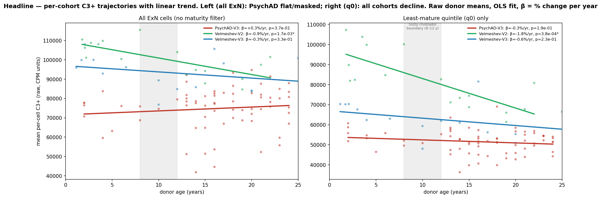

*Raw donor-mean C3+ vs donor age, **per cohort** (not pooled), per-cohort
OLS fit; fuzzy child/adolescent boundary band (8–12 y) shaded. **Left** —
all ExN cells (no maturity filter): PsychAD-V3 (red) is flat-to-rising
(the FANS masking, Appendix C) while both Velmeshev cohorts decline.
**Right** — least-mature quintile (q0): all three cohorts decline.*

| cohort | stratum | fuzzy d | β (%/yr) | p (slope) |
|---|---|---:|---:|---:|
| PsychAD-V3 | all ExN | −0.18 | +0.27 | 0.37 |
| PsychAD-V3 | **q0** | **+0.49** | **−0.29** | 0.19 |
| Velmeshev-V2 | all ExN | +2.47 | −0.85 | **0.002** |
| Velmeshev-V2 | **q0** | **+2.56** | **−1.79** | **<0.001** |
| Velmeshev-V3 | all ExN | +0.58 | −0.34 | 0.33 |
| Velmeshev-V3 | **q0** | **+0.49** | **−0.58** | 0.23 |

The continuous β agrees in sign with the fuzzy d in every q0 stratum (all
negative = C3+ declines with age) and the q0 slope is steeper than all-ExN
in every cohort. As a *linear* trend over 1–25 y it reaches significance
only in Velmeshev-V2; PsychAD-V3 and Velmeshev-V3 q0 are directionally
consistent but individually underpowered (19 and ~6 child donors) and the
trajectory is front-loaded (most decline near the childhood end). The
child-vs-adolescent fuzzy d (a contrast, more sensitive with small child
samples) is the primary per-cohort statistic; the **combined** estimate
(§3.3) is the robust one. Full table: `t1_linear_trends.csv`.

### 1.2 The combined effect

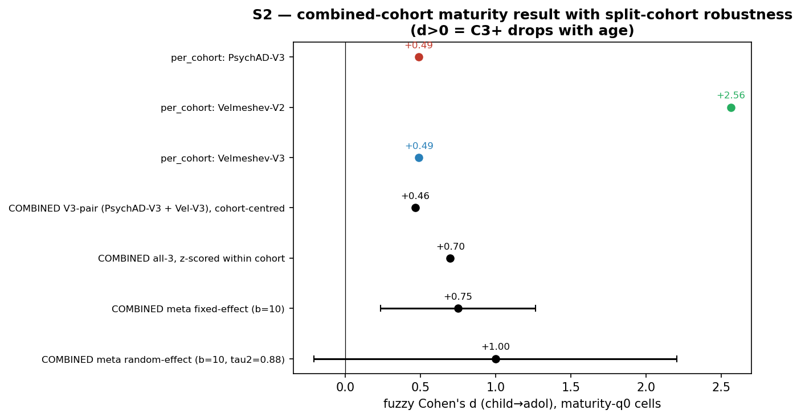

| estimate (maturity-q0 cells, no depth filter) | fuzzy d | n donors |
|---|---:|---:|
| **COMBINED — V3-pair (PsychAD-V3 + Vel-V3), cohort-centred** | **+0.46** | 85 |
| COMBINED — all three cohorts, z-scored within cohort | +0.70 | 102 |
| COMBINED — meta-analysis, fixed-effect (b = 10 y) | +0.75 [95% CI 0.23–1.26] | 3 studies |
| per-cohort: PsychAD-V3 | +0.49 | 70 |
| per-cohort: Velmeshev-V3 | +0.49 | 15 |
| per-cohort: Velmeshev-V2 | +2.56 | 17 |

(d > 0 means C3+ drops with age.) **The headline is the V3-pair +0.46** —
two independent studies, comparable chemistry/depth, agreeing to 0.001 d
(PsychAD-V3 +0.49 vs Velmeshev-V3 +0.49). Velmeshev-V2's +2.56 agrees in
*direction* but is **excluded from quantitative estimates** as technically
confounded (a depth×age artefact moving 66 % of the transcriptome — Appendix
C.1); it is **not** load-bearing evidence, contrary to how an earlier draft
of this work read it.

### 1.3 The biology in one sentence

C3+ is a synapse-formation / neuronal-maturation gene programme that **rises
with a neuron's maturity** (cross-sectional axis, §2) yet is **elevated in
childhood and declines toward adolescence at matched maturity** (developmental
axis, §3) — a childhood synaptic peak. PsychAD's FANS NeuN+ sort under-samples
shallow immature nuclei and so **masks** this peak in the naive all-cell
aggregate (Appendix C), which is why the unsorted Velmeshev atlas and
FANS-sorted PsychAD first appeared to disagree.

---

## 2. C3+ is a single-cell synaptic-maturation programme (strand 1)

Within any age, C3+ **rises** with a neuron's maturity. Scoring each ExN
cell on a 9-marker mature module (Appendix B) and correlating with its C3+
score:

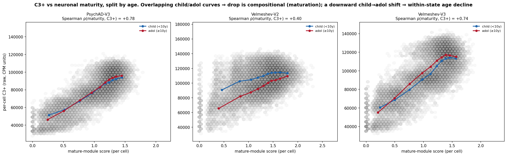

| cohort | ρ(maturity, C3+) within-age |
|---|---:|
| PsychAD-V3 | +0.8 |
| Velmeshev-V2 | +0.4 |
| Velmeshev-V3 | +0.7 |

Mature neurons carry **more** C3+ — they have more synapses (and, partly,
more depth/detection). This establishes the first half of the biological
claim directly and externally: an **adult-derived** spatial programme tracks
the **single-cell maturation state** of developing neurons. The relationship
is positive in all three cohorts and is the cleanest, most robust strand of
evidence.

Note this is the *opposite* sign to the developmental decline (§3): mature
cells carry more C3+, but childhood (across all maturities) carries more C3+
than adolescence. These two orthogonal axes are the key to the whole
analysis and are disentangled in §3.

---

## 3. A childhood→adolescent decline beyond birth differentiation (strand 2)

### 3.1 The decline lives at matched maturity, not in composition

A natural objection: if C3+ falls *because* neurons mature (a less-mature
child cell becomes a more-mature adolescent cell), then the "decline" is
just the §2 maturity gradient seen through changing composition, and tells
us nothing new about development. We tested this with a Kitagawa
decomposition of the child→adolescent drop, splitting it into a
**within-state** term (same-maturity cells losing C3+ with age) and a
**composition** term (cells shifting maturity with age).

In the clean, unsorted Velmeshev-V2 cohort, childhood neurons carry more
C3+ than adolescents **at every maturity decile** (+25 k CPM at the
least-mature decile, tapering to +4 k at the most-mature). The decomposition
is **+116 % within-state, −16 % composition**: the drop is essentially
*entirely* a same-maturity age decline, and the maturation composition
slightly **opposes** it (because, by §2, more-mature adolescent cells
individually carry *more* C3+).

**This reverses the objection.** The C3+ decline is **not** produced by
cells maturing into lower-C3+ states — maturation works against the drop.
It is a genuine within-state developmental decline: at fixed single-cell
maturity, childhood neurons carry more C3+ than adolescent neurons. That is
the signature of a childhood synaptic peak that exceeds, and then recedes
toward, the adult level — i.e. **a process beyond the differentiation
already complete at birth.**

### 3.2 Why this can't be early-differentiation composition: maturity is near-static

Independently, across the postnatal 1–25 y window the **maturity
distribution barely moves with age**:

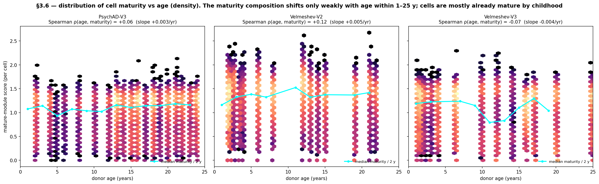

| cohort | ρ(age, maturity) | slope (/yr) | median maturity child → adol |
|---|---:|---:|---|
| PsychAD-V3 | +0.06 | +0.003 | 1.084 → 1.144 |
| Velmeshev-V2 | +0.12 | +0.005 | 1.293 → 1.412 |
| Velmeshev-V3 | −0.07 | −0.004 | 1.216 → 1.143 |

By these canonical post-mitotic markers (NEUROD2/SATB2/BCL11B/…), cortical
excitatory neurons are **already mature by early childhood** — the bulk of
this maturation is prenatal/infancy, complete before our 1 y lower bound.
A compositional mechanism therefore has almost nothing to work with, and the
least-mature quintile is a comparable ~20 % slice at every age (q0
adolescents are the same kind of cell as q0 children, one age-bin later).
**Crucially, this also means the 9-gene module is the *wrong* axis for the
developmental question** — it saturated before our window opens. The decline
we see is orthogonal to it, which is exactly what motivates strand 3.

### 3.3 The combined estimate and why q0

Conditioning on the least-mature quintile (q0) removes the opposing
cross-sectional gradient (§2) and reveals the developmental decline in
**every cohort**, recoverable as the combined V3-pair fuzzy d = **+0.46**
(§1.2). The childhood elevation is robust and cohort-consistent only in the
least-mature decile (child − adol C3+ = +5.1 k / +25 k / +5.5 k in
PsychAD-V3 / Vel-V2 / Vel-V3 — positive in all three). In *mature* deciles
the cohorts disagree (the residual depth/FANS confound, Appendix C), which
is why q0 is the one stratum where the effect is measurable without that
contamination — not discarded signal.

The raw child→adol C3+ difference is modest (a few percent of the ~100 k CPM
baseline); the d ≈ +0.5 comes from low donor-level variance within q0, not a
large raw shift — a real but quantitatively gentle developmental decline.
See `t2_decomposition.csv`, `t2_c3_vs_maturity_binned.csv`.

### 3.4 Honest caveat on Velmeshev-V2

Velmeshev-V2's +2.56 is **not** strong independent evidence — it is
technically confounded and is **excluded from all quantitative estimates**
in this report (kept only as a direction check). Its children are sequenced
2.4× shallower than its adolescents (3.6 k vs 8.8 k UMI/cell), producing a
*genome-wide* child→adol shift — 66 % of all genes move by |d| > 0.5,
impossible biologically. Appendix C.1 demonstrates this in full. The
trustworthy developmental evidence is the **V3-pair agreement** (PsychAD-V3
+0.49, Velmeshev-V3 +0.49), where depth is comparable and the genome-wide
background is near zero. Because V2 and V3 are the *same study*
(chemistry-split), dropping V2 costs no independent replication.

---

## 4. Is C3+ the missing *late*-maturation programme? (strand 3)

Strand 2 shows C3+ declines child→adolescent, but does not show *which
genes* carry that decline or whether they are specifically a C3+ programme.
The user's hypothesis is sharper: **the genes that distinguish childhood
from adolescent neurons — the under-described late circuit-maturation
genes — are captured by C3+**, in a way the 9 early-differentiation markers
are not. We tested this in two steps (`w_age_axis.py`, job 30241257).

### 4.1 Childhood and adolescent neurons occupy different embedding regions

First: do childhood and adolescent ExN cells actually differ in the
batch-corrected (scVI) latent space? A donor-grouped cross-validated
classifier (LogisticRegression, GroupKFold by donor) says **yes**, with
cohort-dependent strength:

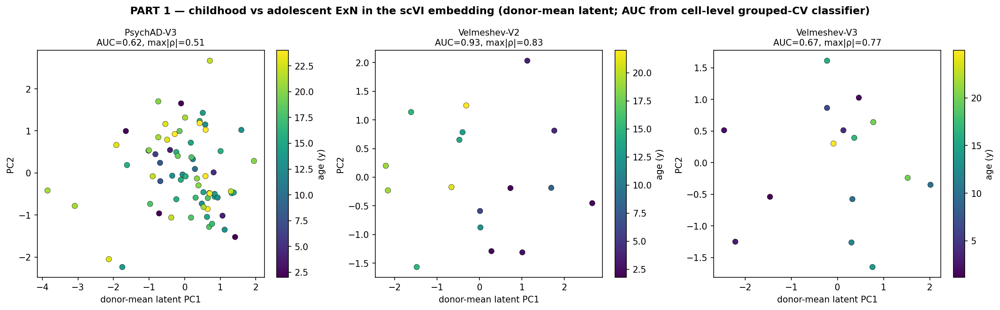

| cohort | grouped-CV AUC (child vs adol) | max \|ρ(latent dim, age)\| | donors (child) |
|---|---:|---:|---:|
| PsychAD-V3 | 0.62 | 0.51 | 70 (10) |
| Velmeshev-V2 | **0.93** | **0.83** | 17 (8) |
| Velmeshev-V3 | 0.67 | 0.77 | 15 (8) |

There **is** a data-driven age axis in the ExN latent space — at least one
latent dimension correlates with donor age at ρ = 0.5–0.8. It is strongest
in Velmeshev and **weak in PsychAD** (AUC 0.62), echoing the weak cell-level
age signal seen for the deep FANS cohort throughout this project. *Caveats:*
(i) with 15–17 donors and donor-grouped CV, the AUC partly reflects donor-level
clustering, and V2's high AUC coincides with its shallow/technical profile
(Appendix C.1) — so the V2 number is the least trustworthy. (ii) **This used
the shipped `X_scVI`, an integration trained on *all* cell types** (then
subset to ExN), so most of the latent's capacity encodes between-class
structure and the within-ExN age axis is under-resolved — and because maturity
is partly confounded with batch, the `batch_key` correction may have regressed
*out* part of it. These AUCs are therefore a **conservative lower bound**; an
**ExN-only re-embedding** (Appendix D) is the proper test and is the natural
first step of the §5 data-driven-axis recommendation. But the existence of a
real age axis (notably in the clean V3 cohort, AUC 0.67, ρ 0.77) is solid.

### 4.2 The childhood-elevated genes are enriched for C3+ membership

Second, and decisively: are the genes that drive that childhood→adolescent
difference enriched in C3+? For each gene we computed the donor-level
child→adol Cohen's d (CPM log1p, child < 10 vs adol ≥ 10), then asked
whether C3+ genes are over-represented among the most childhood-elevated:

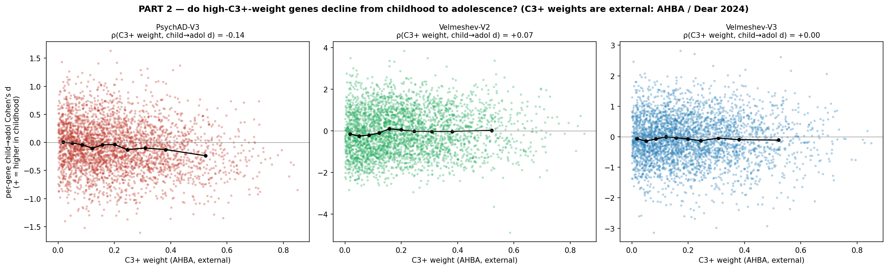

| cohort | C3+ in top-300 child-elevated (expected) | hypergeom p | ρ(C3+ weight, age d) | background mean age d |
|---|---:|---:|---:|---:|
| PsychAD-V3 | 30 (29) | 0.47 — **none** | −0.14 | −0.06 |
| Velmeshev-V2 | 141 (63) | 2.9e-24 | +0.07 | **−0.34** |
| Velmeshev-V3 | 115 (63) | **2.9e-12** | +0.00 | −0.12 |

Two findings, pulling in opposite directions:

- **Support.** In **both** Velmeshev chemistries the childhood-elevated genes
  are strongly enriched for C3+ membership. The cleanest is **Velmeshev-V3**
  (115 vs 63 expected, p = 3e-12) where the genome-wide background is near
  zero (−0.12) — so this is a *specific* enrichment, not a global shift. This
  is direct support for the hypothesis: an adult spatial programme is
  over-represented among the genes that separate childhood from adolescent
  neurons in an independent developmental atlas.
- **Qualification.** The enrichment is for C3+ **membership**, not C3+
  **weight** — within C3+ genes, the weight does not track the age effect
  (ρ ≈ 0 in V3; the binned mean in the figure is flat across weight). And the
  enrichment is **absent in PsychAD** (p = 0.47), the cohort with the weak
  embedding age axis. And the **Velmeshev-V2** enrichment is partly inflated
  by its genome-wide child-shift (background −0.34) — the same V2 technical
  confound flagged in §3.4.

### 4.3 The 9-gene module confirms it is the wrong (early) axis

The 9-gene early-differentiation module's own child→adol d is **flat in the
deep cohorts** (PsychAD −0.10, Velmeshev-V3 −0.05) — exactly as expected for
fate markers that saturated before childhood — and only spuriously elevated
in the technically-shifted V2 (+0.38). So the module is *not* the programme
that changes across our window; C3+ partly is. This is consistent, mutually
reinforcing evidence that **C3+ reaches into a later maturation phase the
canonical early markers cannot see** — but "partly," "in Velmeshev,"
"membership not weight" are the honest qualifiers.

---

## 5. Synthesis and what would settle it

**What the evidence supports.** C3+ — an adult, spatially-derived,
synapse-enriched gene programme — is connected to human cortical development
in three independent ways: (1) it rises with single-cell neuronal maturity
in every cohort (ρ +0.4–0.8); (2) it is elevated in childhood and declines
toward adolescence at matched maturity (V3-pair fuzzy d +0.46, a genuine
within-state decline, not composition); and (3) the genes that separate
childhood from adolescent neurons in the embedding are enriched for C3+
membership in the clean Velmeshev-V3 cohort (p = 3e-12), while the canonical
early-differentiation markers are flat. Together these are consistent with
the hypothesis that **C3+ captures part of the under-described
childhood→adolescent synaptic-maturation programme, beyond the cell
differentiation complete at birth.**

**What it does not yet establish.** The case is suggestive, not closed:
- The gene-level alignment is **membership-level, not weight-level** — C3+'s
  *high-weight* genes are not preferentially the age-changing ones, so C3+ is
  not cleanly "a late-maturation axis."
- The alignment and the embedding age axis are **clean in Velmeshev, weak or
  absent in PsychAD** — the two independent studies only partly agree at the
  gene level.
- The largest single effect (**Velmeshev-V2**) is **technically confounded**
  (a depth×age artefact moving 66 % of the transcriptome, Appendix C.1) and is
  **excluded from quantitative estimates** here — it was over-weighted as "a
  big lead" in earlier drafts. It survives only as a direction check, at no
  cost to evidence since it is the same study as V3.
- The 9-gene module is an **early-differentiation** index that saturates
  before our window — useful for *removing* the maturity confound (§3) but
  the wrong tool for *measuring* late maturation.

**The decisive next experiment: a data-driven late-maturation index.** The
clean way to settle the hypothesis is to build a maturity/age axis that is
relevant to childhood and adolescence specifically — not the early-diff
module — and ask directly how C3+ projects onto it. Two routes:

1. **Supervised age axis (recommended first).** The §4.1 classifier already
   finds a latent direction separating childhood from adolescent cells.
   Project C3+ onto that direction, pooled across cohorts, and test whether
   high-C3+ cells sit at the childhood end. This is the most direct test of
   "C3+ = late-maturation programme" and avoids DPT's root sensitivity.
2. **Diffusion pseudotime on the scVI latent** (Appendix D gives the full
   recipe and pitfalls). A batch-corrected immature→mature ordering would let
   the §3 analysis run once, pooled, on a single common axis — *if* scVI has
   not regressed maturity out as batch (the mandatory check). Because the
   §4.1 axis is weak in PsychAD, expect this to be cohort-limited too.

Both should be cross-checked against the gene-level enrichment (§4.2): if the
data-driven late-maturation axis is built from genes that overlap C3+, that
closes the loop — and because C3+ is **externally** derived from the adult
AHBA, that overlap is a genuine cross-modal validation, not circularity.

**On replication.** A truly independent third pediatric-DLPFC cohort does not
appear to exist (Appendix E / `THIRD_COHORT_FEASIBILITY.md`): the on-disk
candidates fail (Wang is fetal with zero 1–12 y PFC donors; Zhu has ~5), and
the large new 284-donor lifespan DLPFC atlas is itself a PsychAD/HBCC subset.
Pediatric post-mortem PFC is intrinsically scarce and donor-recycled across
studies, so this question is near the ceiling of what human snRNA-seq can
currently arbitrate. The strongest remaining evidence is internal: the
V3-pair maturity agreement, the within-state decomposition, and the
data-driven late-maturation axis above.

---

# Appendix

The methodological machinery below makes the cohorts comparable and the
maturity index trustworthy. It is the evidence base for the main text but is
not itself the biological result.

## Appendix A — How the cohorts were made comparable

### A.1 Confound 1: native cell-class labels are unreliable

PsychAD's per-cell `cell_class` labels were assigned by a classifier trained
on the adult/aging PsychAD reference (median donor ~80 y), which defines
"Excitatory neuron" by the state of *mature, aged* pyramidal neurons. Applied
to pediatric donors it under-recovers ExN in the youngest (<1 y: ~5 % called
Excitatory vs ~25–30 % in Wang/Velmeshev). scANVI label transfer does not fix
this — it is supervised on the same biased labels and propagates them
(cross-supervision experiment, `scripts/relabel_comparison/`).

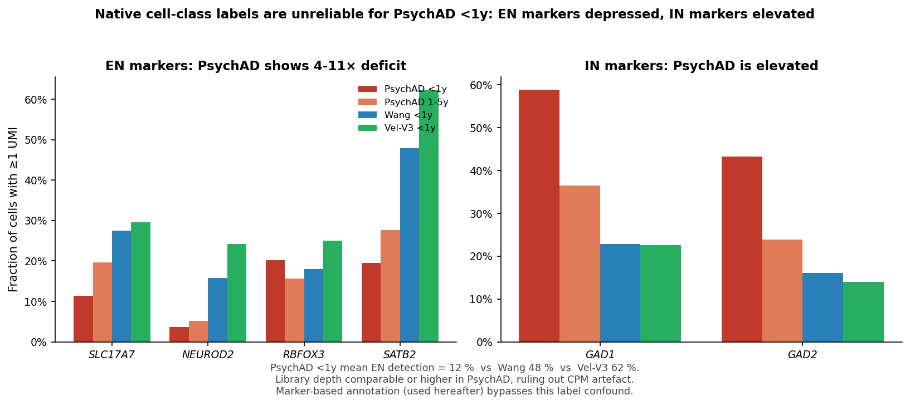

In <1 y donors PsychAD shows a 4–11× deficit in excitatory markers (SATB2,
SLC17A7, NEUROD2, RBFOX3) and ~5× elevation in inhibitory markers (GAD1/2)
vs same-age Wang/Vel-V3 cells, at comparable or higher depth — not a CPM
artefact. (Conversely, 96 % of Velmeshev cells labelled "Interneurons" are
transcriptionally excitatory under cross-classification — both datasets'
native labels are unreliable, motivating a marker-only annotation.)

**The ExN definition evolved in three steps. The third is the one to use.**

**Step 1 — native labels (rejected).** As above, the reference-trained
`cell_class` under-recovers ExN in young PsychAD (~6 % at 0–1 y).

**Step 2 — marker rule (intermediate; *over*-corrects).**
`code/annotation_by_markers.py` classifies on direct marker UMI counts:
```
if max(GAD1, GAD2, SLC32A1) ≥ 10:     InN
elif RBFOX3 ≥ 1:                       ExN_mature
elif DCX ≥ 1:                          ExN_immature
elif (no glial marker) and RBFOX1 ≥ 1: ExN_weak
```
This rescues many young neurons (PsychAD ExN rises to ~44–52 %), and **all C3+
numbers in §§1–5 use it.** But the `GAD≥10` cut is arbitrary, and in developing
cortex it **mis-assigns immature inhibitory neurons to ExN**: migrating
interneurons are DCX⁺/RBFOX3⁺ and express inhibitory-lineage TFs (DLX1/2, LHX6)
but have not yet raised GAD above 10, so they default to ExN. Diagnostics
(`y3_diagnose.py`): of young-PsychAD (<10 y) cells the rule calls ExN, the
"gained" set carries RBFOX3 (64 %) and DCX (67 %) but almost no SLC17A7 (7 %) /
SATB2 (13 %) — and, decisively, high **inhibitory**-lineage TFs.

**Step 3 — principled lineage + embedding vote (the believed definition).**
`y4_lineage_exn.py`. The excitatory vs inhibitory *lineage* is separable in
immature cells by lineage TFs even before SLC17A7 turns on
(excitatory: NEUROD2/6, TBR1, EOMES, SATB2, BCL11B, FEZF2;
inhibitory: GAD1/2, DLX1/2/5, LHX6, ADARB2, SP8). We:
1. set confident anchors — ExN (SLC17A7/6 ≥ 1), InN (GAD ≥ 10);
2. for every **ambiguous** immature neuron (RBFOX3/DCX⁺ but neither anchor),
   take a **kNN vote in the batch-corrected scVI latent** — are its neighbours
   ExN- or InN-anchors? — a threshold-free, data-driven call;
3. verify the vote **agrees with the lineage TFs** (voted-ExN: exc 0.30 > inh
   0.24; voted-InN: inh 0.49 ≫ exc 0.12).

The vote reveals that young-PsychAD ambiguous cells are **mostly inhibitory**
(only 45.7 % vote ExN; exc-lineage 0.08 ≪ inh-lineage 0.46) — the marker rule's
GAD-threshold default was wrong for them. The principled ExN fraction is
biologically sensible and age-stable (PsychAD ~25–32 % across ages; Velmeshev
declining with age, high in prenatal/infant). **Effect on the result: the
maturity-q0 child→adol C3+ fuzzy d roughly halves** (combined +0.44 → +0.22;
Herring +0.49 → +0.12; PsychAD +0.46 → +0.28; `z_principled_c3.py`, §0.5).

**Caveat (acknowledged):** the same young-PsychAD excitatory under-detection
(4–11× deficit in SATB2/SLC17A7/NEUROD2 vs Wang/Herring at comparable depth,
fig. above) could bias the lineage-TF scores downward, so the principled set may
*under*-recover some genuine young ExN. Two independent signals (lineage TFs and
the transcriptome-wide embedding neighbours) agree, and immature postnatal
interneurons are a real population — so this is the most defensible definition —
but the true ExN-specific effect is bracketed +0.22 (principled) … +0.44
(marker rule). A RBFOX3⁺-strict variant is available as a further check.

### A.2 Confound 2: sum-then-CPM aggregation bias

`sum raw counts → CPM` is mathematically a **UMI-weighted** mean of per-cell
CPM (deep cells dominate). PsychAD-V3 adolescent cells average 21.5 k UMI vs
children's 17.7 k, so adolescent bulks over-weight their deep cells — a
systematic anti-drop bias for C3+. **Fix:** per-cell CPM, then per-donor
*mean* (equal weight per cell); equivalent to a fixed-UMI downsample to
within 0.02 d. Effect: PsychAD-V3 −0.30 → −0.18; Vel-V2 +2.09 → +2.46;
Vel-V3 +0.24 → +0.58. This leaves stage B: PsychAD-V3 −0.18 vs Vel-V3 +0.58,
still a sign disagreement on the all-cell aggregate — resolved by maturity
stratification (§3) once the depth/FANS confound (Appendix C) is understood.

### A.3 Correction-stage progression

| stage | PsychAD-V3 | Vel-V2 | Vel-V3 | n donors (Psy/V2/V3) |
|---|---:|---:|---:|---|
| 0. native cell-class label, sum-then-CPM | +0.09 | +2.03 | +0.01 | 64 / 17 / 15 |
| A. marker-based annotation, sum-then-CPM | −0.30 | +2.09 | +0.24 | 70 / 17 / 15 |
| B. + per-cell-CPM mean (**all ExN** — the disagreement) | **−0.18** | +2.46 | +0.58 | 70 / 17 / 15 |
| **C. + maturity-q0 (least-mature quintile)** | **+0.49** | **+2.56** | **+0.49** | 70 / 17 / 15 |

### A.4 Excluded donor: Donor_1400

One PsychAD donor (`Donor_1400`, 3 y) is excluded: composition outlier on
ExN_immature % (38 %, z = +2.51; biologically implausible at 3 y) and a prior
C3+ outlier (z = −3.4 under sum-then-CPM). The exclusion is criterion-set
before recomputing d and is **not load-bearing**: leave-one-out across all 70
q0 donors keeps PsychAD-V3 in +0.36 … +0.64 regardless (Appendix B.3).
`Donor_28` (4 y, 45 % immature) is more extreme on composition but has only
71 cells; kept, flagged. See `n_psychad_per_donor.csv`, `n_leave_one_out_d.csv`.

### A.5 Fuzzy childhood/adolescence boundary

There is no sharp child→adolescent transition. Every Cohen's d is the **mean
of d at boundary ages 8, 9, 10, 11, 12 y** (donors [1, b) child, [b, 25)
adolescent). Per-boundary d's are saved (`m_window_bounds_d.csv`,
`m2_correction_progression_data.csv`); the story is identical at every
boundary.

## Appendix B — The maturity index

### B.1 The 9-marker mature module

Each ExN cell scores the mean of `log1p(CP10k)` across nine canonical
post-mitotic / maturation markers (Ensembl-resolved; `r1_marker_id_resolution.csv`):

| marker | role | reference |
|---|---|---|
| NEUROD2 | proneural bHLH TF, ExN differentiation & synaptic maturation | Bormuth 2013; Olson 2001 |
| SATB2 | upper-layer callosal identity; postmitotic differentiation | Alcamo 2008; Britanova 2008 |
| BCL11B (CTIP2) | deep-layer (L5) projection identity & maturation | Arlotta 2005 |
| MEF2C | activity-dependent synaptic maturation/refinement TF | Lyons 2012; Harrington 2016 |
| NEFM / NEFH | neurofilament M/H, cytoskeletal, upregulated as neurons mature | Yuan 2012 |
| SYT1 | synaptotagmin-1, presynaptic Ca²⁺ sensor | Geppert 1994 |
| SNAP25 | presynaptic SNARE, rises with synaptic maturation | Oyler 1991 |
| MAP2 | dendritic MAP, rises with arborisation | Caceres 1984 |

The module **excludes** DCX and RBFOX3/RBFOX1 (used by the A.1 classifier),
so it is not circular with it. NEFL is genuinely absent from the HVG feature
space (dropped; results unchanged from a six-marker version). **Important
scope limit:** these are *early-differentiation / fate* markers; §3.2 shows
they are already saturated by early childhood, so the module is the right
tool for *removing* the single-cell maturity confound (§3) but the **wrong**
tool for measuring late childhood→adolescent maturation (that is strand 3 /
§4's motivation).

### B.2 The drop is concentrated in the least-mature quintile

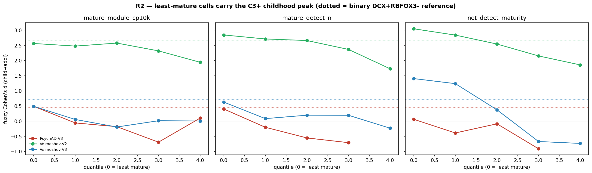

| mature-module quintile | q0 | q1 | q2 | q3 | q4 |
|---|---:|---:|---:|---:|---:|
| PsychAD-V3 fuzzy d | **+0.49** | −0.06 | −0.18 | −0.69 | +0.10 |

Three independent maturity definitions converge in PsychAD-V3, **no depth
filter**:

| definition (least-mature cells) | n cells | n donors | fuzzy d |
|---|---:|---:|---:|
| binary DCX⁺RBFOX3⁻ "ExN_immature" (original lead) | 3 361 | 67 | +0.45 |
| mature-module quintile q0 | 6 412 | 70 | **+0.49** |
| detection count == 1 mature marker | 1 143 | 66 | +0.54 |
| *all-ExN baseline (the stage-B disagreement)* | 32 057 | 70 | −0.18 |

(Splitting the module at its **median** gives only +0.19 — a binning artefact
that lumps the strongly-positive q0 with negative q1–q3; the signal is in the
*extreme* low-maturity bin.) Detection-based scoring works at least as well;
the earlier *failure* of a continuous score was specific to a depth-confounded
two-gene RBFOX3−DCX ratio. Practical guidance: use a multi-marker mean module
or a low-detection count; avoid two-gene normalised ratios.
(`r3_detection_vs_cp10k.csv`.)

### B.3 Pan-layer and donor-robust

- **Pan-layer.** q0 drop positive in every layer (PsychAD-V3): upper +0.37,
  L5_ET +0.16, L6_IT +0.96, L6_CT +0.47, ambiguous +0.74 — a maturation axis,
  not a layer artefact.
- **Donor-robust.** PsychAD-V3 q0 = +0.488 across 70 donors; leave-one-out
  spans +0.358 … +0.642, **never flips sign** (most influential donor Donor_701
  → +0.358). Contrast the all-ExN −0.44, which the F3 audit showed was
  small-n variance among 11 children. (`r6_module_q0_*.csv`.)

## Appendix C — The depth / FANS confound (our initial hypothesis)

Before identifying maturity, we found the stage-B disagreement could be
removed by a common per-cell UMI window. PsychAD-V3's FANS-sorted pool sits
~2× deeper than Velmeshev-V3 with a deep tail Velmeshev barely samples:

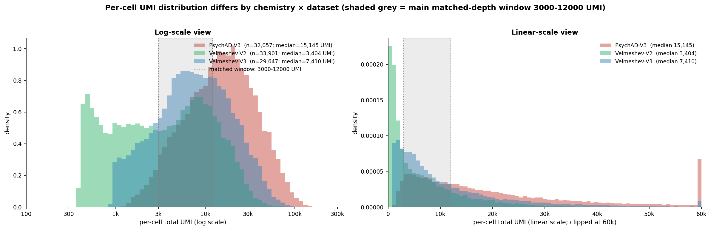
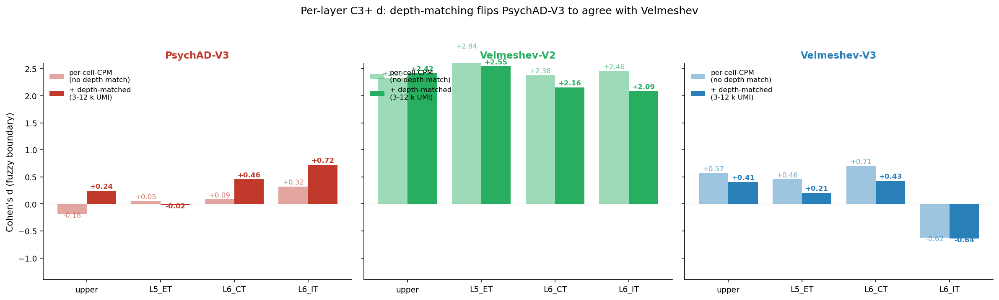

| window (UMI) | PsychAD-V3 | Vel-V2 | Vel-V3 |
|---|---:|---:|---:|
| none (all cells) | −0.18 | +2.46 | +0.58 |
| 1 k – 8 k | +0.27 | +2.44 | +0.61 |
| **3 k – 12 k** | **+0.32** | +2.44 | +0.38 |
| 5 k – 25 k | +0.03 | +2.36 | +0.33 |
| 1 k – 35 k | −0.03 | +2.41 | +0.57 |

This worked but needed a hand-chosen window and never explained *why* depth
mattered. **Depth is a proxy for maturity:** per-cell depth ↔ mature-module
ρ = +0.65 (PsychAD-V3), +0.55 (Vel-V2), +0.64 (Vel-V3) — mature pyramidal
neurons are larger, transcriptionally richer. Shallow ≈ immature.

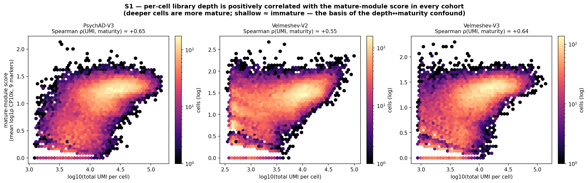
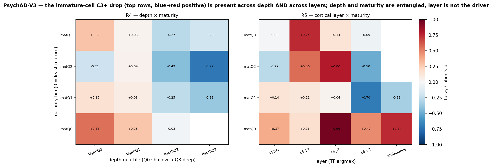

The axes are entangled but not identical (the drop is strongest in the
shallow ∩ immature corner, +0.55; most reversed in deep ∩ mid-mature, −0.72).
Maturity is the *biological* axis (named state, literature markers, no tuned
window, larger effect) so it supersedes depth.

**The FANS mechanism.** In PsychAD-V3 childhood cells are shallower, less
mature, higher immature fraction; FANS NeuN+ preferentially recovers larger /
brighter / deeper / more-mature nuclei, so it disproportionately **drops the
immature high-C3+ childhood cells**, deflating measured childhood C3+ and
erasing the all-cell drop. Velmeshev's unsorted prep imposes no such filter.

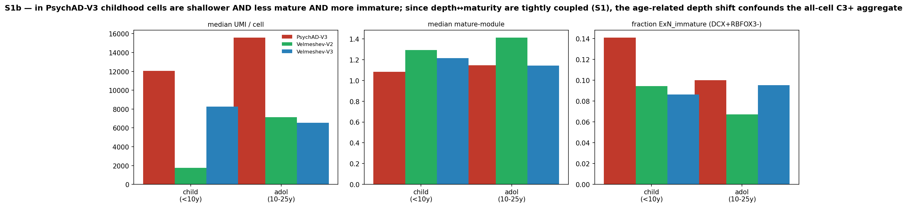

| PsychAD-V3 | median UMI | median maturity | frac ExN_immature |
|---|---:|---:|---:|
| child (<10 y) | 12 045 | 1.084 | 0.141 |
| adolescent (10–25 y) | 15 595 | 1.144 | 0.100 |

This is interpretation, not proof; a direct test (split PsychAD upper-layer
cells by FANS forward-scatter) is in Appendix F.

**The residual Vel-V2 magnitude** (+2.56) is technically confounded — deep
dive in C.1.

### C.1 Deep dive: why Velmeshev-V2 specifically is confounded

(`x_v2_confound.py`, fig `x_v2_confound.png`, `x_v2_confound_summary.csv`.)
V2's child→adol numbers (q0 d +2.56; gene-enrichment p = 3e-24) are inflated
by a **depth × age confound that produces a non-biological, transcriptome-wide
shift**. Three facts, one figure:

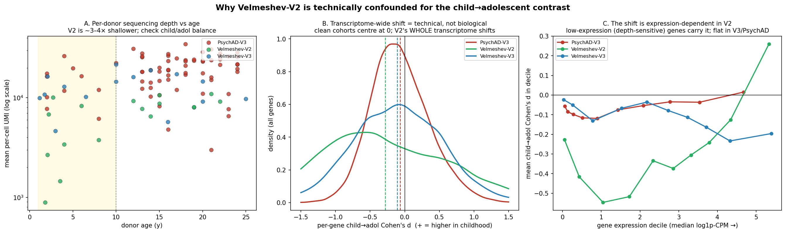

**(A) V2 children are sequenced far shallower than V2 adolescents.** Per-donor
mean per-cell depth:

| cohort | child median UMI | adol median UMI | child/adol ratio | depth~age MWU p |
|---|---:|---:|---:|---:|
| PsychAD-V3 | 14,231 | 19,805 | 0.72 | 0.025 |
| **Velmeshev-V2** | **3,582** | **8,773** | **0.41** | **0.021** |
| Velmeshev-V3 | 11,889 | 14,590 | 0.82 | 0.96 |

V2 children are **2.4× shallower** than V2 adolescents — and ~3–6× shallower
than any other group in absolute terms. V3 has *no* depth–age imbalance
(p = 0.96).

**(B) The result is a whole-transcriptome shift, which cannot be biological.**
A real developmental signal moves a specific gene programme and leaves the
rest of the transcriptome near zero (background mean d ≈ 0). In V2 the per-gene
child→adol Cohen's d is shifted across the *entire* transcriptome (background
mean d = **−0.34**, vs −0.12 in V3, −0.06 in PsychAD), and **66 % of all genes
show |d| > 0.5** (vs 46 % V3, 24 % PsychAD). Two-thirds of the genome cannot
change by half a standard deviation between childhood and adolescence for
biological reasons — this is the signature of a global technical offset
(panel B: clean cohorts peak at 0, V2's whole distribution is shifted left).

**(C) The shift is expression-dependent, pinpointing the mechanism.** Per-cell
CPM + log1p does **not** make per-gene means depth-invariant: for a
low-abundance gene a single count in a shallow cell maps to a large CPM
(1e6 / N), so the log1p-CPM of rare genes is dominated by a depth-sensitive
Poisson / zero-inflation floor. When childhood and adolescent donors differ in
depth, that floor shifts differentially — most for low-expression genes. Panel
C shows exactly this: in V2 the child→adol d dips strongly negative in the
low-expression deciles and flattens toward high expression, while V3 and
PsychAD stay flat. **C3+ is a large, low-to-moderate-expression synaptic gene
set — squarely in the genes this artefact hits hardest.**

**Why V2 and not PsychAD, which also has a depth–age gap?** Two factors
compound: the *ratio* imbalance (V2's 0.41 is the worst) and, crucially, the
*absolute* shallowness. PsychAD's gap (ratio 0.72, p = 0.025) is comparable to
V2's, but PsychAD children at 14 k UMI are well clear of the steep part of the
normalization-distortion curve, so its background shift is tiny (−0.06). V2
children at 3.6 k UMI sit deep in the distortion regime, where the same
relative depth gap becomes a large per-gene offset. **Shallow absolute depth
*plus* a depth–age imbalance is what makes V2 uniquely confounded: V3 has
neither, PsychAD has only the imbalance at safe depth.**

**Recommendation — exclude V2 from all quantitative estimates; retain only as
a sign-level corroboration.** (1) Headline stays the V3-pair fuzzy d = +0.46.
(2) Drop V2 from the combined/meta estimates — the all-3 z-scored +0.70 and
random-effects +1.00 import V2's inflation and must not be quoted as effect
sizes. (3) In the gene-enrichment test (§4.2) cite Velmeshev-V3 (p = 3e-12,
clean background); treat V2's p = 3e-24 as confounded. This costs **no
independent evidence**, because V2 and V3 are the *same study* (Velmeshev
2023, chemistry-split) — V3 already carries Velmeshev. V2 survives only for the
weak statement "even the shallow unsorted chemistry agrees on the *direction*
of the drop."

Layer composition at matched depth is near-identical between V2 and V3,
confirming the anomaly is chemistry/depth, not which cells were captured:

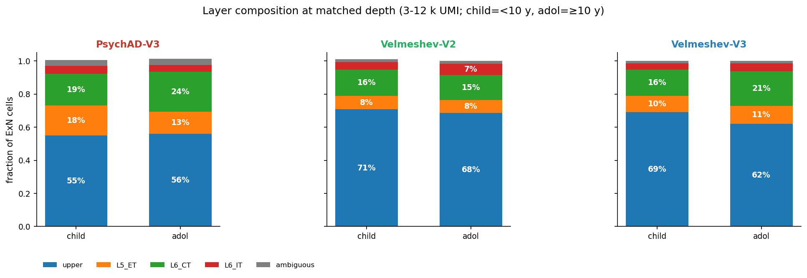

## Appendix D — Pseudotime recipe for a data-driven maturity axis

The marker module is computed on uncorrected counts and so carries per-cohort
capture biases (e.g. at 5–8 k UMI, Vel-V2 detects RBFOX3 in 77 % of cells vs
PsychAD-V3's 19 %), which is why the maturity quintile must be defined
*within* each cohort. A latent-space pseudotime could give one batch-corrected
maturity coordinate across all cells.

```python
import scanpy as sc
# 1. Load integrated h5ad; subset to marker-ExN cells (v4 cache cell_key).
# 2. Graph ON the scVI latent (NOT PCA of raw counts):
sc.pp.neighbors(adata, use_rep="X_scVI", n_neighbors=15)
sc.tl.diffmap(adata)
adata.uns["iroot"] = int(np.argmax(adata.obs["raw_DCX"] /
                                   (adata.obs["mature_module"] + eps)))
sc.tl.dpt(adata)                       # → dpt_pseudotime
sc.tl.paga(adata, groups="layer")      # confirm one dominant axis
# 3. Re-run §3 stratified by dpt quantile, pooled across cohorts.
```

Pitfalls a future agent must handle: **(1) over-correction** — if maturity
correlates with batch (PsychAD FANS = more mature), scVI may regress out the
maturity axis; mandatory check is ρ(dpt, mature-module) before use.
**(2) re-embed the ExN subset** — shipped X_scVI was trained on all cell
types. **(3) root sensitivity** — anchor on markers, never a raw DC extreme.
**(4) parallel lineages** — PAGA to decide one global vs per-layer pseudotime
(the pan-layer result B.3 suggests one axis is defensible). **(5)** pseudotime
is rank, not time. **(6)** consider the **supervised** axis from §5 (cleaner,
avoids DPT root sensitivity) or **CellRank2** (`project_cellrank2_pipeline`).
The v4 cache (`r_per_cell_cache_v4.parquet`) is the join table.

## Appendix E — What we ruled out

| Hypothesis | How rejected | Where |
|---|---|---|
| Marker classifier mis-categorises cells | Marker annotation IS the fix; native labels are the bug | A.1 |
| scANVI re-mapping rescues PsychAD pediatric EN | Cross-supervision: reference bias propagates | A.1 |
| scANVI `transform_batch` asymmetry causes the gap | By design for single-chemistry config | scvi_batch memory |
| Vel signal driven by non-PFC region | Both 100 % PFC after filter | audit A4 |
| Donor density / power in 1–25 y window | Survives at every age bin | audit A2 |
| CPM gene-universe denominator | Survives var_name intersection | audit D1 |
| Pediatric clinical pathology in PsychAD | All 11 HBCC normals; disease flags No | audit F3 |
| Single outlier donor (Donor_1400) | LOO on q0 keeps +0.36…+0.64 | A.4, B.3 |
| Depth is the true driver | Depth ↔ maturity ρ=0.65; maturity larger & window-free | Appendix C |
| Effect is a layer artefact | q0 drop in every layer | B.3 |
| Effect driven by a few donors | LOO across 70 donors never flips | B.3 |
| Two-gene normalised maturity score uninformative | True for RBFOX3−DCX ratio only | B.2 |
| Specific child/adolescent boundary | Fuzzy mean across 8–12 y identical | A.5 |

**No independent third cohort exists** (`THIRD_COHORT_FEASIBILITY.md`): Wang
fetal (0 childhood PFC donors), Zhu tiny (~5), 284-donor lifespan atlas =
PsychAD/HBCC consortium subset, Herring 2022 = only different-lab option but
small and likely NeuroBioBank-overlapping. Pediatric post-mortem PFC is
intrinsically scarce and donor-recycled.

## Appendix F — Next experiments (in value order)

1. **Data-driven late-maturation axis** (supervised age direction from §4.1,
   then pseudotime, Appendix D) — the route to settling strand 3 and giving
   one pooled number. **Highest value.**
2. **Direct FANS test:** split PsychAD upper-layer cells by FANS forward-scatter
   (or depth within layer); confirm the anti-drop concentrates in the
   FANS-favoured deep/mature subset. Confirms Appendix C.
3. **Per-gene biology panel** (NRXN1, NLGN1, GRIK1/2, GRM7, KIRREL3, NTM,
   MEF2C, GRIN2A, DLGAP1): the gene-level child→adol drop is robust in both
   datasets; only the weighted aggregate disagreed, because the weights
   up-weight the genes where PsychAD has the technical bias (F2_REPORT).
4. **PMI / antemortem-condition audit** for both pediatric pools.

## Appendix G — File index

All in `scripts/grn_dev_diagnostics/outputs/`.

### Figures

| Figure | File | Section |
|---|---|---|
| Per-cohort trajectories + linear fit (all-ExN \| q0) | `t1_headline_trajectories.png` | §1.1 |
| Combined maturity result (forest) | `s2_combined_forest.png` | §1.2 |
| C3+ vs maturity, child/adol split | `t2_c3_vs_maturity.png` | §2 |
| Maturity distribution vs age | `t3_maturity_vs_age.png` | §3.2 |
| **Child vs adol embedding separability (NEW)** | `w1_latent_separability.png` | §4.1 |
| **Per-gene age-d vs C3+ weight (NEW)** | `w2_age_vs_c3_scatter.png` | §4.2 |
| Combined maturity-q0 trajectory | `s2_combined_trajectory.png` | §3.3 |
| Maturity-index cascade | `r2_maturity_cascade.png` | B.2 |
| Depth ↔ maturity scatter | `s1_depth_maturity_scatter.png` | Appendix C |
| Depth×maturity \| layer×maturity | `s3_psychad_depth_x_layer_maturity.png` | Appendix C |
| Depth & maturity by age stage | `s1_stage_shift.png` | Appendix C |
| **Why Velmeshev-V2 is technically confounded (NEW)** | `x_v2_confound.png` | C.1 |
| Cell-class confound (<1 y markers) | `m1_cell_class_problem.png` | A.1 |
| Per-cell UMI distributions | `m3_depth_distributions.png` | Appendix C |
| Per-layer d before/after depth | `m4_per_layer_d.png` | Appendix C |
| Layer composition at matched depth | `m5_layer_composition.png` | Appendix C |

### Key tables

| Table | File |
|---|---|
| **Embedding separability (AUC, latent-age ρ) (NEW)** | `w1_latent_separability.csv` |
| **Age-DE vs C3+ enrichment summary (NEW)** | `w2_age_vs_c3_summary.csv` |
| **Per-gene child→adol d + C3+ weight (NEW)** | `w2_per_gene_age_d.csv` |
| **V2 confound: depth/background/expr-dependence (NEW)** | `x_v2_confound_summary.csv`, `x_v2_donor_depth.csv` |
| Combined estimates | `s2_combined_estimate.csv` |
| Depth↔maturity Spearman ρ | `s1_spearman.csv` |
| Depth & maturity by age stage | `s1_stage_shift.csv` |
| Maturity-index cascade | `r2_maturity_cascade.csv` |
| C3+ vs maturity decile | `t2_c3_vs_maturity_binned.csv` |
| Kitagawa decomposition | `t2_decomposition.csv` |
| Per-cohort linear trends (β, p) | `t1_linear_trends.csv` |
| Maturity-vs-age stats | `t3_maturity_age_stats.csv` |
| Detection vs CP10k | `r3_detection_vs_cp10k.csv` |
| Depth × / layer × maturity 2D d | `r4_depth_x_module.csv`, `r5_layer_x_module.csv` |
| Maturity-q0 per-donor + LOO | `r6_module_q0_*.csv` |
| Marker symbol→Ensembl | `r1_marker_id_resolution.csv` |
| PsychAD per-donor composition | `n_psychad_per_donor.csv` |

### Companion reports

| Report | Content |
|---|---|
| `THIRD_COHORT_FEASIBILITY.md` | Why no independent third cohort exists (Appendix E) |
| `PAIRWISE_RELATIONS.md` | 6-relationship pairwise scatters (depth/maturity/C3+/age) |
| `R_REPORT.md` | The maturity investigation in full |
| `Q_REPORT.md` | Multi-marker reconciliation (binary vs continuous) |
| `J_REPORT.md` | Per-cell-CPM mean correction (A.2) |
| `K_REPORT.md` / `L_REPORT.md` | Layer + depth-matched analysis (Appendix C) |
| `F2_REPORT.md` | Per-gene biology |
| `G_REPORT.md` / `H_REPORT.md` | Depth-dependent classification; maturity baseline |

Scripts: `a_`…`n_` (audit trail), `r_immature_investigation.py` (maturity +
v4 cache), `s_combined_maturity.py` (combined estimate), `t_trajectories_and_scatter.py`
(§1–3 figures), `u_pairwise_scatter.py` (PAIRWISE_RELATIONS), `v_cohort_audit.py`
(third-cohort feasibility), **`w_age_axis.py` (§4 embedding separability +
age-DE-vs-C3+ enrichment), `x_v2_confound.py` (Appendix C.1 V2 depth×age
confound)**.

### Reading order

1. This report §0–§5 — the biological question and answer.
2. `R_REPORT.md` — maturity result derivation.
3. `J_REPORT.md` — per-cell-CPM correction.
4. `F2_REPORT.md` — per-gene biology.
5. PsychAD diagnostic report (`notebooks/results/psychad_diagnostic_report/`)
   for A.1's evidence base.
