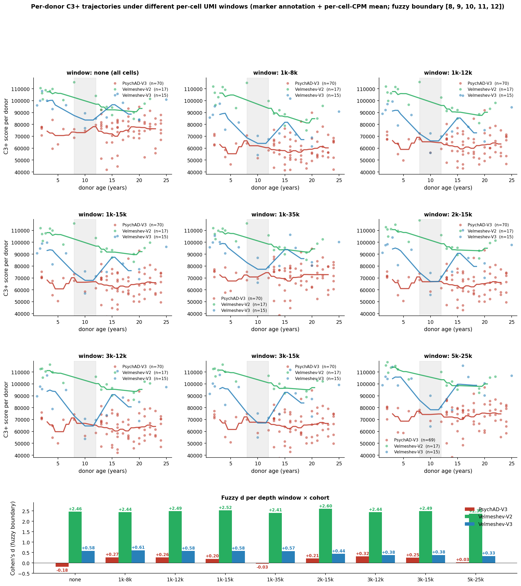
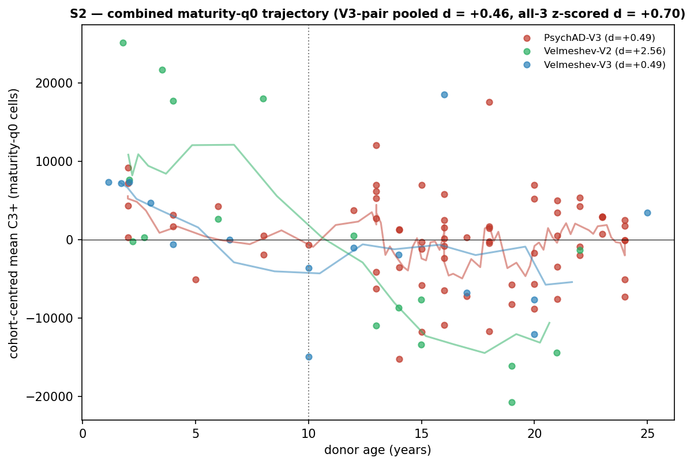

# AHBA C3+ developmental disagreement: PsychAD vs Velmeshev — final report

## Headline result

The cross-cohort disagreement about whether the AHBA **C3+** gene-regulatory
network drops between childhood and adolescence in human DLPFC excitatory
neurons (ExN) is resolved by recognising that **the developmental signal
lives in immature neurons**. After two upstream fixes (a marker-based
cell-class relabelling, §1; and a per-cell-CPM aggregation fix, §2), the
remaining disagreement is removed not by an arbitrary sequencing-depth
window (our initial hypothesis, §4) but by conditioning on a direct,
literature-grounded **neuronal-maturity index** (§3).

When we restrict to the least-mature quintile of ExN cells (the
9-marker mature-module q0, defined below), the C3+ child→adolescent drop
appears in **every cohort and chemistry, with no depth filtering at all**:


| estimate (maturity-q0 cells, no depth filter) | fuzzy d | n donors |
|---|---:|---:|
| **COMBINED — V3-pair (PsychAD-V3 + Vel-V3), cohort-centred** | **+0.46** | 85 |
| COMBINED — all three cohorts, z-scored within cohort | +0.70 | 102 |
| COMBINED — meta-analysis, fixed-effect (b = 10 y) | +0.75 [95% CI 0.23–1.26] | 3 studies |
| per-cohort: PsychAD-V3 | +0.49 | 70 |
| per-cohort: Velmeshev-V3 | +0.49 | 15 |
| per-cohort: Velmeshev-V2 | +2.56 | 17 |

(d > 0 means C3+ drops with age, the expected biology.)

**The single combined result is a child→adolescent C3+ drop of d ≈ +0.46
to +0.70**, depending on how the three cohorts are pooled, with the
cleanest V3-pair estimate at **+0.46**. The split-cohort numbers are
mutually consistent in direction and — for the two directly-comparable
V3-chemistry cohorts — in magnitude (**PsychAD-V3 +0.49 vs Velmeshev-V3
+0.49, agreement to 0.001 d**). Velmeshev-V2's much larger +2.56 is a
shallow-library amplification (§5); it agrees in direction and inflates
the random-effects interval but not the V3-based headline.

This is a **stronger and more principled** result than the depth-window
version of this report (which reached only +0.32 for PsychAD-V3 and
required a hand-chosen 3–12 k UMI window). The maturity index needs no
window, is donor-robust, is pan-layer, and makes the cohorts agree
because it targets the biological axis the depth window was only an
indirect proxy for.

### The biology in one sentence

C3+ is a synapse-formation / neuronal-maturation gene programme; it peaks
in **immature** excitatory neurons in childhood and **declines as those
neurons mature**. PsychAD's FANS NeuN+ nuclear-sorting prep selectively
recovers larger, deeper, more-mature nuclei and under-samples shallow
immature nuclei; in the all-cell aggregate this **masks** the childhood
peak (all-ExN PsychAD-V3 d = −0.18), which is why the naive analysis
disagreed with the unsorted Velmeshev atlas (all-ExN Vel-V3 d = +0.58).
Conditioning on maturity removes the masking and the cohorts agree.

### Correction-stage progression

| stage | PsychAD-V3 | Vel-V2 | Vel-V3 | n donors (Psy/V2/V3) |
|---|---:|---:|---:|---|
| 0. native cell-class label, sum-then-CPM | +0.09 | +2.03 | +0.01 | 64 / 17 / 15 |
| A. marker-based annotation, sum-then-CPM | −0.30 | +2.09 | +0.24 | 70 / 17 / 15 |
| B. + per-cell-CPM mean (**all ExN** — the disagreement) | **−0.18** | +2.46 | +0.58 | 70 / 17 / 15 |
| **C. + maturity-q0 (least-mature quintile)** | **+0.49** | **+2.56** | **+0.49** | 70 / 17 / 15 |

Stage B is where the disagreement is starkest — PsychAD-V3 (−0.18) and
Vel-V3 (+0.58) differ in *sign*. Stage C (maturity stratification) is the
fix: both V3 cohorts converge to +0.49.

> **Note on this revision.** An earlier version of this report used a
> 3–12 k UMI **depth window** as stage C (PsychAD-V3 +0.32). That analysis
> was correct but incomplete: depth was a *proxy* for maturity. §4
> documents the depth analysis as our initial hypothesis and shows the
> depth↔maturity correlation that supersedes it. All depth-window CSVs and
> figures are retained in the file index for provenance.

### Excluded donor: Donor_1400

One PsychAD pediatric donor (`Donor_1400`, age 3 y) is excluded from all
numbers in this report:

- **Composition outlier on ExN_immature %.** 38 % of Donor_1400's cells
  are classified ExN_immature (marker_annotation), z = +2.51 vs the
  PsychAD-V3 donor pool (median ~6 %, mean ~12 %). At age 3 y almost all
  cortical excitatory neurons should already be postmitotic and RBFOX3+
  (mature), so a 38 % DCX-only fraction is biologically implausible and
  most likely a per-cell QC issue (degraded mature transcript profile
  preventing RBFOX3 detection, forcing the DCX-only classifier tier).
- **Previously flagged as a C3+ outlier** (F3 donor audit): most negative
  C3+ outlier under sum-then-CPM (z = −3.4).
- Removal is principled (criterion set before recomputing d) and small in
  effect on the maturity result. Leave-one-out across all 70 maturity-q0
  donors keeps PsychAD-V3 in +0.36 … +0.64 regardless (§3.4), so the
  exclusion is not load-bearing for the maturity headline.

A second donor (`Donor_28`, 4 y; 45 % immature, n = 71 cells; z = +3.22)
is even more extreme on composition but has only 71 cells; we keep it
(mentioned for any reviewer re-running). See `n_psychad_per_donor.csv`
and `n_leave_one_out_d.csv`.

### Why all d values use a fuzzy childhood/adolescence boundary

There is no biologically sharp child→adolescent transition. Every Cohen's
d here is the **mean of d at five candidate boundary ages 8, 9, 10, 11,
12 y**: for each boundary b, donors with age ∈ [1, b) are "child" and
[b, 25) "adolescent". Per-boundary d's are saved with every result
(`m_window_bounds_d.csv`, `m2_correction_progression_data.csv`). The
qualitative story is identical at every individual boundary.

---

## 1. The first confound — native cell-class labels are unreliable

### 1.1 The native PsychAD labels were derived from an aging-brain reference

PsychAD's per-cell `cell_class` labels were assigned by an upstream
classifier trained on the original PsychAD adult/aging reference (the
~50 k-donor Mathys-lab aging cortex atlas, median donor age ~80 y,
heavily enriched for late-life dementia controls). That reference defines
its "Excitatory neuron" type by the transcriptional state of *postmitotic,
mature, aged* pyramidal neurons — high RBFOX3 / SLC17A7 / NEUROD2 and
absence of immature-neuron markers.

Applied to PsychAD pediatric donors, whose cells do *not* yet match the
adult mature state, it systematically under-recovers excitatory neurons in
the youngest donors — in the strictest case (<1 y) only ~5 % of cells are
called Excitatory, vs ~25–30 % in the comparator developmental atlases
(Wang, Velmeshev).

### 1.2 scANVI re-mapping does not solve this

The integration pipeline applies scANVI label transfer, but scANVI is a
*supervised* classifier anchored on the reference labels: when those are
biased toward adult definitions, scANVI propagates the bias. In a
cross-supervision experiment (`scripts/relabel_comparison/`),
PsychAD-supervised scANVI compressed Vel pediatric EN into IN, and
Vel-supervised scANVI failed to recover PsychAD's missing pediatric EN.
No choice of reference makes the label set internally consistent across
developmental and aging cohorts.

### 1.3 Direct marker-gene evidence of the misclassification


In <1 y donors PsychAD shows a **4–11× deficit** in established excitatory
markers (SATB2, SLC17A7, NEUROD2, RBFOX3) and a **~5× elevation** in
inhibitory markers (GAD1, GAD2) vs Wang and Vel-V3 cells from the same age
window. Library depth is comparable or higher in PsychAD, so this is not a
CPM artefact. HVG selection, ambient RNA, and chemistry were separately
ruled out (`notebooks/results/psychad_diagnostic_report/`).

> **Aside — Velmeshev's "Interneurons" label is also misleading.** Under
> PsychAD-supervised scANVI cross-classification, 96 % of Velmeshev cells
> labelled "Interneurons" are transcriptionally excitatory (EN_L2_3_IT —
> immature upper-layer IT). This is a second motivation for a marker-only
> annotation that bypasses both datasets' labels.

### 1.4 The fix — marker-based annotation

A per-cell marker-rule classifier (`code/annotation_by_markers.py`) uses
only direct marker-gene UMI counts and consults neither reference's labels:

```
if max(GAD1, GAD2, SLC32A1) ≥ 10:     InN
elif RBFOX3 ≥ 1:                       ExN_mature
elif DCX ≥ 1:                          ExN_immature
elif (no glial marker) and RBFOX1 ≥ 1: ExN_weak
```

For excitatory analysis we take the union of the three ExN sub-classes.

**Why this is biologically reasonable.** Each marker is a >30-year
canonical class label:

- **GAD1/GAD2** — the only enzymes synthesising GABA; transcript ⇒
  GABAergic interneuron (Erlander et al. 1991 *Neuron*). The ≥ 10 UMI
  threshold gives InN priority because GAD is abundant in true
  interneurons and ambient leakage is bounded well below 10 UMI/cell.
- **SLC32A1 (VGAT)** — vesicular GABA transporter; supports GAD-based
  assignment (Chaudhry et al. 1998 *J Neurosci*).
- **RBFOX3 (NeuN)** — pan-neuronal nuclear antigen distinguishing neurons
  from glia for three decades (Mullen et al. 1992 *Development*);
  essentially exclusive to postmitotic neurons in maturing cortex.
- **DCX (doublecortin)** — transient marker of postmitotic *immature*
  migrating neurons (Brown et al. 2003 *J Comp Neurol*; Couillard-Despres
  et al. 2005). Rescues immature pediatric ExN that have not yet
  upregulated RBFOX3.
- **RBFOX1** — broad neuronal RNA-binding protein, present in almost all
  postmitotic neurons, absent from glia (Lee et al. 2016 *Cell Rep*) — the
  weakest ExN rescue tier.

This is the marker-rule logic the canonical isocortex taxonomies use
(Tasic et al. 2018 *Nature*; Yao et al. 2021 *Cell*).

### 1.5 What this fix accomplishes (and what it doesn't)

After this fix the ExN pool is biologically coherent (~25–30 % of pediatric
cells in every cohort). But the aggregate C3+ score still disagreed in
direction (stage A: PsychAD-V3 −0.30, Vel-V3 +0.24). §§2–3 diagnose why.

---

## 2. The second confound — sum-then-CPM aggregation bias

The standard pseudobulk recipe `sum raw counts → CPM → project GRN` is
**mathematically a UMI-weighted average of per-cell CPM values**:

```
bulk_CPM_g  =  sum_i count_ig / sum_i N_i × 1e6
            =  weighted mean of per-cell CPM with weight_i = per-cell UMI N_i
```

Deep cells dominate the bulk. In PsychAD-V3 adolescent cells average
21.5 k UMI/cell vs children's 17.7 k (~25 % deeper), so adolescent bulks
preferentially reflect their deep cells. For C3+ this is a systematic
anti-drop bias because deep PsychAD-V3 cells carry stronger residual
synapse-associated signal.

**Fix:** compute per-cell CPM, then take a per-donor MEAN (equal weight
per cell). (Equivalently, downsample each cell to a fixed UMI cap; the two
agree to within 0.02 d at every cap 500–8 000 UMI.)

Effect (Donor_1400 excluded): PsychAD-V3 −0.30 → **−0.18**; Vel-V2
+2.09 → +2.46; Vel-V3 +0.24 → +0.58. The same bias operates in the same
direction in all three groups.

This leaves stage B: PsychAD-V3 −0.18 vs Vel-V3 +0.58 — still a sign
disagreement on the **all-cell** ExN aggregate. That is the problem §3
solves.

---

## 3. The resolution — the C3+ drop lives in immature neurons

### 3.1 A literature-grounded neuronal-maturity index

We score each ExN cell on a **mature-module**: the mean of
`log1p(CP10k)` expression across nine canonical post-mitotic /
maturation markers (resolved by Ensembl ID; see `r1_marker_id_resolution.csv`):

| marker | role in excitatory-neuron maturation | reference |
|---|---|---|
| **NEUROD2** | proneural bHLH TF driving cortical ExN differentiation & synaptic maturation | Bormuth et al. 2013 *J Neurosci*; Olson et al. 2001 |
| **SATB2** | upper-layer callosal projection-neuron identity; postmitotic differentiation | Alcamo et al. 2008 *Neuron*; Britanova et al. 2008 *Neuron* |
| **BCL11B (CTIP2)** | deep-layer (L5) projection-neuron identity & maturation | Arlotta et al. 2005 *Neuron* |
| **MEF2C** | activity-dependent synaptic maturation / refinement TF | Lyons et al. 2012; Harrington et al. 2016 *eLife* |
| **NEFM / NEFH** | neurofilament medium/heavy — cytoskeletal proteins upregulated as neurons mature and extend axons | Yuan et al. 2012 *CSH Perspect Biol* |
| **SYT1** | synaptotagmin-1, presynaptic Ca²⁺ sensor; marks synaptically mature neurons | Geppert et al. 1994 *Cell* |
| **SNAP25** | presynaptic SNARE; rises with synaptic maturation | Oyler et al. 1991 *J Cell Biol* |
| **MAP2** | dendritic microtubule-associated protein; rises with dendritic arborisation | Caceres et al. 1984 |

The module deliberately **excludes** DCX and the pan-neuronal RBFOX3/RBFOX1
used by the §1 binary classifier, so it is not circular with it. (A tenth
marker, NEFL, is genuinely absent from the HVG-filtered integrated feature
space — not merely a wrong ID — and is dropped; results are unchanged from
a six-marker version.) Low module score ⇒ immature; high ⇒ mature.

We also test two **detection-based** maturity indices (count of mature
markers with raw count ≥ 1; and a net mature-minus-immature detection
count), to address whether normalised-expression or raw-detection scoring
is more robust (§3.3).

### 3.2 The C3+ drop is concentrated in the least-mature cells

Stratifying ExN cells by mature-module quintile (no depth filter), the
child→adolescent C3+ d is **monotone in maturity** in PsychAD-V3:


| mature-module quintile | q0 (least mature) | q1 | q2 | q3 | q4 |
|---|---:|---:|---:|---:|---:|
| PsychAD-V3 fuzzy d | **+0.49** | −0.06 | −0.18 | −0.69 | +0.10 |

The least-mature quintile carries a clear +0.49 drop; the signal fades and
reverses as cells mature. Three independent maturity definitions converge
on the same answer in PsychAD-V3, **all without any depth filter**:

| definition (least-mature cells) | n cells | n donors | fuzzy d |
|---|---:|---:|---:|
| binary DCX⁺RBFOX3⁻ "ExN_immature" (the original lead) | 3 361 | 67 | +0.45 |
| mature-module quintile q0 | 6 412 | 70 | **+0.49** |
| detection count == 1 mature marker | 1 143 | 66 | +0.54 |
| *all-ExN baseline (the stage-B disagreement)* | 32 057 | 70 | −0.18 |

So the original +0.45 from the DCX/RBFOX3 classifier was **not a lucky
hit**: a principled multi-marker module *recovers and slightly exceeds it*
(+0.49), and a detection count does too (+0.54).

> **Why an earlier module attempt looked weak.** Splitting the module at
> its **median** gave only +0.19, which had suggested the module was a poor
> maturity index. That was a binning artefact: the median lumps the
> strongly-positive q0 (+0.49) together with the negative q1–q3, diluting
> it. The signal was always in the *extreme* low-maturity bin; you must
> take the least-mature quintile, not the lower half.

### 3.3 Detection-based vs normalised scoring

Both work; detection is at least as good (PsychAD-V3, no depth filter):

| method | n cells | n donors | fuzzy d |
|---|---:|---:|---:|
| CP10k mature-module q0 | 6 412 | 70 | +0.49 |
| detection count == 1 | 1 143 | 66 | **+0.54** |
| detection count == 2 | 2 171 | 69 | +0.39 |
| detection count == 3 | 2 586 | 68 | +0.33 |
| detection ≤ median (= 5) | 21 960 | 70 | +0.03 |

The earlier *failure* of a continuous maturity score (in the depth-era
analysis) was specific to a **two-gene difference** construction
(RBFOX3 − DCX in CP10k space), which is depth-confounded: a shallow cell
with a single DCX read gets a large normalised value. A **multi-gene mean
module** or a **detection count** both avoid that and recover the signal.
Practical guidance: use either a multi-marker mean module or a low-detection
count; avoid two-gene normalised ratios.

### 3.4 The signal is pan-layer and donor-robust

**Pan-layer (R5).** The least-mature bin is positive in every cortical
layer (PsychAD-V3): upper +0.37, L5_ET +0.16, L6_IT +0.96, L6_CT +0.47,
ambiguous +0.74. So this is a maturation axis, not a layer-composition
artefact. (The depth↔maturity interaction is shown side-by-side with the
layer breakdown in §4, fig. S3.)

**Donor-robust (R6).** The PsychAD-V3 module-q0 estimate is +0.488 across
70 donors; **leave-one-out spans +0.358 … +0.642 and never flips sign**.
The single most influential donor (Donor_701) only moves it to +0.358.
This is the opposite of the original all-ExN d = −0.44, which the F3 audit
showed was dominated by small-n variance among the 11 children — the
maturity-conditioned result is uniformly supported across all 19 child
donors and all 70 donors.

---

## 4. Our initial hypothesis was depth — and why maturity supersedes it

### 4.1 The depth-window finding (correct, but a proxy)

Before identifying maturity as the operative variable, we found that the
stage-B disagreement could be removed by **restricting to a common per-cell
UMI window**. PsychAD-V3's FANS-sorted ExN pool sits ~2× deeper than
Velmeshev-V3, with a deep tail Velmeshev barely samples:


Within a 3–12 k UMI window, PsychAD-V3's per-layer C3+ d flips from
negative to positive, agreeing in direction with both Velmeshev chemistries:


and PsychAD-V3 is positive in 7 of 9 candidate windows (only the two
windows that re-admit the deep tail stay marginally negative):



| window (UMI) | PsychAD-V3 | Vel-V2 | Vel-V3 |
|---|---:|---:|---:|
| none (all cells) | −0.18 | +2.46 | +0.58 |
| 1 k – 8 k | +0.27 | +2.44 | +0.61 |
| 1 k – 12 k | +0.26 | +2.49 | +0.58 |
| 1 k – 15 k | +0.20 | +2.52 | +0.58 |
| 2 k – 15 k | +0.21 | +2.60 | +0.44 |
| **3 k – 12 k** | **+0.32** | +2.44 | +0.38 |
| 3 k – 15 k | +0.25 | +2.49 | +0.39 |
| 5 k – 25 k | +0.03 | +2.36 | +0.33 |
| 1 k – 35 k | −0.03 | +2.41 | +0.57 |

This worked, but it has two weaknesses: it required a hand-chosen window,
and it never explained *why* depth should matter biologically. The maturity
analysis (§3) answers both — and reaches a larger effect (+0.49 vs +0.32)
with no window.

### 4.2 Depth is a proxy for maturity

Per-cell library depth is **strongly positively correlated with the
mature-module score in every cohort** — Spearman ρ = **+0.65** (PsychAD-V3),
+0.55 (Vel-V2), +0.64 (Vel-V3):


This is expected biology: per-cell UMI is dominated by mRNA content, and
mature pyramidal neurons are larger and transcriptionally richer than
immature ones. **Shallow ≈ immature.** A depth window and a maturity filter
therefore select overlapping cell populations — which is exactly why the
depth window "worked".

The two axes are **entangled but not identical**. The depth × maturity 2D
grid (below left) shows the C3+ drop is strongest in the shallow ∩ immature
corner (+0.55) and most reversed in the deep ∩ mid-mature corner (−0.72);
each axis still carries signal within strata of the other. The layer ×
maturity grid (below right) confirms the immature-row drop is present
across all layers:


Because maturity is the **biological** axis (a named cell state with
literature markers) while depth is a **technical** read-out of it, maturity
is the better explanatory and analytic variable: it is interpretable, needs
no tuned window, gives a larger effect, and reconciles the cohorts (§3.2).

### 4.3 The FANS-bias mechanism

Putting the pieces together explains *why PsychAD specifically* masked the
signal in the all-cell aggregate. In PsychAD-V3, childhood cells are
shallower, less mature, and have a higher immature fraction than adolescent
cells; and depth↔maturity are tightly coupled (§4.2):


| PsychAD-V3 | median UMI | median maturity | frac ExN_immature |
|---|---:|---:|---:|
| child (<10 y) | 12 045 | 1.084 | 0.141 |
| adolescent (10–25 y) | 15 595 | 1.144 | 0.100 |

PsychAD's FANS NeuN+ sort preferentially recovers larger / brighter / more
intact (= deeper, more mature) nuclei. Because shallow≈immature and
childhood has more shallow cells, the FANS "shallow filter" disproportionately
**drops the immature, high-C3+ cells in childhood**, deflating the measured
childhood C3+ and erasing the child→adol drop in the all-cell aggregate.
Velmeshev's unsorted prep does not impose this filter, so its all-cell
aggregate retains the drop. Conditioning on maturity (or, less directly, on
depth) restores the comparison by analysing the same cell state in both
cohorts.

This is interpretation, not proof — the supporting facts are the depth↔maturity
correlation (ρ = 0.65), the child→adol depth/maturity shift in PsychAD, and
the known size-selectivity of FANS. A direct test (split PsychAD upper-layer
cells by FANS forward-scatter) is listed in §8.

---

## 5. The combined result and the residual Velmeshev-V2 gap

The goal is **one result from the combined data**, with the split-cohort
numbers as robustness. Pooling the maturity-q0 donors (each cohort centred
to remove its baseline) gives the combined trajectory:



- **V3-pair (PsychAD-V3 + Vel-V3), cohort-centred: fuzzy d = +0.46** — the
  cleanest combined estimate (comparable chemistry & depth, 85 donors).
- All three cohorts, z-scored within cohort: **+0.70** (102 donors).
- Meta-analysis (fixed-effect, b = 10 y): **+0.75** [95 % CI 0.23–1.26].
- Random-effects: +1.00 [−0.20, +2.22] — the wide interval reflects
  Velmeshev-V2's heterogeneity (τ² = 0.88), not weakness of the V3 signal.

**Velmeshev-V2 (+2.56)** agrees in direction but is anomalously large. Its
median depth is ~1.8 k UMI in children (vs 6–8 k for the V3 cohorts), and
shallow libraries amplify any real developmental loss of synaptic
transcripts (higher Poisson-floor noise, differentially amplified in child
vs adult cells). The layer composition at matched depth confirms Vel-V2 and
Vel-V3 are nearly identical in cell mixture, so the V2 magnitude is a
chemistry/depth effect, not a composition or biology difference:


The most likely residual sources (Vel-V2 magnitude; any small PsychAD-V3
vs Vel-V3 gap), in decreasing plausibility: shallow-library amplification
in V2; true cohort biology (PsychAD = 11 HBCC opportunistic controls vs
Velmeshev = developmental-atlas recruitment); residual FANS cell-state
selectivity. None are resolvable from this dataset combination alone; an
independent third pediatric DLPFC cohort is the appropriate arbiter (§8).

---

## 6. Would pseudotime improve on the marker-based maturity index?

The marker module is computed from per-cell CP10k expression on the
**uncorrected counts**, so it still carries per-cohort capture biases —
e.g. at 5–8 k UMI, Vel-V2 detects RBFOX3 in 77 % of cells vs PsychAD-V3's
19 % (a 4× capture gap not explained by depth; stage G). This is why we
must currently define the maturity quintile *within* each cohort and pool
post-hoc, rather than having one common maturity axis. A **latent-space
pseudotime** could give a single, batch-corrected maturity coordinate
across all cells — the natural path to a fully-integrated single result.

### 6.1 The idea

The integration already produces an `X_scVI` latent space designed to
remove batch/chemistry while preserving biology. A diffusion pseudotime on
that latent space would order all ExN cells (all cohorts together) along a
single immature→mature axis, and the C3+ child→adol d could then be
computed in one pooled analysis stratified by pseudotime quantile — exactly
the §3 analysis but with a cross-cohort-common maturity coordinate.

### 6.2 Concrete recipe (for a future agent)

```python
import scanpy as sc
# 1. Load the integrated h5ad; subset to marker-ExN cells (use the v4
#    cache cell_key to select the same 95,605 cells used here).
# 2. Build the graph ON the scVI latent (NOT on PCA of raw counts):
sc.pp.neighbors(adata, use_rep="X_scVI", n_neighbors=15)
# 3. Diffusion map + pseudotime, anchored on an IMMATURE root:
sc.tl.diffmap(adata)
#    root = the cell with highest DCX / lowest mature-module (marker-anchored),
#    NOT an arbitrary extreme of DC1:
adata.uns["iroot"] = int(np.argmax(adata.obs["raw_DCX"] /
                                   (adata.obs["mature_module"] + eps)))
sc.tl.dpt(adata)                 # → adata.obs["dpt_pseudotime"]
# 4. (Validate topology) coarse trajectory / branch structure:
sc.tl.paga(adata, groups="layer")  # confirm one dominant maturation axis
# 5. Re-run §3: stratify cells by dpt_pseudotime quantile, pool ALL cohorts,
#    compute fuzzy child→adol d in the least-mature quantile.
```

### 6.3 Complexities a future agent must handle (this is not turn-key)

1. **Over-correction risk (the central danger).** scVI removes batch; if
   maturity correlates with batch (PsychAD FANS = systematically more
   mature), scVI may regress *out* part of the maturity axis along with the
   batch effect. **Mandatory check:** correlate `dpt_pseudotime` with the
   marker mature-module; if ρ is weak, the latent has absorbed maturity into
   "batch" and pseudotime is unusable as-is. Consider an integration that
   protects a maturation covariate, or a semi-supervised axis.
2. **Re-embed the ExN subset.** The shipped `X_scVI` was trained on *all*
   cell types; a clean ExN maturation axis usually needs the latent
   restricted to (or retrained on) ExN cells, else glia/InN structure
   dominates DC1–DC2.
3. **Root choice dominates DPT.** DPT is highly sensitive to root and kNN
   graph. Anchor the root on markers (max DCX / min mature-module), never on
   a raw diffusion-component extreme.
4. **Parallel lineages vs one tree.** Cortical ExN maturation is roughly
   continuous *within* a layer, but layers are parallel lineages. PAGA is
   needed to decide whether one global pseudotime is meaningful or whether a
   per-layer pseudotime (then pooled) is required. The §3.4 pan-layer result
   suggests a single maturation axis is defensible, but verify.
5. **Pseudotime is rank, not time.** It only *stratifies* cells by maturity
   (like the module quintile); the child→adol comparison still uses donor
   age. Do not interpret dpt values as developmental time.
6. **Alternative / complementary tools.** (a) A *supervised* maturity axis —
   project cells onto the scVI-latent direction separating DCX⁺ immature
   from RBFOX3⁺ mature cells (cleaner, avoids DPT root sensitivity).
   (b) **CellRank2**, for which this project already has a pipeline
   (`project_cellrank2_pipeline`): a real-time-informed or
   pseudotime kernel could give a principled maturity ordering with
   uncertainty. (c) Palantir, if a probabilistic terminal-state ordering is
   wanted.

### 6.4 Decision criterion

Compute the pseudotime-q0 combined fuzzy d and compare to the marker-module
combined +0.46 / +0.49. **If they agree**, the marker module is validated and
is the simpler deliverable. **If pseudotime is cleaner** (tighter cross-cohort
agreement, a single common axis, no per-cohort quintile definition needed),
adopt it as the headline and keep the marker module as the interpretable
robustness check. The v4 cache (`r_per_cell_cache_v4.parquet`, carrying
`cell_key`, markers, mature_module, layer, per_cell_c3) is the join table
that lets pseudotime be merged back onto the C3+ scores without recomputation.

---

## 7. What we explicitly ruled out

| Hypothesis | How rejected | Where |
|---|---|---|
| Marker classifier mis-categorises cells (vs native labels) | Marker annotation IS the fix; native labels are the bug | §1 |
| scANVI re-mapping can rescue PsychAD pediatric EN | Cross-supervision: reference bias propagates | §1.2 |
| scANVI `transform_batch` asymmetry causes the gap | By design for single-chemistry config | scvi_batch memory |
| Vel signal driven by non-PFC region | Both 100 % PFC after filter | A4 |
| Donor density / power in 1–25 y window | Survives at every age bin | A2 |
| CPM gene-universe denominator | Survives var_name intersection | D1 |
| Pediatric clinical pathology in PsychAD | All 11 HBCC normals; all disease flags No | F3 |
| Single outlier donor (Donor_1400) | LOO on maturity-q0 keeps +0.36…+0.64 | §3.4 |
| **Depth is the true driver** | **Depth ↔ maturity ρ=0.65; maturity gives larger effect & reconciles cohorts without a window** | §4 |
| Effect is a cortical-layer artefact | Immature-bin drop present in every layer | §3.4 (R5) |
| Effect is driven by a few donors | LOO across 70 donors never flips | §3.4 (R6) |
| Two-gene normalised maturity score is uninformative | True for RBFOX3−DCX ratio only; multi-marker module/detection recover the signal | §3.3 |
| Specific child/adolescent boundary cut-off | Fuzzy mean across 8–12 y is identical | this report |

---

## 8. Recommended deliverable + next experiments

### 8.1 Headline analysis for `grn_dev_multi.md`

```python
For each ExN cell (marker_annotation ∈ {ExN_mature, immature, weak}, 1–25 y, PFC):
  1. mature_module_i = mean over {NEUROD2,SATB2,BCL11B,MEF2C,NEFM,NEFH,
                                  SYT1,SNAP25,MAP2} of log1p(CP10k count).
  2. per_cell_C3_i   = sum_g (w_g * count_ig) / total_i * 1e6.
Per cohort: take the LEAST-MATURE quintile (mature_module q0).
Per donor (≥5 q0 cells): donor_score = mean per_cell_C3 over its q0 cells.
Combined: centre each cohort's donor scores, pool, Cohen's d (child vs adol)
          at boundaries {8,9,10,11,12} y → mean ("fuzzy d").
```

> Suggested headline: *In the least-mature quintile of marker-annotated
> DLPFC excitatory neurons — a maturation state defined by nine canonical
> post-mitotic / synaptic markers — the AHBA C3+ network drops from
> childhood to adolescence in every cohort: combined V3 fuzzy d = +0.46
> (PsychAD-V3 +0.49, Velmeshev-V3 +0.49; Velmeshev-V2 +2.56, larger due to
> shallow-library amplification). No sequencing-depth window is required;
> depth is a technical proxy for maturity (ρ = 0.65). The all-cell aggregate
> masks the drop in PsychAD because its FANS NeuN+ prep under-samples the
> shallow, immature, high-C3+ nuclei that carry the childhood peak.*

Also report the canonical per-gene drop panel (NRXN1, NLGN1, GRIK1/2, GRM7,
KIRREL3, NTM, MEF2C, GRIN2A, DLGAP1) — the gene-level signal is robust in
both datasets; only the weighted aggregate disagreed, because the weights
up-weight exactly the genes where PsychAD has the technical bias (F2).

### 8.2 Next experiments (in order of value)

1. **Pseudotime on the scVI latent** (§6) — the route to a single fully-
   integrated maturity axis and one combined number. Highest value.
2. **Run a third pediatric DLPFC cohort** (Wang+Lu, ABCA pediatric, Hodge
   MTG) through the same maturity-stratified pipeline. Arbiter of the
   residual Vel-V2 magnitude and any PsychAD-vs-Vel gap.
3. **Direct FANS test:** split PsychAD upper-layer cells by FANS
   forward-scatter (or by depth within layer) and confirm the anti-drop
   concentrates in the FANS-favoured (deep/mature) subset. Confirms §4.3.
4. **PMI / antemortem-condition audit** for both pediatric pools.

---

## 9. File index

All in `scripts/grn_dev_diagnostics/outputs/`.

### Figures in this report

| Figure | File | Section |
|---|---|---|
| Combined maturity result (forest) | `s2_combined_forest.png` | Headline, §5 |
| Combined maturity-q0 trajectory | `s2_combined_trajectory.png` | §5 |
| Maturity-index cascade (3 cohorts) | `r2_maturity_cascade.png` | §3.2 |
| Depth ↔ maturity scatter (ρ per cohort) | `s1_depth_maturity_scatter.png` | §4.2 |
| Depth×maturity \| layer×maturity (PsychAD) | `s3_psychad_depth_x_layer_maturity.png` | §3.4, §4.2 |
| Depth & maturity by age stage | `s1_stage_shift.png` | §4.3 |
| Cell-class confound (markers <1 y) | `m1_cell_class_problem.png` | §1.3 |
| Per-cell UMI distributions | `m3_depth_distributions.png` | §4.1 |
| Per-layer d before/after depth | `m4_per_layer_d.png` | §4.1 |
| Multi-window trajectories + d bars | `m7_multi_window_trajectories.png` | §4.1 |
| Layer composition at matched depth | `m5_layer_composition.png` | §5 |

### Key tables

| Table | File |
|---|---|
| Combined estimates (per-cohort, V3-pair, all-3, meta) | `s2_combined_estimate.csv` |
| Depth↔maturity Spearman ρ per cohort | `s1_spearman.csv` |
| Depth & maturity by age stage | `s1_stage_shift.csv` |
| Maturity-index cascade (all definitions) | `r2_maturity_cascade.csv` |
| Detection vs CP10k head-to-head | `r3_detection_vs_cp10k.csv` |
| Depth × maturity 2D d | `r4_depth_x_module.csv` |
| Layer × maturity 2D d | `r5_layer_x_module.csv` |
| Maturity-q0 per-donor + leave-one-out | `r6_module_q0_per_donor.csv`, `r6_module_q0_leave_one_out.csv` |
| Cross-cohort concordance (definitions) | `r7_concordance.csv` |
| Marker symbol→Ensembl resolution | `r1_marker_id_resolution.csv` |
| PsychAD per-donor composition + scores | `n_psychad_per_donor.csv` |
| Per-stage / per-depth-window d (provenance) | `m2_correction_progression_data.csv`, `m_window_bounds_d.csv` |

### Companion reports & audit trail

| Report | Content |
|---|---|
| `R_REPORT.md` | The maturity investigation in full (where +0.45 comes from) |
| `Q_REPORT.md` | Multi-marker reconciliation (binary vs continuous) |
| `J_REPORT.md` | Per-cell-CPM mean correction (§2) |
| `K_REPORT.md` / `L_REPORT.md` | Layer + depth-matched analysis (§4.1 provenance) |
| `F2_REPORT.md` | Per-gene biology: which genes carry signal vs disagreement |
| `G_REPORT.md` / `H_REPORT.md` | Depth-dependent classification; within-PsychAD maturity baseline |

Scripts: `a_`…`n_` (audit trail), `r_immature_investigation.py` (the
maturity result + v4 cache), `s_combined_maturity.py` (combined estimate +
§4/§5 figures).

### Reading order for a colleague

1. This report (`FINAL_REPORT.md`) — headline + biology + methods.
2. `R_REPORT.md` — the maturity result derivation and robustness.
3. `J_REPORT.md` — the per-cell-CPM mean correction.
4. Optionally `F2_REPORT.md` — per-gene biology.
5. The PsychAD diagnostic report
   (`notebooks/results/psychad_diagnostic_report/`) for §1's evidence base.
